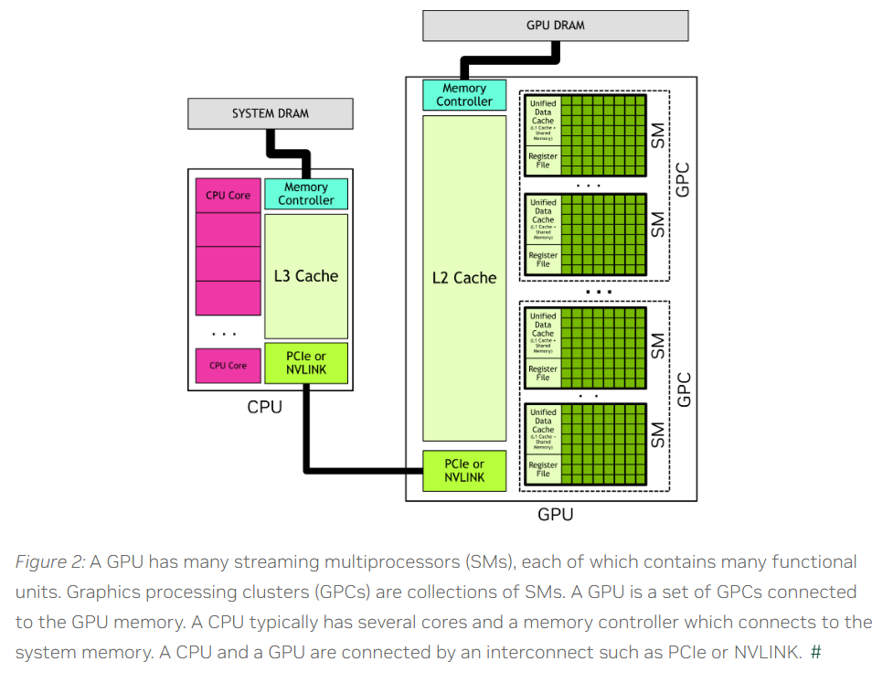
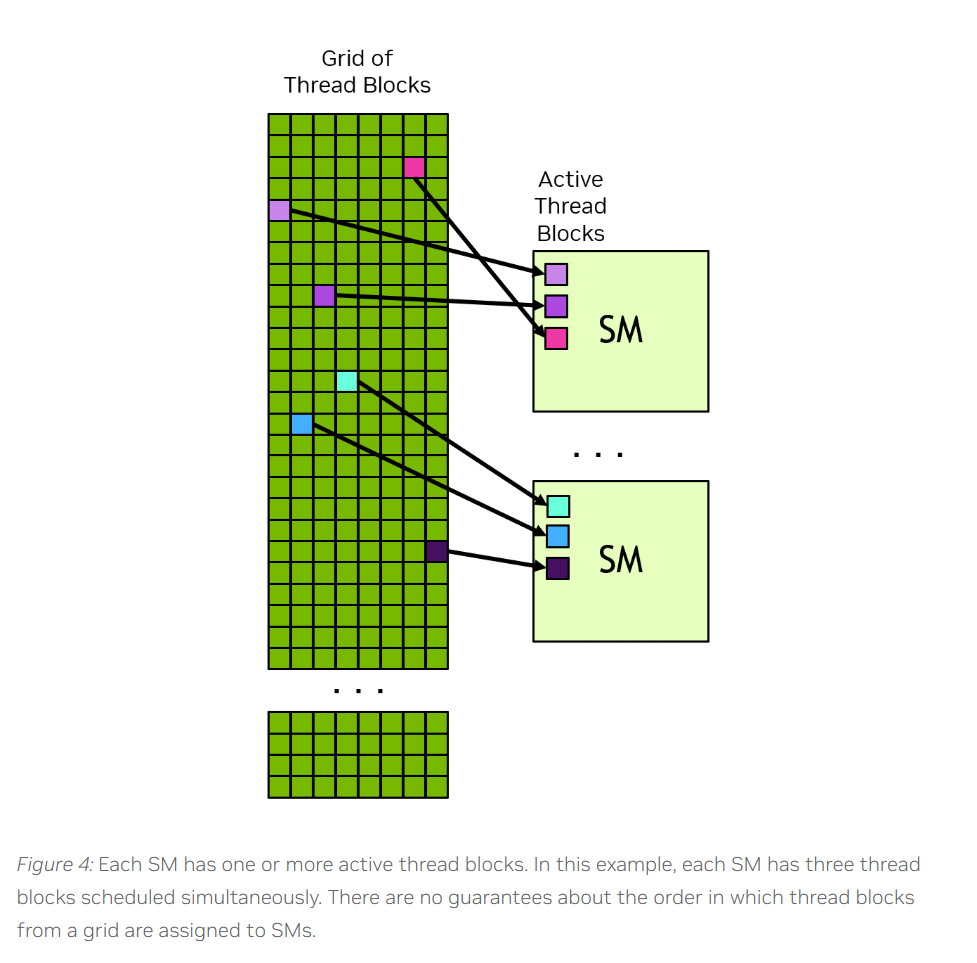
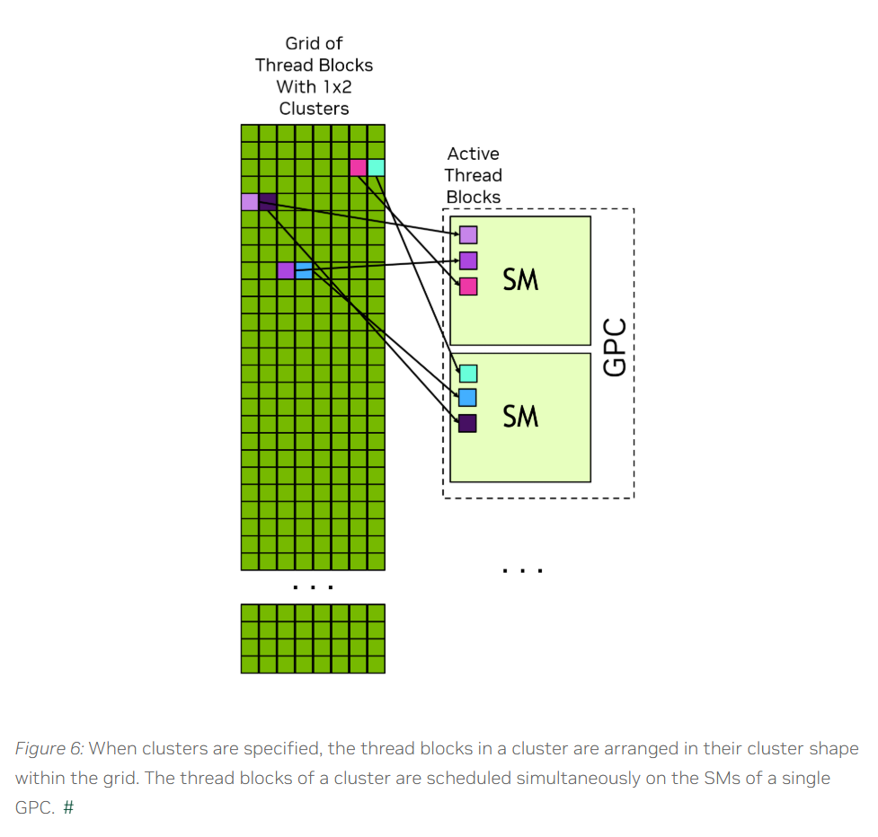
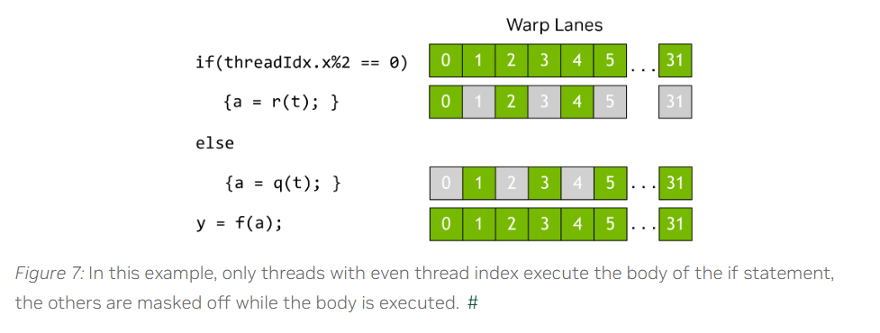
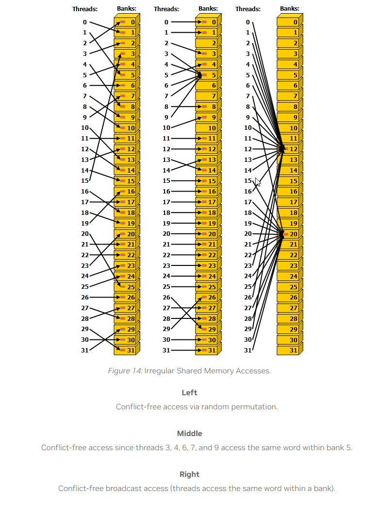
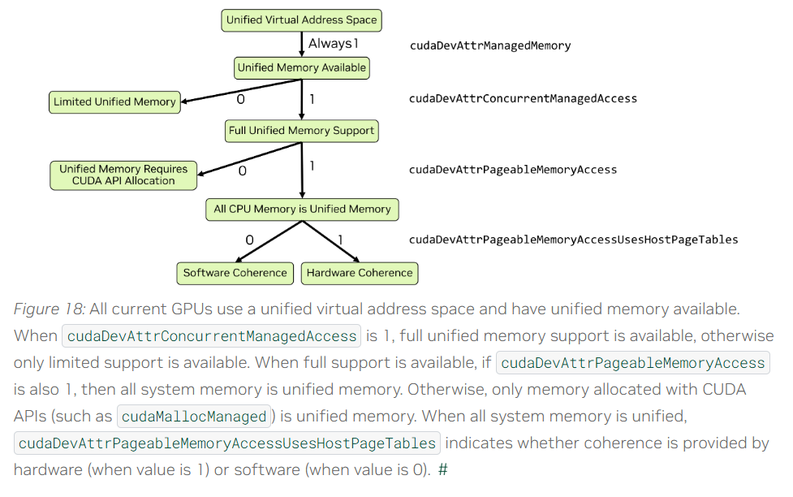

# 1. Introduction to CUDA
## 1.2 Programming Model
### 1.2.1 异构系统
异构系统：指的是CUDA编程模型 假定 系统中一定包含一个CPU和一个GPU。
host：指CPU。host memory指CPU内存，host code指在CPU上运行的代码
device：指GPU。device memory指GPU内存，device code指在GPU上运行的代码

### 1.2.2 GPU 硬件模型
一个GPU包含多个Streaming Multiprocessors (SMs)。SM被组织成多个Graphics Processing Clusters (GPCs)
一个SM包含：a local register file、a unified data cache、a number of functional units
a unified data cache：可以被划分为 shared memory 和 L1 cache。可以运行时通过代码划分。


#### 1.2.2.1 Thread Blocks and Grids
线程组织结构：Grid -> Thread Block -> warp=32threads
Grid和Thread Block有三个维度。代码中可以用blockDim和gridDim获取
kernel执行的时候，需要用`kernelName<<<dim3, dim3>>>(args...);`指定grid和block的dim。
一个block的所有线程执行在同一个SM上。
一个block上的所有线程可以访问片上(on-chip)共享内存(shared memory)，可以用来在同一个block上的其他线程共享数据
一个block不能依赖于来自其他block的结果，因为block的调度顺序无法保证。简而言之，CUDA编程模型要求可以以【任意顺序、并行或线性】调度block
由于warp运行所需的上下文是在片上存储的，持续整个warp的生命周期，所以warp的切换不需要耗时

每个SM同时只能有几个block激活，gred中的block分配给SM的顺序无法保证。


如下所示图像中：一个SM同时激活了三个block



##### 1.2.2.1.1 Thread Block Clusters
TODO：还不熟，主要对Cooperative Groups不了解。后面再看

clusters是9.0之后可选的线程组织层级：Grid -> Thread Block Cluster -> Thread Block -> warp=32threads
clusters也有三维。
同一个cluster的所有block在同一个GPC上执行。

同一个cluster的线程，可以访问这个cluster内所有block的共享内存。
同一个cluster的block之间可以通信，也可以同步。软件接口是：[Cooperative Groups](https://docs.nvidia.com/cuda/cuda-programming-guide/02-basics/writing-cuda-kernels.html#writing-cuda-kernels-cooperative-groups)
> Because the thread blocks are scheduled simultaneously and within a single GPC, threads in different blocks but within the same cluster can communicate and synchronize with each other using software interfaces provided by Cooperative Groups. Threads in clusters can access the shared memory of all blocks in the cluster, which is referred to as distributed shared memory.The maximum size of a cluster is hardware dependent and varies between devices.




#### 1.2.2.2 Warps and SMIT
Block内的线程被组织成warp，每个warp有32个线程。warp内的线程以SIMT(Single-Instruction Multiple-Threads)范式执行kernel代码.
SIMT：warp内的所有线程都执行同一个kernel代码，不同线程可以在代码的不同分支上。warp内的所有线程应该同步执行。
warp内的所有线程同一时间只能执行同一个指令，如果遇到分支代码，那么就会退化成串行执行，一部分线程执行分支A，其他线程等待，分支A执行完之后其他线程会执行分支B，执行分支A的线程等待。硬件原理大致是：32个warp共享指令寄存器，active的线程会执行同一个指令，同时会通过mask决定哪些线程active。



### 1.2.3 GPU Memory

#### 1.2.3.1 异构系统中的DRAM内存

global memory: GPU全局内存。可被所有SM访问
GPU的虚拟内存范围是唯一的，和系统中的其他GPU与CPU的虚拟内存范围都不一样。

#### 1.2.3.2 GPU片上内存

> 片上内存：包括高速缓存、寄存器文件等。

每个SM都有register file和shared memory。
shared memory与L1 cache的内存来自同一个物理设备，可以编程决定这两块内存占比。

register file：储存thread local变量，通常由编译器决定。
shared memory：由block(或cluster)上的所有线程共享的内存，可以用来和block(或cluster)内其他线程交换数据。

block的线程数*单个线程所需寄存器总数 < SM中可用寄存器数。否则内存无法启动

##### 1.2.3.2.1 缓存
L2缓存GPU所有SM共享。L1缓存SM内部共享。

#### 1.2.3.3 统一内存

CUDA的统一内存是一种内存管理机制，允许CPU和GPU共享同一内存地址空间，简化了内存操作。

# 2. CUDA GPU编程

## 2.1 CPU C++ 导论

重点介绍CUDA runtime API

nvcc 是CUDA代码的编译器

### 2.1.2 kernel

主机调用，GPU执行的函数称为内核。
__global__ 修饰的函数是内核函数
`<<<>>>`用于启动内核
```c++
 __global__ void vecAdd(float* A, float* B, float* C)
{

}

int main()
{
    ...
    // Kernel invocation
    vecAdd<<<1, 256>>>(A, B, C);
    ...
}
```

**内置变量**
* **threadIdx**: uint3类型。当前线程在所属block中的坐标。有xyz三个分量。
* **blockIdx**: uint3类型。当前线程的block 在所属grid中的坐标，包含xyz三个分量。
* **blockDim**: dim3类型。block的形状，包含xyz三个分量分别表示 宽高厚。blockDim的三个维度乘积不能超过1024，这是由硬件限制的。
* **gridDim**: dim3类型。grid的形状。

### 2.1.3 内存
* cudaMalloc 函数用来分配GPU内存
* cudaMallocHost 用来分配CPU内存
* cudaFree 用来释放GPU内存
* cudaFreeHost 释放CPU内存
* cudaMemcpy 用来在设备间拷贝内存

### 2.1.7 错误检查
```c++
#define CUDA_CHECK(expr_to_check) do {            \
    cudaError_t result  = expr_to_check;          \
    if(result != cudaSuccess)                     \
    {                                             \
        fprintf(stderr,                           \
                "CUDA Runtime Error: %s:%i:%d = %s\n", \
                __FILE__,                         \
                __LINE__,                         \
                result,\
                cudaGetErrorString(result));      \
    }                                             \
} while(0)
```


cudaGetLastError 返回最新的错误并重置为cudaSuccess（意味着下次再调用的时候就是SUCCESS了）
cudaPeekLastError 返回最新的错误但是不做重置
```c++
    vecAdd<<<blocks, threads>>>(devA, devB, devC);
    // check error state after kernel launch
    CUDA_CHECK(cudaGetLastError());
    // wait for kernel execution to complete
    // The CUDA_CHECK will report errors that occurred during execution of the kernel
    CUDA_CHECK(cudaDeviceSynchronize());
```


### Device和Host 函数
* `__global__`: GPU执行，CPU/GPU调用。即kernel函数。调用时必须用<<<>>>指定launch的参数
* `__device__`: GPU执行，GPU调用
* `__host__`: CPU执行，CPU调用。没有任何修饰的函数默认是host code

### 2.1.9 变量说明符
* `__device__`: specifies that a variable is stored in Global Memory
* `__constant__`: specifies that a variable is stored in Constant Memory
* `__managed__`: specifies that a variable is stored as Unified Memory
* `__shared__`: specifies that a variable is store in Shared Memory

如果不指定说明符声明变量：
* 变量在`__device__`或`__global__`函数中，会自动放在register或者local memory中。
* 否则会放在CPU内存中。

## 2.2 编写CUDA SIMT kernel函数

### 2.2.3 GPU 设备内存空间



#### 2.2.3.1 Global Memory
指的是GPU内存。

#### 2.2.3.2 shared memory
SM的内存。可以用于在同一个Block内的线程交换数据。

__syncthreads()用来避免数据冲突：只要有一个线程执行到这个函数，那么必须同一个Block的所有线程都执行到__syncthreads()函数后才会继续往下走。这个函数用来在Block内，跨warp实现数据共享。

```c++
// 静态分配
__shared__ float sharedArray[1024];

// 动态分配
extern __shared__ float sharedArray[];
//同时需要按如下形式调用kernel
functionName<<<grid, block, sharedMemoryBytes>>>()


// 注意：一个kernel只能有一个extern __shared__。如果需要多个动态内存，那么可以用以下方式实现
extern __shared__ float array[];
short* array0 = (short*)array;
float* array1 = (float*)&array0[128];
int*   array2 =   (int*)&array1[64];
```

### 2.2.4 Memory Performance

#### 2.2.4.1 全局内存 合并访存

一次全局内存的访问可以获取32B的数据。所以warp内的线程最好需要访问连续内存，这样就可以少几次全局内存的访问。
举个例子，一个warp内的32个线程，每个线程访问4B的数据，一共需要访问128B的数据，如果这128B的数据是连续的，那么4次全局内存访问就可以全部取完。但是如果是分开的，那么就需要32次全局内存访问了。

#### 2.2.4.2 共享内存 bank冲突

Bank：shared memory会把内存划分为一个个的小格子，每个格子大小为4B，这一个个的小格子按顺序编号从0~31。编号相同的所有小格子组成一个Bank，共有32个Bank。每个Bank可能会有多个格子。

当**同一个warp中的多个线程访问同一个Bank中的不同地址的数据**的时候，会造成Bank confilt，退化成串行执行。以下两种特殊情况不属于warp confilt
* 同一个warp的多个线程读同一个bank的同一个地址：一个线程读，然后广播到其他线程。
* 同一个warp的多个线程写同一个bank的同一个地址：仅一个线程写。哪个线程写是未定义的。
* 不同warp不会conflict


### 2.2.5 原子
原子操作可以对global memory的某个location上锁，从而实现原子的读写。
```c++
// 一个atomic_ref的例子。atomic具体用法就不罗列了。没必要，用到的时候查即可
__global__ void sumReduction(int n, float *array, float *result) {
   ...
   tid = threadIdx.x + blockIdx.x * blockDim.x;

   cuda::atomic_ref<float, cuda::thread_scope_device> result_ref(result);
   result_ref.fetch_add(array[tid]);
   ...
}
```

### 2.2.7 Kernel 的launch与Occupancy
kernel一旦launch之后，调度器就给SM分配thread blocks，直到SM资源不足以容纳新的block了。此时调度器会等待，直到有SM能够容纳新的block。

使用cudaGetDeviceProperties函数可以获取SM的资源限制
* maxBlocksPerMultiProcessor: 
* sharedMemPerMultiprocessor:
* regsPerMultiprocessor:
* maxThreadsPerMultiProcessor:
* sharedMemPerBlock:
* regsPerBlock:
* maxThreadsPerBlock
拿到以上数据之后，在launch的时候可以取更合适的参数，以达到最优的性能利用率

## 2.3 异步执行

### 2.3.2 CUDA Streams

Stream可以看做是一系列Operation的抽象。
单个流中的Operation是顺序执行的，按FIFO的顺序执行完前一个Operation之后才能执行下一个。
多个流中的Operation可以是同步的，具体如何同步需要根据流的类型区分。

**流相关API**
```c++
// 声明
cudaStream_t stream;  
// 创建
cudaStreamCreate(&stream);  // 阻塞流
cudaStreamCreateWithFlags(&stream, cudaStreamNonBlocking);  // 非阻塞流
// 销毁
cudaStreamDestroy(stream);
// 指定流调用kernel
kernelFunc<<<grid, block, shared_mem_size, stream>>>(...);
// 指定流执行Memory Transfer
cudaMemcpyAsync(dst, src, size, cudaMemcpyHostToDevice, stream);  // Copy `size` bytes from `src` to `dst` in stream `stream`
```
> cudaMemcpy()是同步的，等待copy完成才返回。cudaMemcpyAsync()是异步的，函数立马返回。


**流同步API**
* cudaStreamSynchronize(): 阻塞等待流中操作全部完成
* cudaStreamQuery(): 立刻返回流中是否还有操作未完成。cudaSuccess表示完成、cudaErrorNotReady表示未完成

### 2.3.3 CUDA Events

CUDA Event设计出来就是为了更好地控制和管理流中的操作。流同步API只能以粗粒度（以整个流为粒度）进行同步，有了Event就可以以任意Operation为粒度进行同步了。

可以在流中插入Event，然后以Event为粒度进行同步。

**Event相关API**
```c++
// 声明，创建与销毁
cudaEvent_t event;
cudaEventCreate(&event);
cudaEventDestroy(event);

// 插入流中
cudaEventRecord(event, stream);

// 计算两个Event之间的时间
float elapsedTime;
cudaEventElapsedTime(&elapsedTime, start, stop);  // 单位ms

// 检查Event状态
// 举个例子，Stream1中插入了kernel1 -> Event1 -> kernel2。主线程执行funcA->funcB
// 如果funcB依赖kernel1的结果，就可以在执行funcB之前执行下面的同步函数等待Event1完成。
cudaEventSynchronize(event);  // 阻塞等待直到event完成
cudaEventQuery(event);  // 立即返回cudaSuccess表示完成、cudaErrorNotReady表示未完成
```

### 2.3.6 阻塞流、非阻塞流、默认流
默认流default stream/NULL strem/strem with ID 0：没有指定流的kernel launch或cudaMemcpy call 会在默认流上执行。
阻塞流与非阻塞流的唯一区别就是与默认流的同步方式不同。
* 阻塞流Blocking stream: 与默认流按同步的方式执行。
* 非阻塞流non-Blocking stream: 与默认流按异步的方式执行。


CUDA7之后可以通过在编译时开启`--default-stream per-thread`或在代码中定义`CUDA_API_PER_THREAD_DEFAULT_STREAM`宏来开启Pre-thread Default Stream。开启之后每个host thread都有一个default stream，它们之间按异步方式执行。

### 2.3.7 显式同步
* cudaDeviceSynchronize(): 等待在此之前的所有host thread、所有stream的所有操作都执行完
* cudaStreamSynchronize(stream): 等待指定的stream的所有操作都执行完。可以用来同步host线程和指定stream。其他strem不影响
* cudaStreamWaitEvent(stream, event): 给定的stream等待event执行完成。主要用来做流间的同步 
* cudaStreamQuery(stream): 判断流内操作是否执行完
* cudaEventSynchronize(event): host线程阻塞等待event完成。用来同步host线程和指定stream
* cudaEventQuery(event): 判断Event是否执行完

### 2.3.8 隐式同步

不同阻塞流的两个operation，如果中间插入了默认流的任何操作，那么这两个阻塞流的operation不会同步执行。

## 2.4 Unified and System Memory

* 统一虚拟地址空间(Unified Virtual Address Space): 
* 统一内存(Unified Memory):
  * Limited Unified Memory:
  * Full Unified Memory:
  * Full Unified Memory with Hardware Coherency:
  * Unified memory hints:
* Page-locked Host Memory:
  * Mapped memory:
* Heterogeneous Managed Memory:
* Address Translation Services:

### 2.4.1 统一虚拟地址空间
对于单个进程来说，主机内存和所有的GPU内存共享同一个虚拟地址空间。不管是用CUDA API(eg. cudaMalloc cudaMallocHost)分配内存，还是使用系统API(new malloc mmap)分配的内存都一样。

cudaPointerGetAttributes()
cudaMemcpy*()
cudaMemcpyKind 
cudaMemcpyDefault

### 2.4.2 统一内存

代码中可以用以下API判断系统对统一内存支持到什么程度。


```c++
void queryDevices()
{
    int numDevices = 0;
    cudaGetDeviceCount(&numDevices);
    for(int i=0; i<numDevices; i++)
    {
        cudaSetDevice(i);
        cudaInitDevice(0, 0, 0);
        int deviceId = i;

        int concurrentManagedAccess = -1;     
        cudaDeviceGetAttribute (&concurrentManagedAccess, cudaDevAttrConcurrentManagedAccess, deviceId);    
        int pageableMemoryAccess = -1;
        cudaDeviceGetAttribute (&pageableMemoryAccess, cudaDevAttrPageableMemoryAccess, deviceId);
        int pageableMemoryAccessUsesHostPageTables = -1;
        cudaDeviceGetAttribute (&pageableMemoryAccessUsesHostPageTables, cudaDevAttrPageableMemoryAccessUsesHostPageTables, deviceId);

        printf("Device %d has ", deviceId);
        if(concurrentManagedAccess){
            if(pageableMemoryAccess){
                printf("full unified memory support");
                if( pageableMemoryAccessUsesHostPageTables)
                    { printf(" with hardware coherency\n");  }
                else
                    { printf(" with software coherency\n"); }
            }
            else
                { printf("full unified memory support for CUDA-made managed allocations\n"); }
        }
        else
        {   printf("limited unified memory support: Windows, WSL, or Tegra\n");  }
    }
}
```

#### 2.4.2.2 FUM（Full Unified Memory）特性支持

cudaDevAttrPageableMemoryAccess 返回1：所有内存都是统一内存，包括CUDA API分配的内存和系统API分配的内存（包括mmap、new、malloc）
cudaDevAttrPageableMemoryAccess 返回0：只有CUDA API分配的内存是统一内存

统一内存的 分配和迁移方式如下
* 分配：首次使用时分配内存。
* 迁移：首次由其他设备访问时进行迁移
* 迁移与访问 按 pages (software coherency) 或 cache lines (hardware coherency) 为粒度
* 允许申请比物理内存多的统一内存。

##### 2.4.2.2.1 硬件一致性(Hardware Coherency)的FUM
硬件一致性的FUM比软件一致性的FUM性能更高

cudaDevAttrPageableMemoryAccessUsesHostPageTables 是1则ATS(address translation services)可用

ATS可用意味着：
* GPU分配的内存(cudamalloc)可以在CPU上访问。cudaDevAttrDirectManagedMemAccessFromHost 值会返回1
* CPU和GPU支持native atomic。cudaDevAttrHostNativeAtomicSupported 值会返回1

ATS支持所有HMM功能。如果ATS可用，那么HMM自动不使能。

##### 2.4.2.2.2 HMM - 软件一致性(Software Coherency)的FUM

Heterogeneous Memory Management (HMM) 是Linux操作系统上的一种特性

#### 2.4.2.3 受限的统一内存
Windows系统和WSL 仅支持统一内存功能的子集

* 统一内存一定在CPU上分配
* 统一内存迁移的粒度 比 virtual memory pages 更
* GPU执行时 统一内存会往GPU上迁移
* GPU active时，CPU不能访问统一内存
* GPU同步(synchronized)的时候 会把统一内存迁移到CPU上
* 不允许申请比物理GPU内存多的统一内存。

#### 2.4.2.4 Memory Advise and Prefetch

* cudaMemAdvise: 可以指定 初次分配时分配到哪个设备上，以及 非统一内存当前所在设备的其他设备 访问时是否做迁移
* cudaMemPrefetchAsync: 可以异步地做 统一内存的迁移。

### 2.4.3 Page-Locked Host Memory
Page-Locked Host Memory 又名 pinned memory。
> 锁页内存是一种通过操作系统锁定物理内存页的技术，使其**无法被换出到磁盘**。从而保证内存地址的固定性和直接访问能力。
> * 物理地址固定
> * DMA直接访问：GPU通过PCIe总线直接访问锁页内存的物理地址。避免双拷贝开销（CPU->临时锁页->GPU）
> * 零拷贝的前提条件

相关API
* cudaMallocHost: 分配Page-Locked Host Memory
* cudaHostAlloc: 默认行为和cudaMallocHost一样，也可以指定参数做其他行为
* cudaFreeHost: frees memory allocated with cudaMallocHost or cudaHostAlloc
* cudaHostRegister: 现有的内存进行page-lock


# CUDA Features

## 4.1 统一内存
