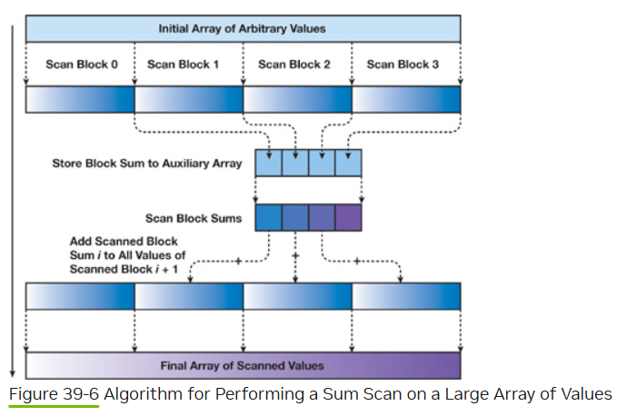

# 性能优化武器
* 合并访存: 针对全局内存
* bank冲突：针对共享内存
* cache命中率
* 全局内存访问转共享内存访问
* 隐藏访存延迟：访存中间对应多次计算，计算和访存可以并行。

# 全局坐标如何计算
https://zhuanlan.zhihu.com/p/544864997
https://www.zhihu.com/question/35361192#

```c++
// (x,y,z) = (一行多少个，一列多少个，一纵多少个)
__global void threadIdxInGrid()
{
    int threadInBlock = threadIdx.x + threadIdx.y*blockDim.x + threadIdx.z*blockDim.x*blockDim.y;
    int blockInGrid = blockIdx.x + blockIdx.y*gridDim.x + blockIdx.z*blockDim.x*blockDim.y;
    int blockSize = blockDim.x*blockDim.y*blockDim.z;
    
    int idxInGrid = blockInGrid * blockSize + threadInBlock;
    int idxInBlock = threadInBlock;
    int idxInWarp = idxInGrid % 32;

    int idx_x = blockIdx.x * blockDim.x + thread.x;
    int idx_y = blockIdx.y * blockDim.y + thread.y;
    int idx_z = blockIdx.z * blockDim.z + thread.z;
}
```


# add
```c++
// int block_size = 1024;
// int grid_size  = CEIL(N, block_size);
// elementwise_add<<<grid_size, block_size>>>(a, b, c, N);
__global__ void elementwise_add(float *a, float *b, float *c, int N)
{
    int idx = blockDim.x * blockIdx.x + threadIdx.x;
    if (idx < N) {
        c[idx] = a[idx] + b[idx];
    }
}
// y_m=x_n*w_nm+b_m
// y_k=(x_n*w_nm+b_m)*w_mk+b_k
// y_k=x_n*w_nm*w_mk+b_m*w_mk+bk

// float4在这个场景下有意义吗？
// 合并访存是合并一个warp内的访存。这里原本一个warp访问的内存空间就是连续的
__global__ void elementwise_add_float4(float *a, float *b, float *c, int N)
{
    int idx = (blockDim.x * blockIdx.x + threadIdx.x) * 4;
    if (idx < N) {
        float4 f4a = FLOAT4(a[idx]);
        float4 f4b = FLOAT4(b[idx]);
        FLOAT4(c[idx]) = make_float4(f4a.x + f4b.x, f4a.y + f4b.y, f4a.z + f4b.z, f4a.w + f4b.w);
    }
}
```

# sum
```c++
__global__ void sum_1d(float *input, float *output, int N)
{
    __shared__ float vals[32];  // 对于一个block，每个warp的规约结果存放在val[warpid]中
    int idx = blockDim.x * blockIdx.x + threadIdx.x;
    int warpId = threadIdx.x / 32;  // 当前线程属于该block的哪个warp
    int laneId = threadIdx.x % 32;  // 当前线程是warp中的第几个线程
    
    float val = input[idx];
    #pragma unroll  // 防止循环展开，TOOD不加是否会有问题？？？
    for (int offset = 16; offset > 0; offset = offset >> 1) {
        val += __shfl_down_sync(0xFFFFFFFF, val, offset);
    }
    if (laneId == 0) vals[warpId] = val;
    __syncthreads();
    
    if (warpId == 0) {
        float val = (laneId < (blockDim.x/32)) ? vals[laneId] : 0.0f;
        #pragma unroll
        for (int offset = 16; offset > 0; offset = offset >> 1) {
            val += __shfl_down_sync(0xFFFFFFFF, val, offset);
        }
        if (laneId == 0) atomicAdd(output, laneId);
    }
}
```

# transpose
```c++
// input：M行N列
// output: N行M列
__global__ void transpose(float* input, float* output, int M, int N)
{
    int idx_x = blockDim.x * blockIdx.x + threadIdx.x; // 线程的列号
    int idx_y = blockDim.y * blockIdx.y + threadIdx.y; // 线程的行号
    if (idx_x < N && idx_y < M) {
        output[idx_x * M + idx_y] = input[idx_y * N + idx_x];
    }
}
```

```c++
// input：M行N列
// output: N行M列
// dim3 block(32,32);
// dim3 grid(CEIL(M,32), CEIL(N,32));
// transpose<<<grid, block>>>(input, output, M, N);
__global__ void transpose(float* input, float* output, int M, int N)
{
    __shared__ float cap[32][33];
    int idx_x = blockDim.x * blockIdx.x + threadIdx.x;
    int idx_y = blockDim.y * blockIdx.y + threadIdx.y;

    if (idx_x < M && idx_y < N)
        cap[threadIdx.x][threadIdx.y] = input[idx_y*N + idx_x];

    __syncthreads();
    idx_y = blockDim.x * blockIdx.x + threadIdx.y; // 这里应该需要加上 threadIdx.x。但是由于输入的blockDim.x == blockDim.y，所以x和y是可以等价互换的。
    idx_x = blockDim.y * blockIdx.y + threadIdx.x;
    if (idx_x < N && idx_y < M)
        output[idx_y*M + idx_x] = cap[threadIdx.y][threadIdx.x];
}
```

# gemv
矩阵乘以向量

```c++
// M和N的值不同最优写法也会不一样。可以参考这个：https://zhuanlan.zhihu.com/p/494144694
// 这里实现一个通用写法：每个Block里一个warp。每个warp负责output一个元素的计算
// matrix: M行N列
// input: N列
// output: M行
// dim3 block(32);
// dim3 grid(M);
// gemv<<<grid, block>>>(input, output, M, N);
__global__ void gemv(float* matrix, float* input, float* output, int M, int N)
{
    int laneIdx = threadIdx.x;
    float val = 0.0f;
    int idxM = blockIdx.x;
    for (int i = 0; i < CEIL(N, WARP_SIZE); i++) {
        int idx = i*WARP_SIZE+laneIdx;
        if (idx < N ) val += input[idx] * matrix[idxM*N + idx];
    }
    for (int offset = WARP_SIZE>>1; offset > 0; offset>>=1) {
        val += __shfl_down_sync(0xFFFFFFFF, val, offset);
    }
    if (laneIdx == 0) output[idxM] = val;
}
```

# softmax


# 前缀和
[Chapter 39. Parallel Prefix Sum (Scan) with CUDA](https://developer.nvidia.com/gpugems/gpugems3/part-vi-gpu-computing/chapter-39-parallel-prefix-sum-scan-cuda)


1. 先实现一个小Array的scan。array小到可以在一个ThreadBlock内完成
2. 给原始数组分块，每个块都由一个ThreadBlock实现scan。同时记录每个块的和放到BlockSum数组中
3. 同样的操作完成BlockSum的前缀和。
4. BlockSum中的每一项都加到对应块的每一个元素上。
