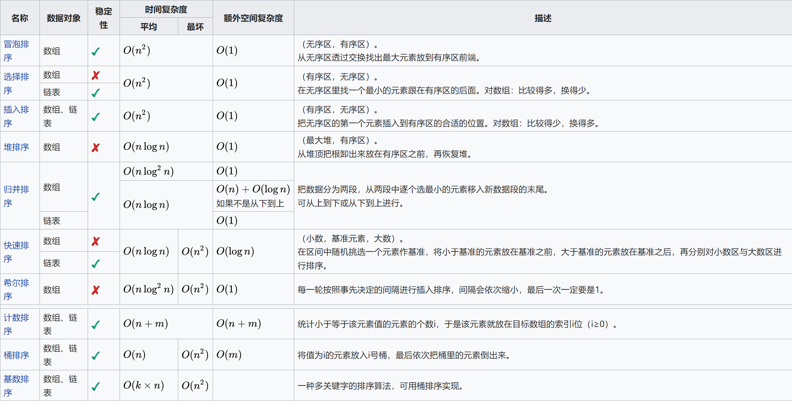

  

# 希尔排序
```java
public void shellSort(int[] array) {
    //希尔排序
    int gap = array.length;
    while (gap >= 1) {
        gap /= 2;   //增量每次减半
        for (int i = 0; i < gap; i++) {
            for (int j = i + gap; j < array.length; j += gap) { //这个循环里其实就是一个插入排序
                int k = j - gap;
                while (k >= 0 && array[k] > array[k + gap]) {
                    int temp = array[k];
                    array[k] = array[k + gap];
                    array[k + gap] = temp;
                    k -= gap;
                }
            }
        }
    }
}
```
# 快速排序
```java
public void quickSort(int[] arr) {
    quickSort(arr, 0, arr.length - 1);
}

private void quickSort(int[] arr, int startIndex, int endIndex) {
    if (startIndex >= endIndex) return;
    int pivot = arr[startIndex];
    int markPoint = startIndex;

    for (int i = startIndex + 1; i <= endIndex; i++) {
        // 如果比分界值小，则 mark++ 后互换。
        if (arr[i] < pivot) {
            markPoint++;
            int temp = arr[markPoint];
            arr[markPoint] = arr[i];
            arr[i] = temp;
        }
    }
    // 将首元素分界值与当前mark互换
    arr[startIndex] = arr[markPoint];
    arr[markPoint] = pivot;
    quickSort(arr, startIndex, markPoint - 1);
    quickSort(arr, markPoint + 1, endIndex);
}
```
# 堆排序
定义：对于跟中的每个子树而言，其跟节点都大于左右孩子节点，满足这样性质的完全二叉树称为**大跟堆**。堆这种数据结构建立在完全二叉树的基础上。

对于堆这种数据结构，可以限制堆大小，也可以不限制堆大小。比如如果找N个数中第k大的数，则可以使用小根堆并限制堆大小为k。如果用于堆排序，则不用限制堆大小。
**堆有两个基本操作**：`shiftUp`和`shiftDown`，`shiftUp`用于自下而上地维护堆结构。`shiftDown`用于自上而下地维护堆结构。
**入节点**：若堆未满，则放在最后，再`shiftUp`。若堆满，则判断是否有资格入堆，若入堆，则与根节点换，再`shiftDown`。
**出节点**：若堆不空，则出根节点。将最后一个元素与根节点交换，再执行`shiftDown`。

[数组中的第K个最大元素](https://leetcode-cn.com/problems/kth-largest-element-in-an-array/)
求第k个最大元素，维护一个大小为k的小根堆。若当前元素大于堆顶，则出堆并维护堆结构。
```java
class Heap { //小根堆，根元素最小
    /*
父节点：parent(i) = (i-1)/2
左孩子：leftChild(i) = 2*i+1
右孩子：rightChild(i) = 2*i+2*/
    int maxSize;
    int[] heap;
    int size = 0;
    public Heap(int maxSize) {
        this.maxSize = maxSize;
        heap = new int[maxSize];
    }
    public void put(int val) {
        if (size == maxSize) {
            if (heap[0] > val) return;
            heap[0] = val;
            shiftDown(0);
        } else {
            heap[size++] = val;
            shiftUp(size - 1);
        }
    }
    public int poll() {
        if (size == 0) return -1;
        int ans = heap[0];
        swap(0, --size);
        shiftDown(0);
        return ans;
    }
    public void shiftDown(int root) {
        while (true) {
            int left = root * 2 + 1;
            int right = left + 1;
            if (left >= size) return;
            int max = left; //保存左右最小的那一个，再和根节点比较
            if (right < size && heap[right] < heap[left]) max = right;
            if (heap[max] < heap[root]) { // 如果根更大，将根向下沉
                swap(max, root);
                root = max;
            } else return;
        }
    }
    public void shiftUp(int root) {
        while (true) {
            int parent = (root - 1) / 2;
            if (parent < 0 || heap[root] >= heap[parent]) return;
            else {
                swap(parent, root);
                root = parent;
            }
        }
    }
    public void swap(int a, int b) {
        int tmp = heap[a];
        heap[a] = heap[b];
        heap[b] = tmp;
    }
}
```
[超级丑数](https://leetcode-cn.com/problems/super-ugly-number/)