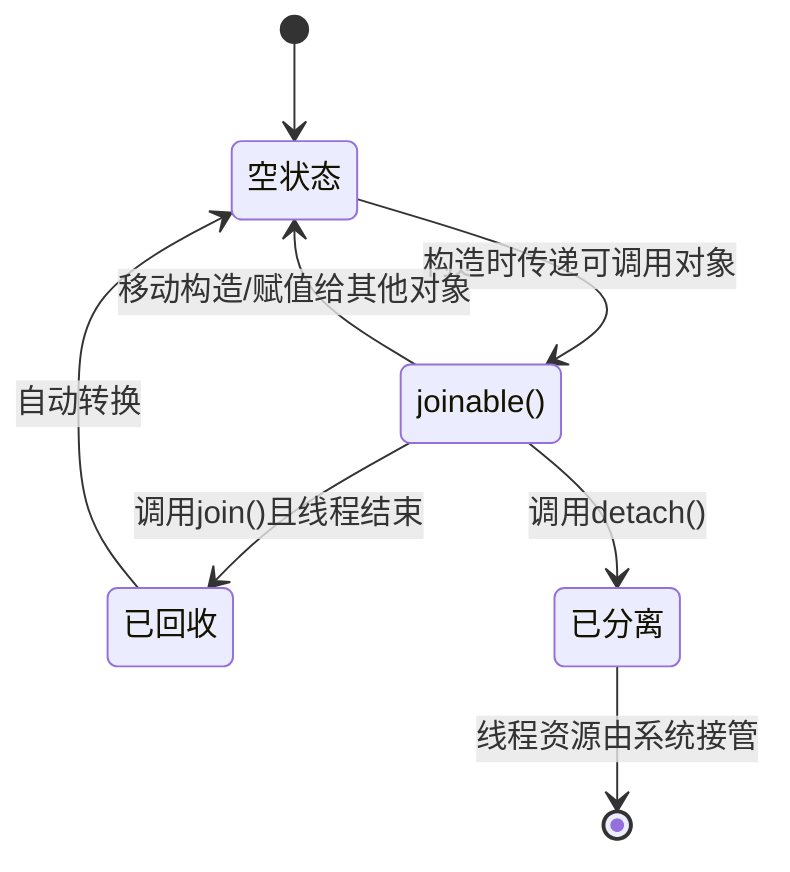

# 线程

## std::thread

**构造函数**

线程创建完后会立马开始执行，join()函数只是让主线程等待子线程执行完毕，而不是在join()的时候子线程才开始执行。

```c++
    thread t1;  // 空构造函数，不关联任何实际线程，joinable()为false
    thread t2(std::move(t1));  // 移动构造函数
    thread t3([](string s) { cout << "Hello: " + s << endl; }, "zhangsan");  // 传入function和参数。关联了实际线程
```

**join()**

调用join()函数后，主线程要等待子线程执行完毕。

join()函数不可重复调用，调用一次join()函数后，joinable()会返回假。

在析构thread对象时，如果thread对象关联了实际线程且仍然joinable()，那么就会调用std::terminate()，会报错: `abort() has been called`。所以join()或detach()必须要被调用，

**detach()**

调用detach()后，主线程和子线程同步执行，子线程脱离主线程的掌控。子线程会在后台执行完成。

**joinable()**


joinable: 可以调用join()和detach()，不能调用析构函数。
not joinable: 可以调用析构函数，不能调用join()和detach()

**get_id()和native_handle()**

get_id：返回线程id
和native_handle：返回平台原生的线程句柄。


**线程状态**



## this_thread

this_thread命名空间提供了访问当前线程的一些方法

**get_id**: 获取线程id，可以用于记录日志

**yield**

让出当前线程时间片

**sleep_until**

当前线程休眠直到某个时间点

**sleep_for**

当前线程休眠一段时间

## std::jthread (C++20)

std::jthread 是 C++20 标准引入的线程管理类，是 std::thread 的增强版本，核心目标是解决 std::thread 在生命周期管理和线程取消方面的痛点，让线程管理更安全、更灵活。

**核心改进1：自动join，防止程序崩溃**

std::thread 的最大问题之一是：如果线程对象销毁时仍处于 “可连接（joinable）” 状态（即未调用 join() 或 detach()），会触发 std::terminate() 导致程序直接崩溃。这要求开发者必须手动管理 join/detach，在复杂逻辑（如异常、分支）中容易遗漏。

而 std::jthread 解决了这个问题，其析构函数会自动调用 join()（如果线程仍可连接），无需手动处理。即使在异常抛出、函数提前返回等场景下，也能保证线程正确收尾，避免程序崩溃。

**核心改进2：内置 “取消机制”，支持线程优雅退出**

调用request_stop可以优雅地退出线程，利用stop_source修改stop_token的stop_state，工作中的线程察觉到退出请求后可以优雅地进行退出

```c++
#include <thread>
#include <stop_token>
#include <iostream>

void worker(std::stop_token st) {
    while (!st.stop_requested()) { // 检查是否收到停止请求
        std::cout << "working..." << std::endl;
        std::this_thread::sleep_for(std::chrono::seconds(1));
    }
    std::cout << "stop" << std::endl;
}

int main() {
    std::jthread t(worker); // 传递 worker 函数，jthread 会自动传入 stop_token
  
    // 主线程运行 3 秒后，请求停止
    std::this_thread::sleep_for(std::chrono::seconds(3));
    t.request_stop(); // 发送停止请求
  
    // t 析构时自动 join()，无需手动调用
    return 0;
}
```

# 锁

## 锁

### mutex

最普通的锁，由于没有递归性质，所以已经加锁的线程再次加锁会导致死锁。

**lock()**

阻塞式地尝试加锁。必须加锁成功才往下执行，如果mutex被当前线程占用，则会造成死锁

**unlock()**

当前线程必须调用了lock()才能调用unlock()，用于解锁

**try_lock()**

非阻塞式地尝试加锁，如果加锁成功则返回true，否则返回false。如果锁被当前线程占有也算加锁失败返回false。

返回值被标记为`nodiscard`(It is dangerous to ignore the return value.)

### recursive_mutex

和mutex用法一样，唯一的区别是当前线程持有锁之后，再次lock()会成功，try_lock()会返回true。

注意递归锁加了多少次锁必须要解多少次锁

### timed_mutex

lock() unlock() try_lock()逻辑和mutex完全一样，提供了两个额外的函数

**try_lock_for()**
接收一个参数，表示阻塞等待多长时间，超时还没加锁则返回false。`m.try_lock_for(chrono::milliseconds(1000))`

**try_lock_until()**
接收一个参数，表示阻塞等待到哪个时间点，超时还没加锁则返回false。

### recursive_timed_mutex

成员函数与timed_mutex相同，只不过允许递归加锁

### shared_mutex

lock() unlock() try_lock() 表示加解写锁

lock_shared() unlock_shared() try_lock_shared() 表示加解读锁

写锁与其他写锁以及读锁互斥，读锁与读锁共享。
同一个线程只能占用一个写锁或一个读锁。

## 锁管理

### lock_guard

利用RAII对锁进行管理，在lock_guard对象构造时自动加锁，析构时自动解锁，避免程序异常退出导致没有解锁。不提供任何成员函数，**性能高效，适合简单场景**

### unique_lock

和lock_guard类似，也是利用RAII对锁进行管理。但是性能相比lock_guard更低，功能更强大，适用于比较复杂的锁场景。

* lock() unlock() try_lock() try_lock_for()  try_lock_until() 和直接调用传入的mutex对象的相应的函数完全相同，需要保证传入的mutex里面有这些成员函数，否则运行时会报错。
* mutex()：返回传入的mutex
* owns_lock(): 是否被加锁
* release(): 释放该unique_lock对传入的mutex的控制。返回这个mutex

```c++
mutex m;
unique_lock<mutex> l(m); // l的声明周期要在m之内
```

### shared_lock

利用RAII对shared_mutex进行管理。shared_lock只会操作shared_mutex的读锁

```c++
std::shared_mutex smtx;  // 共享互斥锁
int shared_data = 0;

// 读操作：获取共享锁
void read_data(int id) {
    std::shared_lock<std::shared_mutex> lock(smtx);  // 获取共享锁
    std::cout << "线程" << id << "读取数据: " << shared_data << std::endl;
    // 离开作用域自动释放共享锁
}

// 写操作：获取独占锁（需用unique_lock）
void write_data(int value) {
    std::unique_lock<std::shared_mutex> lock(smtx);  // 获取独占锁
    shared_data = value;
    std::cout << "写入数据: " << shared_data << std::endl;
    // 离开作用域自动释放独占锁
}
```

### scoped_lock

std::scoped_lock是 C++17 引入的用于同时锁定多个互斥锁的 RAII 类，主要解决 “多锁顺序问题” 导致的死锁。

特点：同时锁定多个互斥锁，通过加锁顺序保证不会产生死锁问题
* 按顺序加锁
* 不可手动控制
* 不可复制或移动
* 自动解锁和加锁

## once_flag+call_once

`std::once_flag`是一个状态标志类型，用于配合`std::call_once`记录代码块是否已执行。

```c++
#include <thread>
#include <iostream>
#include <mutex>

std::mutex mx;
std::once_flag config_flag;
bool is_configured = false;

void configure_resource() {
    // 模拟资源配置操作
    std::cout << "configure" << std::endl;
    is_configured = true;
}

void use_resource(int id) {
    // 确保配置只执行一次
    std::unique_lock<std::mutex> lock(mx);
    std::call_once(config_flag, configure_resource);
    // 所有线程都能使用已配置的资源
    std::cout << "thread " << id << " use " << std::boolalpha << is_configured << "" << std::endl;
}

int main() {
    std::thread t1(use_resource, 1);
    std::thread t2(use_resource, 2);
    std::thread t3(use_resource, 3);
    
    t1.join();
    t2.join();
    t3.join();
    return 0;
}
```

# 原子操作

## Atomic详解

C++提供了一系列别名来替代atomic<T>
```c++
_EXPORT_STD using atomic_bool = atomic<bool>;
_EXPORT_STD using atomic_char   = atomic<char>;
_EXPORT_STD using atomic_schar  = atomic<signed char>;
_EXPORT_STD using atomic_uchar  = atomic<unsigned char>;
_EXPORT_STD using atomic_short  = atomic<short>;
_EXPORT_STD using atomic_ushort = atomic<unsigned short>;
_EXPORT_STD using atomic_int    = atomic<int>;
_EXPORT_STD using atomic_uint   = atomic<unsigned int>;
_EXPORT_STD using atomic_long   = atomic<long>;
_EXPORT_STD using atomic_ulong  = atomic<unsigned long>;
_EXPORT_STD using atomic_llong  = atomic<long long>;
_EXPORT_STD using atomic_ullong = atomic<unsigned long long>;
```

**Atomic是什么，有啥用？**

std::atomic是C++11标准引入的原子操作库，用于解决多线程环境下共享数据的线程安全问题。它提供了一组原子操作，确保对共享变量的操作具有“不可分割性”，从而避免因数据竞争导致的未定义行为。

如下所示的例子中，`count++`实际上从机器码的层面来说，会分为“读取-修改-写入”三个步骤，而且由于操作的是缓存（现代CPU中L1和L2一般是私有缓存，L3是共享缓存），所以导致每个CPU核心都持有一份缓存副本导致数据不一致的情况，可能导致最终结果小于预期。
```c++
int count = 0;
count++; // 线程1
count++; // 线程2
```

### Atomic 基础用法

基本用法

#### 读写/异或/is_lock_free

* load(): 原子读
* store(): 原子写
* exchange(): 原子交换，写入新值返回旧值。
* fetch_add(): 原子加，返回旧值
* fetch_sub(): 原子减，返回旧值
* fetch_or(): 按比特位进行原子或，返回旧值
* fetch_and(): 按比特位进行原子与，返回旧值
* fetch_xor(): 按比特位进行原子异或，返回旧值


#### is_lock_free

Atomic的原子性不保证无锁实现，原子性是否使用锁和平台以及变量的类型都有关系。比如大部分平台都支持int类型无锁原子操作，而对于某些大型结构体的原子操作大都依赖锁实现。可以使用`is_lock_free()`来判断该atomic对象的各种原子操作是否依赖锁。
> 如果is_lock_free()返回false，则意味着编译器会通过内部加锁（如全局互斥锁）的方式来模拟原子性，此时操作本质上是于锁的，性能较差，且需要考虑锁竞争导致的其他问题（如线程阻塞、饿死）。


#### cas操作

compare_exchange_strong()和compare_exhange_weak()默认的内存序是`memory_order_seq_cst`，如果不是对性能要求特别高的地方，一般不需要指定内存序。

**compare_exchange_strong()**
原子cas操作，按比特位进行比较。如果相等则改为新值，否则交换expected和旧值。
```c++
// 以下为compare_exchange_strong的伪代码
bool compare_exchange_strong(T& expected, T desired)
{
    if (value == expected) {
        value = desired;
        return true;
    } else {
        swap(value, expected);
        return false;
    }
}
```

**compare_exhange_weak()**
原子cas操作，按比特位进行比较。允许错误的返回false（也就是偶尔会导致错过swap的时机，所以必须用while包裹），性能比strong版本更高。

#### wait/notify (C++20)

**wait(T old)**
**如果值为old则等待其他线程调用notify**，否则直接返回。由于可能存在虚假唤醒，所以需要循环判断。
> **虚假唤醒**：由于操作系统错误唤醒了被阻塞的线程，或者其他线程调用了notify_all，但是此时条件仍未满足，所以需要用while循环判断。

```c++
// wait伪代码
void wait(T old) {
    for (;;) {
        if (val != old) return;
        else 阻塞;
    }
}
```

**notify**
* notify_all(): 唤醒所有等待的线程
* notify_one(): 唤醒一个等待的线程

## atomic_flag

`atomic_flag`是唯一**确保无锁的原子类型**，不管什么平台上都一定是通过无锁的方式实现的。`atomic_flag`只有两个状态“未设置”和“已设置”，分别对应false和true。从功能上看，`atomic_flag`就是简化了的`atomic_bool`，只不过`atomic_flag`保证操作移动无锁。
> 通过读MSVC的C++20源码可以发现，`atomic_flag`实际上就是包装了一层`atomic<long>`，所以Windows平台能确保`atomic<long>`一定是无锁的。

* wait/notify_all/notify_one和Atomic完全一样。
* clear(): 将状态设置为“未设置”
* test(): 判断状态是否为“已设置”，如果是则返回true。c++20之后出现
* test_and_set(): 设置状态为“已设置”，同时返回旧状态（旧状态为“已设置”则返回true）。
  

## 内存序

实际上Atomic和Atomic_flag的各种涉及到读/取的操作都可以指定内存序，默认内存序就是memory_order_seq_cst，是最安全的内存序。

**TODO** 还需要整理所有内存序以及它们的区别


# 线程同步
## 条件变量

### condition_variable和condition_variable_any

**二者的区别**
condition_variable和condition_variable_any的唯一的区别就是condition_variable_any支持任意锁类型，所以在condition_variable满足不了要求的时候需要使用condition_variable_any，否则直接用condition_variable即可。

**condition_variable_any的锁类型不要使用lock_guard**
线程阻塞的时候会自动解锁，线程被唤醒的时候会自动加锁。由于lock_guard不支持手动加锁解锁，所以不要使用lock_guard。

### wait

**wait的基础用法**

std::condition_variable提供了四种wait，接下来分别介绍它们的作用
```c++
void wait(unique_lock<mutex>& _Lck)
void wait(unique_lock<mutex>& _Lck, _Predicate _Pred)
cv_status wait_for(unique_lock<mutex>& _Lck, const chrono::duration<_Rep, _Period>& _Rel_time)
cv_status wait_until(unique_lock<mutex>& _Lck, const chrono::time_point<_Clock, _Duration>& _Abs_time)
```

* `wait(_Lck)`: 阻塞当前线程
* `wait(_Lck, _Pred)`: 如果_Pred不满足则阻塞当前线程，否则什么也不做。用法：`wait(lock, [](){return flag;});`
* `wait_for(_Lck, _Rel_time)`: 阻塞_Rel_time时间，如果提前被notify了那么返回`cv_status::no_timeout`，否则返回`cv_status::timeout`
* `wait_until(_Lck, _Abs_time)`: 阻塞到_Abs_time时间点，返回值同wait_for

**对比下Java和condition_variable的wait/notify的等待集与锁对象**
Java的每个对象都内置一个等待集（由JVM维护），线程调用obj.wait()会当线程进入obj的等待集，这样obj.notify()的时候就知道哪些线程正在等待。而c++中condition_variable自身维护一个等待集。

锁对象的作用是定义同步范围，Java中的锁对象是synchronized关联的对象；condition_variable的锁对象就是传入的unique_lock，由传入的unique_lock定义同步范围

**和Atomic的wait/notify对比有什么区别**
Atomic的wait/notify不需要额外的锁，且条件比较简单，只能监控自身值的变化。
condition_variable需要额外加锁，能监控任意用户自定义变量的值的变换。


### notify

notify没什么好说的，notify_all和notify_one分别是唤醒所有线程和唤醒一个线程，具体唤醒哪个线程由操作系统决定。

## 信号量

还有一个`binary_semaphore`，实际上就是`counting_semaphore<1>`，所以这里只介绍`counting_semaphore`。


counting_semaphore持有两个atomic<int>分别是`_Counter`和`_Waiting`。_Counter用来记录信号量剩余的值，_Waiting用来记录有多少线程等待，_Waiting的主要作用是提高性能。在release时，只会释放min(_Waiting.load(), _Update)个线程。
> 这里看的是MSVC 14.44.35270版本的代码。

### 基础用法

**构造**
```c++
const int MAX_CAPACITY = 10;
std::counting_semaphore<MAX_CAPACITY> empty(MAX_CAPACITY);
std::counting_semaphore<MAX_CAPACITY> full(0);
```

**常用函数**

* **release(int _Update=1)**: 释放_Update个资源。_Update需要在[0,max]之间，且release后的值需要在[0,max]之间，否则程序运行会报错。
* **acquire()**: 申请一个资源。如果无资源则阻塞等待。
* **try_acquire()**: 尝试申请一个资源。申请成功则返回true，申请失败返回false，不会阻塞等待。
* **try_acquire_for(chrono::duration)**: 尝试申请一个资源。申请失败会阻塞一段时间，如果最后申请成功则返回true。
* **try_acquire_until(chrono::time_point)**: 尝试申请一个资源。申请失败会阻塞到某个时间点，如果最后申请成功则返回true。

## 同步原语

### latch (C++20)

一次性屏障，初始化时计数为N，线程调用count_down()减少计数，调用wait()阻塞等待直到计数为0。计数一旦到0则永久有效且不可重置。MSVC版本中latch是利用`atomic<int>`实现的。

* **构造**: `std::latch latch(3);`
* **wait()**: 阻塞等待计数变为0
* **arrive_and_wait(int _Update=1)**: 计数减_Update并阻塞等待计数变为0。从名字能猜出来用法，想象一个比赛的场景，每个人到了起跑线都调用一下arrive_and_wait()，直到所有人都到了才会开始起跑。
* **count_down(int _Update=1)**: 计数减_Update
* **try_wait()**: 仅判断计数是否为0，为0则返回true。任何情况下都不会阻塞。

### barrier (C++20)

可重用屏障，初始时计数为N，线程调用arrive减少计数，调用wait阻塞等待直到计数为0。计数到0之后会自动重置为N。

* **arrive()**：表示一个线程已经到达同步点。这会使内部的计数器递减。如果计数器达到零，所有等待的线程都会被释放。
* **wait()**：使一个线程在同步点上等待，直到所有线程都到达同步点。
* **arrive_and_wait()**：这是arrive()和wait()的组合。它表示一个线程已经到达同步点，并在同步点上等待，直到所有线程都到达同步点。
* **arrive_and_drop()**：这表示一个线程已经到达同步点，并且不再需要同步。这会使内部的计数器递减，并且将barrier的总线程数减一。


# 异步任务类​

## std::future<T>

future是异步任务结果的 “句柄”，是**异步任务结果的消费者**，通过调用get()函数阻塞等待结果。future是独占的，只能一个线程获取结果，且get()只能调用一次。

* get(): 阻塞等待结果。get只能执行一次。
* share(): 返回shared_future对象，原future对象变为无效。shared_future是共享的，get()可以调用多次。
* valid(): 该future是否有效。调用get()、share()后变为无效。在设置值之前也是有效的
* wait()/wait_for()/wait_untile(): 不获取值，只阻塞等待到值被设置。

## std::promise<T>

promise是**异步任务结果的生产者**，通过set_value设置结果，设置完之后阻塞在对应future上的线程会被唤醒。

* get_future(): 返回相关联的future对象
* set_value(): 设置结果，唤醒因调用get()而阻塞的线程。set_value()只能调用一次
* set_exception(): 设置异常，也会唤醒因调用get()而阻塞的线程，会将设置的异常抛给这个线程，该线程必须在get()处捕获异常。
* set_value_at_thread_exit(): 在线程退出时设置值。
* set_exception_at_thread_exit(): 在线程退出时设置异常。

```c++
#include <future>
#include <thread>
#include <iostream>

void produce_result(std::promise<int> prom) {
    // 模拟耗时计算
    std::this_thread::sleep_for(std::chrono::seconds(2));
    int result = 42;
    prom.set_value(result); // 向共享状态设置结果
}

int main() {
    std::promise<int> prom;
    std::future<int> fut = prom.get_future(); // 获取关联的future

    // 启动线程执行任务，传递promise（注意必须移动，因为promise不可复制）
    std::thread t(produce_result, std::move(prom));

    // 主线程等待结果
    std::cout << "waiting..." << std::endl;
    int res = fut.get(); // 阻塞，直到结果就绪
    std::cout << "get result: " << res << std::endl;

    t.join();
    return 0;
}
```

## std::packaged_task


**核心逻辑：**

`std::packaged_task` 用于将可调用对象（函数、lambda、函数对象等） 包装成一个 “异步任务”，并自动关联一个 `std::future` 用于获取任务的返回值。

* 包装后的任务可以在当前线程执行，也可以传递给其他线程执行。
* 任务执行完成后，返回值会自动存入共享状态，供关联的 future 获取。
* 本质是 std::function 与 std::promise 的结合：既封装任务逻辑，又负责设置结果。

```c++
#include <future>
#include <thread>
#include <iostream>

// 待包装的任务函数
int calculate(int a, int b) {
    std::this_thread::sleep_for(std::chrono::seconds(1));
    return a + b;
}

int main() {
    std::packaged_task task(calculate);
    std::future<int> fut = task.get_future(); // 获取关联的future

    // std::thread t(std::move(task), 10, 20); // 交给其他线程运行
    task(10,20); // 当前线程运行
    // 获取结果
    std::cout << "cal: " << fut.get() << std::endl; // 输出30

    // t.join();
    return 0;
}
```

## std::async

std::async 是一个函数模板，用于直接创建异步任务，无需手动管理 promise 或 packaged_task。它会自动创建共享状态，并返回一个 std::future 用于获取结果，是最常用的异步任务启动方式。

下面的例子中`std::async(async_task, 5);`定义完后会立马创建一个新线程执行。
```c++
#include <future>
#include <iostream>
#include <chrono>

int async_task(int x) {
    std::this_thread::sleep_for(std::chrono::seconds(2));
    return x * 2;
}

int main() {
    // 启动异步任务（默认策略）
    std::future<int> fut = std::async(async_task, 5);

    std::cout << "waiting async..." << std::endl;
    // 获取结果（若任务是deferred，此时会在主线程执行）
    std::cout << "get result: " << fut.get() << std::endl; // 输出10

    return 0;
}
```

# 手撕

## 线程池

C++标准库没有实现线程池

## 单例模式

## 生产者消费者

## 阻塞队列