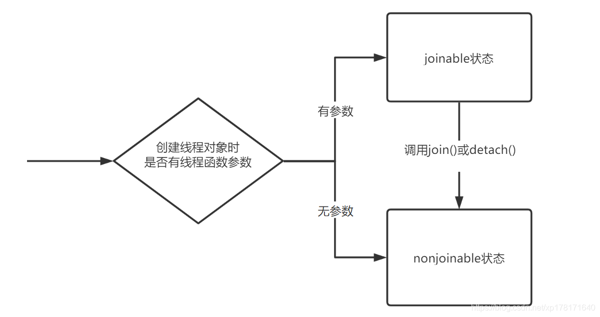
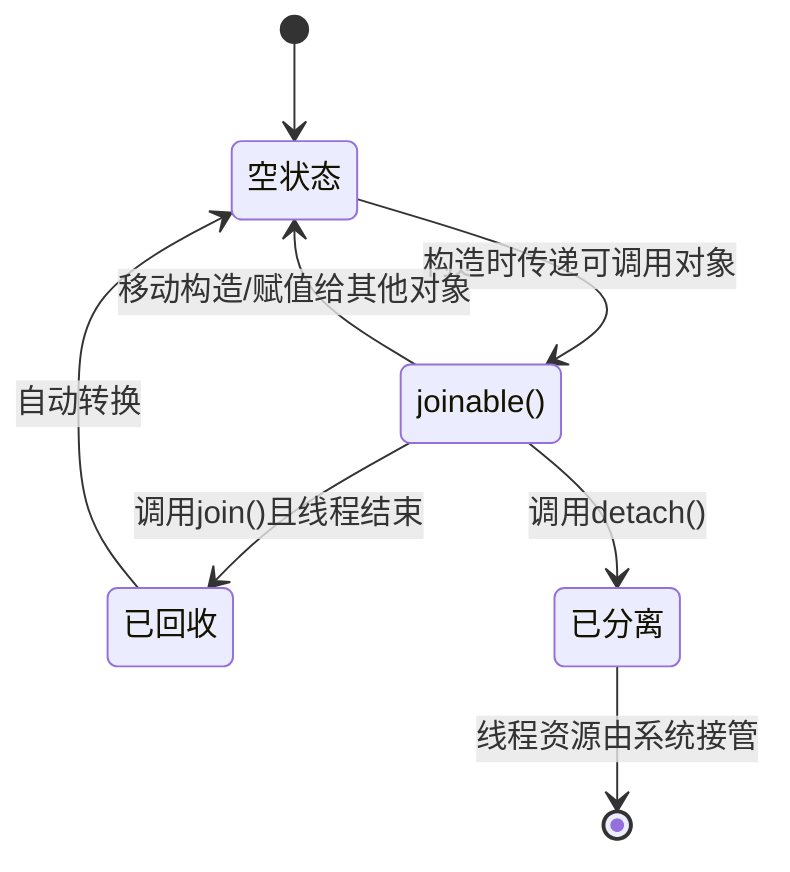

# 线程

## std::thread

**构造函数**

线程创建完后会立马开始执行，join()函数只是让主线程等待子线程执行完毕，而不是在join()的时候子线程才开始执行。

```c++
    thread t1;  // 空构造函数，不关联任何实际线程，joinable()为false
    thread t2(std::move(t1));  // 移动构造函数
    thread t3([](string s) { cout << "Hello: " + s << endl; }, "zhangsan");  // 传入function和参数。关联了实际线程
```

**join()**

调用join()函数后，主线程要等待子线程执行完毕。

join()函数不可重复调用，调用一次join()函数后，joinable()会返回假。

在析构thread对象时，如果thread对象关联了实际线程且仍然joinable()，那么就会调用std::terminate()，会报错: `abort() has been called`。所以join()或detach()必须要被调用，

**detach()**

调用detach()后，主线程和子线程同步执行，子线程脱离主线程的掌控。子线程会在后台执行完成。

**joinable()**



joinable: 可以调用join()和detach()，不能调用析构函数。
not joinable: 可以调用析构函数，不能调用join()和detach()

**get_id()和native_handle()**

get_id：返回线程id
和native_handle：返回平台原生的线程句柄。


**线程状态**



## this_thread

this_thread命名空间提供了访问当前线程的一些方法

**get_id**: 获取线程id，可以用于记录日志

**yield**

让出当前线程时间片

**sleep_until**

当前线程休眠直到某个时间点

**sleep_for**

当前线程休眠一段时间

# 锁

## 锁

### mutex

最普通的锁，由于没有递归性质，所以已经加锁的线程再次加锁会导致死锁。

**lock()**

阻塞式地尝试加锁。必须加锁成功才往下执行，如果mutex被当前线程占用，则会造成死锁

**unlock()**

当前线程必须调用了lock()才能调用unlock()，用于解锁

**try_lock()**

非阻塞式地尝试加锁，如果加锁成功则返回true，否则返回false。如果锁被当前线程占有也算加锁失败返回false。

返回值被标记为`nodiscard`(It is dangerous to ignore the return value.)

### recursive_mutex

和mutex用法一样，唯一的区别是当前线程持有锁之后，再次lock()会成功，try_lock()会返回true。

注意递归锁加了多少次锁必须要解多少次锁

### timed_mutex

lock() unlock() try_lock()逻辑和mutex完全一样，提供了两个额外的函数

**try_lock_for()**
接收一个参数，表示阻塞等待多长时间，超时还没加锁则返回false。`m.try_lock_for(chrono::milliseconds(1000))`

**try_lock_until()**
接收一个参数，表示阻塞等待到哪个时间点，超时还没加锁则返回false。

### recursive_timed_mutex

成员函数与timed_mutex相同，只不过允许递归加锁

### shared_mutex

lock() unlock() try_lock() 表示加解写锁

lock_shared() unlock_shared() try_lock_shared() 表示加解读锁

写锁与其他写锁以及读锁互斥，读锁与读锁共享。
同一个线程只能占用一个写锁或一个读锁。

## 锁管理

### lock_guard

利用RAII对锁进行管理，在lock_guard对象构造时自动加锁，析构时自动解锁，避免程序异常退出导致没有解锁。不提供任何成员函数，性能高效，适合简单的常用

### unique_lock

和lock_guard类似，也是利用RAII对锁进行管理。但是性能相比lock_guard更低，功能更强大，适用于比较复杂的锁场景。

* lock() unlock() try_lock() try_lock_for()  try_lock_until() 和直接调用传入的mutex对象的相应的函数完全相同，需要保证传入的mutex里面有这些成员函数，否则运行时会报错。
* mutex()：返回传入的mutex
* owns_lock(): 是否被加锁
* release(): 释放该unique_lock对传入的mutex的控制。返回这个mutex

```c++
mutex m;
unique_lock<mutex> l(m); // l的声明周期要在m之内
```

### shared_lock

利用RAII对shared_mutex进行管理。shared_lock只会操作shared_mutex的读锁

```c++
std::shared_mutex smtx;  // 共享互斥锁
int shared_data = 0;

// 读操作：获取共享锁
void read_data(int id) {
    std::shared_lock<std::shared_mutex> lock(smtx);  // 获取共享锁
    std::cout << "线程" << id << "读取数据: " << shared_data << std::endl;
    // 离开作用域自动释放共享锁
}

// 写操作：获取独占锁（需用unique_lock）
void write_data(int value) {
    std::unique_lock<std::shared_mutex> lock(smtx);  // 获取独占锁
    shared_data = value;
    std::cout << "写入数据: " << shared_data << std::endl;
    // 离开作用域自动释放独占锁
}
```

### scoped_lock

std::scoped_lock是 C++17 引入的用于同时锁定多个互斥锁的 RAII 类，主要解决 “多锁顺序问题” 导致的死锁。

特点：同时锁定多个互斥锁，通过加锁顺序保证不会产生死锁问题
* 按顺序加锁
* 不可手动控制
* 不可复制或移动
* 自动解锁和加锁

## once_flag+call_once

`std::once_flag`是一个状态标志类型，用于配合`std::call_once`记录代码块是否已执行。

```c++
#include <thread>
#include <iostream>
#include <mutex>

std::mutex mx;
std::once_flag config_flag;
bool is_configured = false;

void configure_resource() {
    // 模拟资源配置操作
    std::cout << "configure" << std::endl;
    is_configured = true;
}

void use_resource(int id) {
    // 确保配置只执行一次
    std::unique_lock<std::mutex> lock(mx);
    std::call_once(config_flag, configure_resource);
    // 所有线程都能使用已配置的资源
    std::cout << "thread " << id << " use " << std::boolalpha << is_configured << "" << std::endl;
}

int main() {
    std::thread t1(use_resource, 1);
    std::thread t2(use_resource, 2);
    std::thread t3(use_resource, 3);
    
    t1.join();
    t2.join();
    t3.join();
    return 0;
}
```

# 原子操作

## Atomic详解

**Atomic是什么，有啥用？**

std::atomic是C++11标准引入的原子操作库，用于解决多线程环境下共享数据的线程安全问题。它提供了一组原子操作，确保对共享变量的操作具有“不可分割性”，从而避免因数据竞争导致的未定义行为。

如下所示的例子中，`count++`实际上从机器码的层面来说，会分为“读取-修改-写入”三个步骤，而且由于操作的是缓存（现代CPU中L1和L2一般是私有缓存，L3是共享缓存），所以导致每个CPU核心都持有一份缓存副本导致数据不一致的情况，可能导致最终结果小于预期。
```c++
int count = 0;
count++; // 线程1
count++; // 线程2
```

### Atomic 基础用法


# 条件变量

std::condition_variable


同步原语：
std::latch(一次性栅栏)
std::barrier(可重用屏障)
std::counting_semaphore


其他：
std::call_once
std::jthread(C++20)

# 异步任务类​

std::future<T>
std::promise<T>
std::packaged_task

# thread_loacl关键字

# 手撕

## 线程池

C++标准库没有实现线程池

## 单例模式

## 生产者消费者