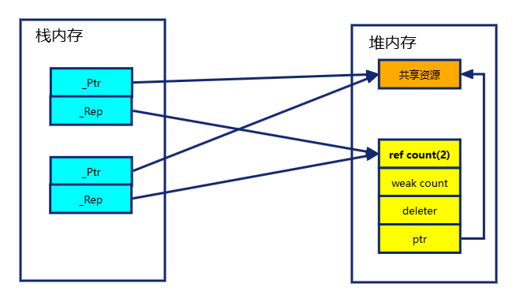
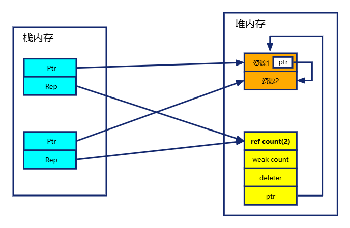
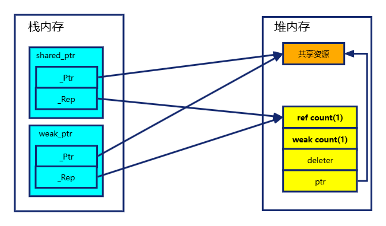

https://blog.csdn.net/cpp_learner/article/details/118912592
https://blog.csdn.net/mingwu96/article/details/123327325

# unique_ptr

不带deleter的unique_ptr就是用RAII管理资源，所以占用内存和原始指针一样。

unique_ptr是独占所有权的智能指针，所以unique_ptr**禁止拷贝，仅允许移动**

## 基本用法
```C++
struct MyDeleter
{
    void operator()(int* p) const
    {
        delete p;
    }
};
void main()
{
    int* p0 = new int(10);
    unique_ptr<int[]> p1 = make_unique<int[]>(10);  // 自动创建大小为10的int数组，然后自动创建一个指针指向这个数组
    unique_ptr<int> p2 = make_unique<int>(1);  // 相当于p4
    unique_ptr<int> p3(p0);   // 不建议使用原始指针初始化unique_ptr，如果两个unique_ptr都指向同一个原始指针会造成双重释放内存问题。
    unique_ptr<int> p4(new int(0));
    {
        unique_ptr<int> up1(std::move(p2));  // up1抢走了p2的资源，p2现在指向空地址
        unique_ptr<int> up2 = std::move(p2); // up2和p2现在都是指向空地址。
        
        // 这里会调用拷贝构造函数，unique_ptr的拷贝构造函数被标记为delete. 
        unique_ptr<int> up3 = up1;   //报错：Attempt to use deleted constructor std::unique_ptr<int>::unique_ptr(const unique_ptr<int>&)
    }
    // 自定义deleter
    unique_ptr<int, function<void(int*)>> p5(new int(10), [](int* p) { delete p; });
    unique_ptr<int, MyDeleter> p6(new int(10));


    /*  成员函数  */
    int* pointer = p2.get();  // 获取原始指针
    p2.reset(new int(1));  // 指向新指针，将旧指针置空，释放旧的资源。
    int* release = p2.release(); // unique_ptr释放对指针的管理权(后续调用get()会获得nullptr)。并返回原始指针，后续需要手动释放原始指针的资源。
    p2.swap(p3); // 交换p2和p3所管理的指针和删除器
}
```

# shared_ptr

shared_ptr内部有两个指针，一个指向控制块，一个指向共享的资源（也就是指针）。


## 基本用法

```c++
void main()
{
    // 初始化
    int* p0 = new int(10);
    shared_ptr<int> sp0(p0); // 使用原始指针初始化
    shared_ptr<int> sp1(new int(10)); // 使用临时指针初始化
    shared_ptr sp2(sp1); // 使用其他shared_ptr初始化，会调用拷贝构造函数。引用计数加一
    shared_ptr sp3 = sp2; // 同上，会调用拷贝构造函数
    shared_ptr sp4(std::move(sp3)); // 使用其他shared_ptr初始化。会调用移动构造函数，将sp3的资源转移给sp4。
    shared_ptr sp5 = std::move(sp4); // 同上，会调用移动构造函数
    shared_ptr<int> sp6 = make_shared<int>(0); // 使用make_shared进行初始化。这里参数就是_Ty构造函数的参数，最多接收十个参数。
    shared_ptr<int[]> sp7 = make_shared<int[]>(5); // 使用make_shared初始化数组，C++20标准
    shared_ptr<int> sp8(new int(8), [](const int* a) { delete a; }); // 带删除器的shared_ptr

    // 赋值
    sp1 = sp0;
    sp3 = std::move(sp2); // sp3现在指向sp2的资源；sp2被置为空。原始的sp3资源引用计数减一，原始的sp2资源引用计数不变。

    // 成员函数用法
    sp1.reset(new int(10)); // 指向新的资源，旧资源引用计数减一。无参版本则指向空指针。
    sp1.swap(sp2);
    int use_count = sp1.use_count(); // 返回控制块的引用计数
}
```

## 循环引用案例

下面这个案例中，new了Boy类和Girl类之后，在堆内存中就会有两个智能指针分别指向对方，导致两个指针形成了循环引用而无法释放内存
```c++
class Boy {
public:
    void setGirlFriend(shared_ptr<Girl> _girlFriend) {
        this->girlFriend = _girlFriend;
    }

private:
    shared_ptr<Girl> girlFriend;
};

class Girl {
public:
    void setBoyFriend(shared_ptr<Boy> _boyFriend) {
        this->boyFriend = _boyFriend;
    }

private:
    shared_ptr<Boy> boyFriend;
};

void useTrap() {
    shared_ptr<Boy> spBoy(new Boy());
    shared_ptr<Girl> spGirl(new Girl());

    // 陷阱用法
    spBoy->setGirlFriend(spGirl);
    spGirl->setBoyFriend(spBoy);
    // 此时boy和girl的引用计数都是2，退出函数后，boy和girl的引用计数都是一。
}
```


## 别名构造函数

别名构造函数是shared_ptr的一种构造函数，看源码可以发现实际上就是控制块指向_Other的控制块，资源指向_Px。
别名构造函数的作用是：**在不改变原对象生命周期的前提下，安全地指向其内部成员或相关资源**。

```c++
    template <class _Ty2>
    shared_ptr(const shared_ptr<_Ty2>& _Right, element_type* _Px) noexcept {
        // construct shared_ptr object that aliases _Right
        this->_Alias_construct_from(_Right, _Px);
    }

    template <class _Ty2>
    void _Alias_construct_from(const shared_ptr<_Ty2>& _Other, element_type* _Px) noexcept {
        // implement shared_ptr's aliasing ctor
        _Other._Incref();

        _Ptr = _Px;
        _Rep = _Other._Rep;
    }
```

以下展示了别名构造函数的典型使用场景: **指向对象的成员变量**
```c++
class Student
{
public:
    Student(string name) : name(name) {}
    string name;
};

void main()
{
    shared_ptr<Student> student(new Student("ZhangSan"));
    shared_ptr<string> stuName(student, &student->name);
    cout << *stuName;
}
```

## enable_shared_from_this

**用法**
需要使用`this`构造`shared_ptr`的类 需要`public`继承 `enable_shared_from_this`，然后调用`shared_from_this()`就可以安全获取使用`this`构造的`shared`了。

```c++
class Base : public enable_shared_from_this<Base>
{
public:
    shared_ptr<Base> getSharedPtr()
    {
        return shared_from_this();
    }
};

void main()
{
    auto sPtr = make_shared<Base>();
    auto base_a = sPtr->getSharedPtr();
}
```

**陷阱**
* 不要在构造函数和析构函数中使用 `shared_from_this()`，这个时候对象正处于创建/析构的过程中，使用`shared_from_this()`可能会出现未定义行为。
* 不要使用裸指针/栈对象去调用 `shared_from_this()`，在调用`shared_from_this()`前一定要确保_Wptr有值，而`_Wptr`是在第一次创建`shared_ptr`时赋值的。

**原理**
enable_shared_from_this持有一个`mutable weak_ptr<_Ty> _Wptr`，shared_from_this就是利用这个_Wptr创建的。
```c++
// 以下是enable_shared_from_this的部分代码
_EXPORT_STD template <class _Ty>
class enable_shared_from_this { // provide member functions that create shared_ptr to this
public:
    using _Esft_type = enable_shared_from_this;

    _NODISCARD shared_ptr<_Ty> shared_from_this() {
        return shared_ptr<_Ty>(_Wptr);
    }

    _NODISCARD shared_ptr<const _Ty> shared_from_this() const {
        return shared_ptr<const _Ty>(_Wptr);
    }

private:
    template <class _Yty>
    friend class shared_ptr;

    mutable weak_ptr<_Ty> _Wptr;
};
```
_Wptr是在shared_ptr类中赋值的，首次创建shared_ptr时会进入`if (_Px && _Px->_Wptr.expired())`分支：
```c++
_NODISCARD_SMART_PTR_ALLOC shared_ptr<_Ty> make_shared(_Types&&... _Args) { // make a shared_ptr to non-array object
    const auto _Rx = new _Ref_count_obj2<_Ty>(_STD forward<_Types>(_Args)...);
    shared_ptr<_Ty> _Ret;
    _Ret._Set_ptr_rep_and_enable_shared(_STD addressof(_Rx->_Storage._Value), _Rx);
    return _Ret;
}


_EXPORT_STD template <class _Ty>
class shared_ptr : public _Ptr_base<_Ty> { // class for reference counted resource management

private:
    template <class _Ux>
    void _Set_ptr_rep_and_enable_shared(_Ux* const _Px, _Ref_count_base* const _Rx) noexcept { // take ownership of _Px
        this->_Ptr = _Px;
        this->_Rep = _Rx;
        if constexpr (conjunction_v<negation<is_array<_Ty>>, negation<is_volatile<_Ux>>, _Can_enable_shared<_Ux>>) {
            if (_Px && _Px->_Wptr.expired()) {
                _Px->_Wptr = shared_ptr<remove_cv_t<_Ux>>(*this, const_cast<remove_cv_t<_Ux>*>(_Px));
            }
        }
    }
};
```

## Q & A

**不要使用同一个原始指针初始化多个shared_ptr**

```c++
    // 不要使用同一个原始指针初始化不同的shared_ptr, 否则会产生双重释放问题
    int* p0 = new int(10);
    shared_ptr<int> sp0(p0);
    shared_ptr<int> sp1(p0);  // 错误用法，会有两份引用计数
    shared_ptr<int> sp1(sp0); // 正确用法
```


**为什么要用owner_before，不能用operator<**

因为operator<是根据资源地址进行排序的，排序结果难以预测。下面是官方给出的一个例子。
```c++
class BaseA { int a; };
class BaseB { double b; };
class Derived: public BaseA, public BaseB {};
void main()
{

    std::shared_ptr<Derived> pd(new Derived);
    std::shared_ptr<BaseB> pb(pd);
    // 多继承时，派生类指针转换为不同基类指针时需要做地址偏移
    printf("%p %p\n", pd.get(), pb.get());  // 01240D50 01240D58
    printf("%d %d\n", pd < pb, pb < pd);  // 0 0
    printf("%d %d\n", pd.owner_before(pb), pb.owner_before(pd));  // 0 0

    std::shared_ptr<void> p0(pd), p1(pb);
    printf("%p %p\n", p0.get(), p1.get());  // 01240D50 01240D58
    printf("%d %d\n", p0 < p1, p1 < p0);  // 1 0
    printf("%d %d\n", p0.owner_before(p1), p1.owner_before(p0));  // 0 0
}
```


**使用make_shared构造shared_ptr**
make_shared会将两次内存分配合并为一次，且会把共享资源和控制块放在一起，防止了内存碎片的产生。
make_shared是异常安全的，如果new对象的过程中抛出了异常，可能会造成内存泄漏。


**控制块为什么分为weak count和ref count**

当ref count减到零时，会自动销毁被管理的对象；当weak count减到零时，会自动销毁控制块。weak_ptr可以通过控制块判断对象是否存活。

* ref count用于跟踪当前有多少个shared_ptr拥有对象控制权。
  * shared_ptr被创建：ref count 和 weak count 都加一
  * shared_ptr被销毁：ref count 和 weak count 都减一。
* weak count用于跟踪当前有多少个weak_ptr在观察这个控制块。
  * weak_ptr被创建：weak count+1
  * weak_ptr被销毁：weak count-1。当减到0时，控制块被销毁

# weak_ptr



## 基本用法

```c++
void main()
{
    // 构造 
    shared_ptr<int> sp = make_shared<int>(10);
    weak_ptr<int> wp0 = sp;
    weak_ptr<int> wp1 = wp0;  // 等价于wp1(wp0);
    weak_ptr<int> wp2(std::move(wp1));

    // 用法
    bool expired = wp1.expired();  // 当前wp是否可用。会判断控制块引用计数是否为0
    const shared_ptr<int>& shared = wp1.lock();  // 返回一个shared_ptr
}
```

