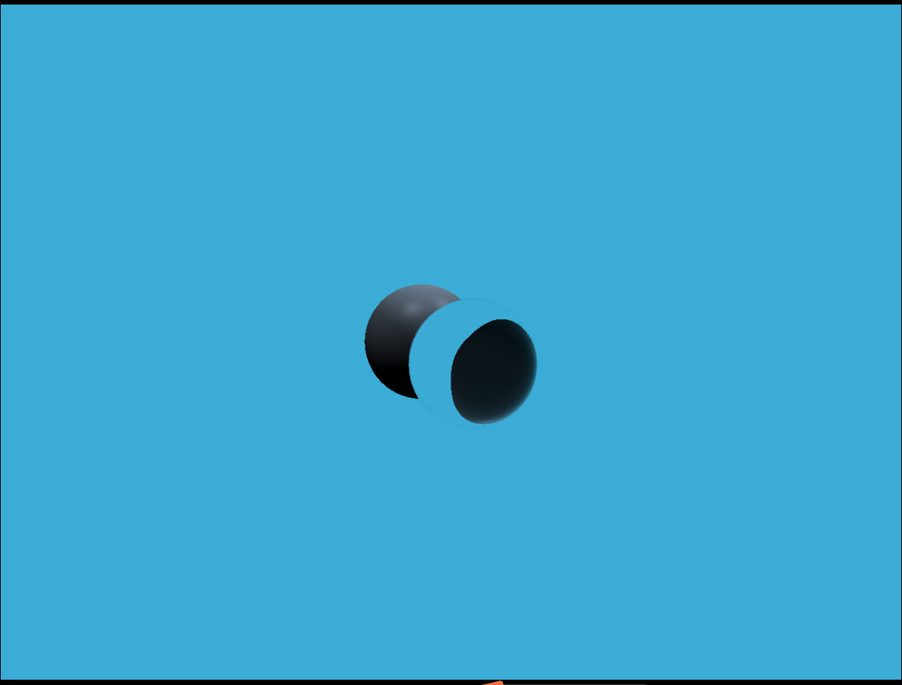

# 作业0
不建议使用官方提供的虚拟机，因为虚拟机内部还有好多东西需要配置，比如虚拟机内无法输入中文。另外官方提供的虚拟机和宿主机的文件交互方案也有可能配置不成功。
使用[GAMES101-Premake](https://github.com/Hinageshi01/GAMES101-Premake)，可以一键配置GAMES101作业运行环境。支持Windows+VS2022。

vs2022快捷键修改
* 回车自动提交：Tools->Options->Text Editor->C/C++->Advanced->Member List Commit Aggressive 选择 True
* 快捷键设置成vsCode：Tools->Options->Environment->Kyeboard->Apply the following additional keyboard mapping scheme 设置成 Visual Studio Code
* 字体设置成Consolas：Tools->Options->Environment->Fonts and Clors->Font 那一栏选择Consolas

# 作业1
`Eigen::Matrix4f get_model_matrix(float rotation_angle)`
* `rotation_angle`就是绕`z`轴的旋转角度，对照着笔记里的3D绕轴旋转的$R_z(x)$即可。

`Eigen::Matrix4f get_projection_matrix(float eye_fov, float aspect_ratio, float zNear, float zFar)`
* 根据MVP过程可知，经过view变换，摄像机位置和角度都已经在正确的位置了。
* `eye_fov`：视角范围，是一个角度。透视投影笔记部分给出了坐标`fov`的示意图
* `zNear`和`zFar`是z轴坐标。理论上是负值，但是默认全改为正值（在视频第七节有说）
* 根据透视投影变换矩阵的公式可知，构建投影矩阵需要$M_{persp->ortho}$和$M_{ortho}$两个部分。经过$M_{persp->ortho}$变换后就从截头椎体变换成立方体。高度是近平面的高度，利用`eye_fov``和zNear`可以得出。

`Eigen::Matrix4f get_rotation(Eigen::Vector3f axis, float angle)`
* 返回笔记里的$R(n,\alpha)$即可。

```c++
Eigen::Matrix4f get_model_matrix(float rotation_angle)
{
    Eigen::Matrix4f model = Eigen::Matrix4f::Identity();
    model(0, 0) = cos(rotation_angle);
    model(0, 1) = -sin(rotation_angle);
    model(1, 0) = sin(rotation_angle);
    model(1, 1) = cos(rotation_angle);
    return model;
}

Eigen::Matrix4f get_projection_matrix(float eye_fov, float aspect_ratio,
    float zNear, float zFar)
{   // fov: field-of-view，视角范围，是一个角度。
    zNear = -zNear; zFar = -zFar;
    Eigen::Matrix4f projection;
    Eigen::Matrix4f p2o, oMove, oScale; // p2o是persp->ortho，oMove是正交投影的平移变换矩阵，oScale是正交投影的缩放变换矩阵
    float top, buttom, left, right;  // 正交矩阵中那个立方体的各个坐标

    top = tan(eye_fov * 0.5 * MY_PI / 180.0) * abs(zNear); // 简单利用三角函数推一下即可
    right = aspect_ratio * top;
    buttom = -top;
    left = -right;

    p2o << zNear, 0, 0, 0,
        0, zNear, 0, 0,
        0, 0, zNear + zFar, -zNear * zFar,
        0, 0, 1, 0;

    oMove << 1, 0, 0, -(right + left) / 2.0,
        0, 1, 0, -(top + buttom) / 2.0,
        0, 0, 1, -(zNear + zFar) / 2.0,
        0, 0, 0, 1;

    oScale << 2.0 / (right - left), 0, 0, 0,
        0, 2.0 / (top - buttom), 0, 0,
        0, 0, 2.0 / (zNear - zFar), 0,
        0, 0, 0, 1;
    projection = oScale * oMove * p2o;
    return projection;
}

Eigen::Matrix4f get_rotation(Eigen::Vector3f axis, float angle)
{
    angle = angle * MY_PI / 180.0;
    Eigen::Matrix3f rotate;
    Eigen::Matrix3f Astar;
    Astar << 0, -axis(2), 0,
        axis(2), 0, -axis(0),
        -axis(1), axis(0), 0;
    rotate = cos(angle) * Eigen::Matrix3f::Identity() + (1 - cos(angle)) * axis * axis.transpose() + sin(angle) * Astar;
    Eigen::Matrix4f ans;
    
    ans << rotate, Eigen::Vector3f::Zero(), Eigen::RowVector3f::Zero(), 1;
    return ans;
}
```

# 作业2
这里直接实现用 super-sampling 处理 Anti-aliasing 后的函数了。
由于无法自己创建depth_buf（如果自己创建的话，会丢失框架对depth_buf做的修改），所以我们这里直接把框架的depth_buf的长度乘4即可。对像素点x，y来说，其中第i个格子对应的`depth_buf`位置是`width*height*i + get_index(x, y)`

* `insideTriangle`：这个函数很简单，只需要利用叉乘公式计算z值即可。
* `void rst::rasterizer::rasterize_triangle(const Triangle& t)`：
    * 首先计算bbox：对于xmax和ymax需要加1，因为浮点型会丢失精度。
    * 再遍历bbox中的所有像素
    * 对每个像素遍历其中的四个格子。如果该格子在三角形内，那么将对应颜色加入到该像素当中。注意颜色应当加入到像素当中，而不是直接更新像素点的颜色。即每次设置的颜色是`frame_buf[get_index(x, y)] + color)`，而不是`color`。如果只将`color`设置成像素点颜色的话，那么就会出现黑边。


```c++
static bool insideTriangle(float x, float y, const Vector3f* v)
{
    // 此时位于屏幕空间，保证 z 分量一致即可
    Eigen::Vector3f point = { x, y, 1.0f };
    Eigen::Vector3f vertex_a = { v[0].x(), v[0].y(), 1.0f };
    Eigen::Vector3f vertex_b = { v[1].x(), v[1].y(), 1.0f };
    Eigen::Vector3f vertex_c = { v[2].x(), v[2].y(), 1.0f };

    Eigen::Vector3f vector_ab = vertex_b - vertex_a;
    Eigen::Vector3f vector_bc = vertex_c - vertex_b;
    Eigen::Vector3f vector_ca = vertex_a - vertex_c;
    Eigen::Vector3f vector_ap = point - vertex_a;
    Eigen::Vector3f vector_bp = point - vertex_b;
    Eigen::Vector3f vector_cp = point - vertex_c;

    float crossz1 = vector_ab.cross(vector_ap).z();
    float crossz2 = vector_bc.cross(vector_bp).z();
    float crossz3 = vector_ca.cross(vector_cp).z();

    return (crossz1 <= 0.0f && crossz2 <= 0.0f && crossz3 <= 0.0f) ||
        (crossz1 >= 0.0f && crossz2 >= 0.0f && crossz3 >= 0.0f);
}


float stepDistance[4][2] = { {0.25,0.25},{0.25,0.75} ,{0.75, 0.25},{0.75, 0.75} };
//Screen space rasterization
void rst::rasterizer::rasterize_triangle(const Triangle& t) {
    auto v = t.toVector4();
    // 计算bbox
    const int xmin = std::min(std::min(v[1].x(), v[2].x()), v[0].x());
    const int ymin = std::min(std::min(v[1].y(), v[2].y()), v[0].y());
    const int xmax = std::max(std::max(v[1].x(), v[2].x()), v[0].x()) + 1;
    const int ymax = std::max(std::max(v[1].y(), v[2].y()), v[0].y()) + 1;

    // 遍历bbox中的像素
    for (int x = xmin; x <= xmax; x++) {
        for (int y = ymin; y <= ymax; y++) {
            // 我这里直接把框架里depth的长度乘以4了。
            int cnt = 0;

            for (int i = 0; i < 4; i++) {
                if (insideTriangle(x + stepDistance[i][0], y + stepDistance[i][1], t.v)) {
                    float& depth = depth_buf[width * height * i + get_index(x, y)];
                    Eigen::Vector3f& color = frame_buf[width * height * i + get_index(x, y)];
                    auto [alpha, beta, gamma] = computeBarycentric2D(x + stepDistance[i][0], y + stepDistance[i][1], t.v);
                    float w_reciprocal = 1.0 / (alpha / v[0].w() + beta / v[1].w() + gamma / v[2].w());
                    float z_interpolated = alpha * v[0].z() / v[0].w() + beta * v[1].z() / v[1].w() + gamma * v[2].z() / v[2].w();
                    z_interpolated *= w_reciprocal;

                    if (depth > -z_interpolated) {
                        depth = -z_interpolated;
                        cnt++;
                        color = t.getColor();
                    }
                }
            }

            if (cnt != 0) {
                Eigen::Vector3f color = (frame_buf[width * height * 0 + get_index(x, y)] + frame_buf[width * height * 1 + get_index(x, y)]
                    + frame_buf[width * height * 2 + get_index(x, y)] + frame_buf[width * height * 3 + get_index(x, y)]) * 0.25;
                set_pixel({ (float)x,(float)y,1.0 }, color);
            }
        }
    }
}

rst::rasterizer::rasterizer(int w, int h) : width(w), height(h)
{
    frame_buf.resize(w * h * 4);
    depth_buf.resize(w * h * 4);  // 修改框架
}
```


# 作业3
执行流程：先执行rasterizer，在内部auto pixel_color = fragment_shader(payload);中会执行main中定义的fragment_shader，默认是phong_fragment_shader。

首先需要把main方法中的phong_fragment_shader改成normal_fragment_shader。

```c++
// 和作业2一样，需要修改源码以支持超采样
rst::rasterizer::rasterizer(int w, int h) : width(w), height(h)
{
    frame_buf.resize(w * h * 4);
    depth_buf.resize(w * h * 4);

    texture = std::nullopt;
}

float stepDistance[4][2] = { {0.25,0.25},{0.25,0.75} ,{0.75, 0.25},{0.75, 0.75} };
//Screen space rasterization
void rst::rasterizer::rasterize_triangle(const Triangle& t, const std::array<Eigen::Vector3f, 3>& view_pos) 
{
    auto v = t.toVector4();
    // 计算bbox
    const int xmin = std::min(std::min(v[1].x(), v[2].x()), v[0].x());
    const int ymin = std::min(std::min(v[1].y(), v[2].y()), v[0].y());
    const int xmax = std::max(std::max(v[1].x(), v[2].x()), v[0].x()) + 1;
    const int ymax = std::max(std::max(v[1].y(), v[2].y()), v[0].y()) + 1;

    // 遍历bbox中的像素
    for (int x = xmin; x <= xmax; x++) {
        for (int y = ymin; y <= ymax; y++) {
            int cnt = 0;

            for (int i = 0; i < 4; i++) {
                float deltaX = stepDistance[i][0];
                float deltaY = stepDistance[i][1];

                if (insideTriangle(x + deltaX, y + deltaY, t.v)) {
                    float& depth = depth_buf[width * height * i + get_index(x, y)];
                    Eigen::Vector3f& color = frame_buf[width * height * i + get_index(x, y)];

                    // alpha, beta, gamma是该点的重心坐标。
                    auto [alpha, beta, gamma] = computeBarycentric2D(x + deltaX, y + deltaY, t.v);
                    float w_reciprocal = 1.0 / (alpha / v[0].w() + beta / v[1].w() + gamma / v[2].w());
                    float z_interpolated = alpha * v[0].z() / v[0].w() + beta * v[1].z() / v[1].w() + gamma * v[2].z() / v[2].w();
                    z_interpolated *= w_reciprocal;

                    if (depth > -z_interpolated) {
                        depth = -z_interpolated;
                        cnt++;
                        // 颜色、法向量、纹理坐标、着色坐标
                        auto interpolated_color = interpolate(alpha, beta, gamma, t.color[0], t.color[1], t.color[2], 1.0);
                        auto interpolated_normal = interpolate(alpha, beta, gamma, t.normal[0], t.normal[1], t.normal[2], 1.0);
                        auto interpolated_texcoords = interpolate(alpha, beta, gamma, t.tex_coords[0], t.tex_coords[1], t.tex_coords[2], 1.0);
                        auto interpolated_shadingcoords = interpolate(alpha, beta, gamma, view_pos[0], view_pos[1], view_pos[2], 1.0);
                        fragment_shader_payload payload(interpolated_color, interpolated_normal.normalized(), interpolated_texcoords, texture ? &*texture : nullptr);
                        payload.view_pos = interpolated_shadingcoords;
                        auto pixel_color = fragment_shader(payload);
                        color = pixel_color;
                    }
                }
            }

            if (cnt != 0) {
                Eigen::Vector3f color = (frame_buf[width * height * 0 + get_index(x, y)] + frame_buf[width * height * 1 + get_index(x, y)]
                    + frame_buf[width * height * 2 + get_index(x, y)] + frame_buf[width * height * 3 + get_index(x, y)]) * 0.25;
                set_pixel({ x,y }, color);
            }

        }
    }
}
```
main.cpp
```c++
Eigen::Vector3f phong_fragment_shader(const fragment_shader_payload& payload)
{   // 反射系数
    Eigen::Vector3f ka = Eigen::Vector3f(0.005, 0.005, 0.005);
    Eigen::Vector3f kd = payload.color;
    Eigen::Vector3f ks = Eigen::Vector3f(0.7937, 0.7937, 0.7937);
    // 两个光源
    auto l1 = light{{20, 20, 20}, {500, 500, 500}};
    auto l2 = light{{-20, 20, 0}, {500, 500, 500}};

    std::vector<light> lights = {l1, l2};
    Eigen::Vector3f amb_light_intensity{10, 10, 10};  // 环境光强度
    Eigen::Vector3f eye_pos{0, 0, 10};  // 眼睛所在位置

    float p = 150;  // 镜面反射的指数

    Eigen::Vector3f color = payload.color;
    Eigen::Vector3f point = payload.view_pos; // 光的照射点
    Eigen::Vector3f normal = payload.normal;

    Eigen::Vector3f result_color(0, 0, 0);
    for (auto& light : lights)
    {
        // TODO: For each light source in the code, calculate what the *ambient*, *diffuse*, and *specular* 
        // components are. Then, accumulate that result on the *result_color* object.
        auto r = (light.position - point).dot(light.position - point);
        auto light_dir = (light.position - point).normalized();
        auto view_dir = (eye_pos - point).normalized();
        auto half_dir = (view_dir + light_dir).normalized();
        
        Vector3f diffuse = kd.cwiseProduct(light.intensity / r) * MAX(0, light_dir.dot(normal));
        Vector3f specular = ks.cwiseProduct(light.intensity / r) * pow(MAX(0, half_dir.dot(normal)), p);
        Vector3f ambient = ka.cwiseProduct(amb_light_intensity);
        result_color += diffuse + specular + ambient;
    }
    return result_color * 255.f;
}

Eigen::Vector3f texture_fragment_shader(const fragment_shader_payload& payload)
{
...
    if (payload.texture)
    {
        // TODO: Get the texture value at the texture coordinates of the current fragment
        Eigen::Vector3f temp = payload.texture->getColor(payload.tex_coords.x(), payload.tex_coords.y());
        return_color << temp.x(), temp.y(), temp.z();
    }
...
}

Eigen::Vector3f bump_fragment_shader(const fragment_shader_payload& payload)
{
...
    float x = normal.x(), y = normal.y(), z = normal.z();
    Vector3f t(x * y / sqrt(x * x + z * z), sqrt(x * x + z * z), z * y / sqrt(x * x + z * z));
    Vector3f b = normal.cross(t);
    Matrix3f TBN;
    TBN << t, b, normal;

    float u = payload.tex_coords.x(), v = payload.tex_coords.y();
    float w = payload.texture->width, h = payload.texture->height;
    float dU = kh * kn * (payload.texture->getColor(u + 1 / w, v).norm() - payload.texture->getColor(u, v).norm());  // u方向移动一个单位距离，h的移动量
    float dV = kh * kn * (payload.texture->getColor(u, v + 1 / h).norm() - payload.texture->getColor(u, v).norm());  // v方向移动一个单位距离，h的移动量
    Vector3f ln(-dU, -dV, 1);
    normal = (TBN * ln).normalized();

    Eigen::Vector3f result_color = {0, 0, 0};
    result_color = normal;

    return result_color * 255.f;
}

Eigen::Vector3f displacement_fragment_shader(const fragment_shader_payload& payload)
{
...
    float x = normal.x(), y = normal.y(), z = normal.z();
    Vector3f t(x * y / sqrt(x * x + z * z), sqrt(x * x + z * z), z * y / sqrt(x * x + z * z));
    Vector3f b = normal.cross(t);
    Matrix3f TBN;
    TBN << t, b, normal;

    float u = payload.tex_coords.x(), v = payload.tex_coords.y();
    float w = payload.texture->width, h = payload.texture->height;
    float dU = kh * kn * (payload.texture->getColor(u + 1 / w, v).norm() - payload.texture->getColor(u, v).norm());  // u方向移动一个单位距离，h的移动量
    float dV = kh * kn * (payload.texture->getColor(u, v + 1 / h).norm() - payload.texture->getColor(u, v).norm());  // v方向移动一个单位距离，h的移动量
    Vector3f ln(-dU, -dV, 1);
    point += kn * normal * (payload.texture->getColor(u, v).norm());
    normal = (TBN * ln).normalized();
...
}
```
Texture.hpp：getColor接收的u和v是坐标，必须在0~1之间，因此需要对getColor进行修改
```c++
static inline Eigen::Vector3f Vec3bToVector3f(const cv::Vec3b& vec)
{
    return Eigen::Vector3f(vec[0], vec[1], vec[2]);
}
Eigen::Vector3f getColor(float u, float v)
{
    u = std::clamp(u, 0.0f, 1.0f);
    v = std::clamp(v, 0.0f, 1.0f);

    int u_index = static_cast<int>(u * static_cast<float>(width));
    int v_index = static_cast<int>((1.0f - v) * static_cast<float>(height));
    u_index = std::clamp(u_index, 0, width - 1);
    v_index = std::clamp(v_index, 0, height - 1);

    return Vec3bToVector3f(image_data.at<cv::Vec3b>(v_index, u_index));
}

Eigen::Vector3f getColorBilinear(float u, float v)
{
    Eigen::Vector3f color(0, 0, 0);
    u = std::clamp(u, 0.0f, 1.0f);
    v = std::clamp(v, 0.0f, 1.0f);
    int u_index = static_cast<int>(u * static_cast<float>(width));
    int v_index = static_cast<int>((1.0f - v) * static_cast<float>(height));
    u_index = std::clamp(u_index, 0, width - 1);
    v_index = std::clamp(v_index, 0, height - 1);

    int p[4][2] = { {u_index, v_index}, {u_index, v_index + 1}, {u_index + 1, v_index}, {u_index + 1, v_index + 1} };
    float sizes[4];
    float totalSize = 0;
    for (int i = 3; i >= 0; i--) {
        sizes[i] = abs((p[i][0] - u) * (p[i][1] - v));
        if (p[i][0] >= width || p[i][1] >= height) {
            sizes[i] = 0;
        }
        else {
            auto tmp = image_data.at<cv::Vec3b>(p[i][1], p[i][0]);
            Eigen::Vector3f pointColor(tmp[0], tmp[1], tmp[2]);
            color += pointColor * sizes[i];
        }
        totalSize += sizes[i];
    }
    color /= totalSize;
    return color;
}
```

# 作业4
```c++
cv::Point2f recursive_bezier(const std::vector<cv::Point2f> &control_points, float t) 
{
    // TODO: Implement de Casteljau's algorithm
    if (control_points.size() == 1) {
        std::cout<<control_points[0]<<std::endl;
        return control_points[0];
    }
    
    std::vector<cv::Point2f> ctl_pts;
    for (int i = 0; i < control_points.size() - 1; i++) {
        auto point = control_points[i] + t * (control_points[i+1] - control_points[i]);
        ctl_pts.push_back(point);
    }

    return recursive_bezier(ctl_pts, t);
}
void shader(cv::Point2f point, cv::Mat& window) 
{
    cv::Point2f tl(int(point.x), int(point.y));
    cv::Point2f tr(tl.x, tl.y+1);
    cv::Point2f bl(tl.x+1, tl.y);
    cv::Point2f br(tl.x+1, tl.y+1);
    std::vector<cv::Point2f> pixels({ tl, tr, bl, br });
    for (int i = 0; i < 4; i++) {
        float size = std::abs(pixels[3-i].x - point.x) * std::abs(pixels[3-i].y - point.y);
        window.at<cv::Vec3b>(pixels[i].y, pixels[i].x)[1] += 255 * size;
    }
}

void bezier(const std::vector<cv::Point2f> &control_points, cv::Mat &window) 
{
    // TODO: Iterate through all t = 0 to t = 1 with small steps, and call de Casteljau's 
    // recursive Bezier algorithm.
    const float epsilon = 0.0001;
    for (float i = 0.0; i < 1; i += epsilon) {
        auto point = recursive_bezier(control_points, i);
        shader(point, window);
        //window.at<cv::Vec3b>(point.y, point.x)[1] = 255;
    }
}
```

# 作业5
ppm查看工具
https://www.fosshub.com/IrfanView.html?dwl=iview467_x64_setup.exe
需要理解这里视口（fov）的概念，视口为90°且`Vector3f dir = Vector3f(x, y, -1)`可以看到屏幕的z轴坐标为-1。那么简单推算以下可以知道屏幕左上角坐标为(-1,1,-1)，屏幕右下角坐标为(1,-1,-1)。随着i从0到w，x从-1到1。随着j从0到h，y从1到-1。由于x和i是一次函数的关系所以直接带入两个点进去可以解得$x={2i\over w} - 1$，$y=1-{2j\over h}$
```c++
void Renderer::Render(const Scene& scene) 
{
...
    float x = (i+0.5)*2 / scene.width - 1;
    float y = ((j+0.5))*-2 / scene.height + 1;
    x *= scale * imageAspectRatio;
    y *= scale;
    Vector3f dir = Vector3f(x, y, -1);
    dir = normalize(dir);
    framebuffer[m++] = castRay(eye_pos, dir, scene, 0);
...
}

bool rayTriangleIntersect(const Vector3f& v0, const Vector3f& v1, const Vector3f& v2, const Vector3f& orig,
                          const Vector3f& dir, float& tnear, float& u, float& v)
{
    // TODO: Implement this function that tests whether the triangle
    // that's specified bt v0, v1 and v2 intersects with the ray (whose
    // origin is *orig* and direction is *dir*)
    // Also don't forget to update tnear, u and v.
    Vector3f e1 = v1 - v0;
    Vector3f e2 = v2 - v0;
    Vector3f s = orig - v0;
    Vector3f s1 = crossProduct(dir, e2);
    Vector3f s2 = crossProduct(s, e1);
    float dividend = 1.0 / dotProduct(s1, e1);
    tnear = dotProduct(s2, e2) * dividend;
    u = dotProduct(s1, s) * dividend;
    v = dotProduct(s2, dir) * dividend;
    if (tnear > 0 && u > 0 && v > 0 && (1-u-v)>0) return true;
    return false;
}
```
只实现Render方法后的结果如下
