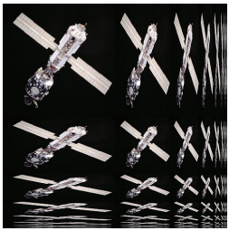
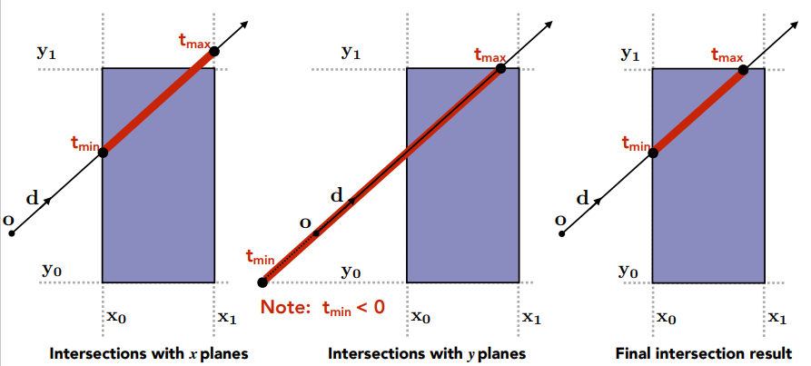
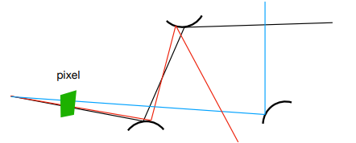

# Section 1 线代复习
## 向量
单位向量：长度为1的向量
向量的模：$\parallel \vec{a} \parallel = \sqrt{x^2+y^2}$
向量归一化：$\hat{a} = \vec{a}/\parallel \vec{a} \parallel$
向量加法
* 几何做法：平行四边形法则/三角形法则
* 代数做法：坐标对应位置相加

### 向量乘法
#### 点乘

* 向量点乘的结果是一个数
* 向量点乘具有交换律、结合律、分配率
* 点乘可以用来计算$cos\theta$
* 点乘可以用来计算向量投影
  $$\vec{b_\bot}=\parallel\vec{b}\parallel\cos\theta \hat{a}$$
* 几何形式公式：
$$
\vec{a} \cdot \vec{b} = \parallel\vec{a}\parallel\parallel\vec{b}\parallel\cos\theta
$$
* 代数形式公式：
$$
\vec{a} \cdot \vec{b}=
\begin{pmatrix}
x_a\\
y_a\\
z_a
\end{pmatrix} \cdot
\begin{pmatrix}
x_b\\
y_b\\
z_b
\end{pmatrix}
=x_ax_b+y_ay_b+z_az_b
$$

#### 叉乘

* 向量叉乘的结果还是一个向量
* 向量叉乘与初始结果正交
* 叉乘结果由右手定则决定。如上图，右手由$\vec{a}$向$\vec{b}$的方向握，大拇指指向的方向
* 向量叉乘不具有交换律 $\vec{a}\times \vec{b} = -\vec{b} \times \vec{a}$
* 代数形式公式
$$
\vec{a}\times \vec{b} = 
\begin{pmatrix}
y_az_b-y_bz_a\\
z_ax_b-x_az_b\\
x_ay_b-y_ax_b
\end{pmatrix}
$$
* 向量叉乘可以用于判断向量a在b的左和右，还可以判断一个点是否在一个三角形的内和外。

### 标准正交基和坐标系
任意三个模为1，且两两正交的向量，构成一组三维空间的标准正交基。

# Section 2 变换
MVP：model view projection。代表从 在空间中放置物体 到 将空间中物体映射到摄像头中 这一过程。
* model transformation：这个过程代表先在空间中放置所有物体，
* view transformation：再将摄像头变换到原点（同步变换所有物体位置）
* projection transformation：再将物体投影到长宽高都在(-1,1)之间的标准正方体中。

## 模型变换
* 缩放变换
$$
\begin{bmatrix}
x^\prime\\
y^\prime\\
\end{bmatrix}=\begin{bmatrix}
s_x&0\\
0&s_y\\
\end{bmatrix}\begin{bmatrix}
x\\
y\\
\end{bmatrix}
$$
* 翻转变换
$$
\begin{bmatrix}
x^\prime\\
y^\prime\\
\end{bmatrix}=\begin{bmatrix}
-1&0\\
0&1\\
\end{bmatrix}\begin{bmatrix}
x\\
y\\
\end{bmatrix}
$$
* 旋转变换

$$
\begin{bmatrix}
x^\prime\\
y^\prime\\
\end{bmatrix}=\begin{bmatrix}
\cos\theta&-\sin\theta\\
\sin\theta&\cos\theta\\
\end{bmatrix}\begin{bmatrix}
x\\
y\\
\end{bmatrix}
$$
* 线性变换
$$
\begin{bmatrix}
x^\prime\\
y^\prime\\
\end{bmatrix}=\begin{bmatrix}
a&b\\
c&d\\
\end{bmatrix}\begin{bmatrix}
x\\
y\\
\end{bmatrix}
$$
### 齐次坐标系
齐次坐标系：笛卡尔坐标系下的向量(x,y)在齐次坐标系下是(x,y,0)，点(x,y)在齐次坐标系下是(x,y,1)。对于点(x,y,z)，如果z不为0，那么表示笛卡尔坐标系下的(x/z,y/z)，如果z为0，那么表示一个无穷远点。齐次坐标系可以用于区分向量和点，可以用一个矩阵实现仿射变换。

* 仿射变换：线性变换+平移
  * 笛卡尔坐标系下：无法用一个矩阵表示仿射变换
$$
\begin{bmatrix}
x^\prime\\
y^\prime\\
\end{bmatrix}=\begin{bmatrix}
a&b\\
c&d\\
\end{bmatrix}\begin{bmatrix}
x\\
y\\
\end{bmatrix}+\begin{bmatrix}
t_x\\
t_y\\
\end{bmatrix}
$$
  * 齐次坐标系下：可以用一个矩阵表示仿射变换
$$
\begin{bmatrix}
x^\prime\\
y^\prime\\
1
\end{bmatrix}=\begin{bmatrix}
a&b&t_x\\
c&d&t_y\\
0&0&1
\end{bmatrix}\begin{bmatrix}
x\\
y\\
1
\end{bmatrix}
$$

* 绕给定点旋转：$T(c)\cdot R(\alpha)\cdot T(-c)$
    * 先利用平移变换将给定点移动到原点位置$T(-c)$
    * 再利用旋转变换进行旋转$R(\alpha)$
    * 再利用平移变换将给定点从原点移回去$T(c)$

* 3D 绕轴旋转
$$
R_x(\alpha) = 
\begin{pmatrix}
1&0&0&0\\
0&\cos\alpha&-\sin\alpha&0\\
0&\sin\alpha&\cos\alpha&0\\
0&0&0&1
\end{pmatrix}
$$
$$
R_y(\alpha) = 
\begin{pmatrix}
\cos\alpha&0&\sin\alpha&0\\
0&1&0&0\\
-\sin\alpha&0&\cos\alpha&0\\
0&0&0&1
\end{pmatrix}
$$
$$
R_z(\alpha) = 
\begin{pmatrix}
\cos\alpha&-\sin\alpha&0&0\\
\sin\alpha&\cos\alpha&0&0\\
0&0&1&0\\
0&0&0&1
\end{pmatrix}
$$

* 3D 绕过原点的轴旋转 
$$
R(n, \alpha) = \cos(\alpha)\mathbf{I} + (1-\cos(\alpha))\mathbf{nn}^T+\sin(\alpha)
\begin{pmatrix}
0&-n_z&0\\
n_z&0&-n_x\\
-n_y&n_x&0\\
\end{pmatrix}
$$

## view变换

假设相机位置为$\vec{e}$，朝向为$\hat{g}$，上方为$\hat{t}$
1. 需要将相机位置移动(0,0,0)
$$
T_{view} = \begin{bmatrix}
1&0&0&-x_e\\
0&1&0&-y_e\\
0&0&1&-z_e\\
0&0&0&1
\end{bmatrix}
$$
2. 将相机进行旋转。$\hat{g}$旋转到$-\hat{z}$方向，$\hat{t}$旋转到$\hat{x}$方向，$\hat{g}\times \hat{t}$旋转到$\hat{x}$方向。
$$
R_{view}^T = R^{-1}_{view}=
\begin{bmatrix}
x_{\hat{g}\times\hat{t}}&x_t&x_{-g}&0\\
y_{\hat{g}\times\hat{t}}&y_t&y_{-g}&0\\
z_{\hat{g}\times\hat{t}}&z_t&z_{-g}&0\\
0&0&0&1
\end{bmatrix}
$$
3. View transformation矩阵
$$
M_{view} = R_{view} T_{view}
$$

## 投影变换
* 透视投影（Perspective Projection）：存在近大远小现象。
* 正交投影（Orthographic projection）：不存在近大远小现象。

viewport：视口，视口代表了一个可看见的多边形区域（通常来说是矩形）
fov：field of view。视角，是一个角度
aspect ratio：横纵比。定义为 宽/高。
### 正交投影

1. 将立方体平移到中间
$$
T_{center} = \begin{bmatrix}
1&0&0&-{{r+l}\over{2}}\\
0&1&0&-{{t+b}\over{2}}\\
0&0&1&-{{n+f}\over{2}}\\
0&0&0&1
\end{bmatrix}
$$
2. 将立方体缩放到标准立方体
$$
T_{scale} = \begin{bmatrix}
2\over{r-l}&0&0&0\\
0&2\over{t-b}&0&0\\
0&0&2\over{n-f}&0\\
0&0&0&1
\end{bmatrix}
$$
3. 正交变换矩阵
$$
M_{ortho} = T_{scale}T_{center}
$$

### 透视投影


1. 将截头椎体变换成立方体
$$
M_{persp->ortho} = \begin{bmatrix}
n&0&0&0\\
0&n&0&0\\
0&0&n+f&-nf\\
0&0&1&0
\end{bmatrix}
$$
2. 执行正交投影矩阵变换
3. 透视变换矩阵
$$
M_{persp}=M_{ortho}M_{persp->ortho}
$$


# Section 3 光栅化
Raster：光栅，德语中屏幕的单词。
* 首先需要将三维的标准立方体转换为二维的平面，因为屏幕是二维的
* 再对二维平面进行采样（离散化），因为屏幕是离散的。

## 标准立方体 to 平面
光栅化就是把标准正方体映射到屏幕上。
* 再把`xy`平面从$[-1,1]^2$映射到$[0,width] \times [0,height]$（利用下面那个矩阵做矩阵变换就行了）
* 视点变换矩阵
$$
M_{viewport}(\alpha) = 
\begin{pmatrix}
width\over2&0&0&width\over2\\
0&height\over2&0&height\over2\\
0&0&1&0\\
0&0&0&1
\end{pmatrix}
$$
* 最后把正方体内一切物体的z方向给去掉进行降维。即可形成一张可以映射在屏幕中的图像。

## 采样
模型由三角网格组成。三角新是最基本的多边形、内外有良好的定义。可以对三角形内部的值进行采样 以映射到屏幕像素值上。

### 简单采样
像素中心点在三角形内部则进行采样。
伪代码：
```c
for (int x=0; x<xmax; x++) 
    for (int y=0; y<ymax; y++)
        image[x][y] = inside(tri, x+0.5, y+0.5);
```
采样会带来锯齿问题


### 锯齿
Aliasing，走样。反走样：antialiasing
Artifacts：一切看上去不太对的东西。中文可以翻译成瑕疵。
artifacts包含：锯齿（jaggies）、摩尔纹（moire pattern）、车轮效应
一切artifacts的本质都是信号改变的太快了，而采样率太低。

先进行模糊，再进行采样。效果会更好。


采样率不够会导致频谱重叠

先模糊再采样相当于先使用低通滤波，再进行采样


### 通过超采样抗锯齿
超分辨率：利用深度学习等方式，将低像素的图像转换为高像素图像。（DLSS）
超采样：增加采样率。比如可以一个像素分为多个格子采样多次，然后对结果取平均。


* MSAA
* FXAA
* TAA

## 遮挡处理
当平面中存在多个三角形，这些三角形之间可能存在重叠关系，需要有特定的手段来对这种遮挡问题进行处理。


### Z-Buffer
利用一个z-buffer存储每个像素的最浅深度（为了简单起见，z值恒为正。z越小代表越近，z越大代表越远），遍历所有三角形，再遍历所有三角形的采样点，如果该采样点深度比z-buffer中更近则更新。否则忽略该采样点。
frame buffer存储颜色值。

```c
for (each triangle T)
    for (each sample(x,y,z) in T) 
        if (z < zbuffer[x,y])
            framebuffer[x,y] = rgb;
            zbuffer[x,y] = z;
        else // do nothing
```

时间复杂度：O(n)。n代表n个三角形。默认每个三角形中的采样点是常数个。
z-buffer处理不了透明物体，透明物体需要特殊处理。

# Section4 着色
着色（shading）是将材料应用到物体上的过程。shading!=shadow，着色不等于阴影

## blinn-phong 着色模型
blinn-phong 着色模型考虑三种类型的光，分别是环境光反射、漫反射光和镜面反射光。

反射是局部的，一个点的反射包含以下一些参数
* 观测方向：$\hat{v}$
* 物体表面法向量：$\hat{n}$
* 光照方向：$\hat{l}$
* 光照方向与法线方向的夹角为$\theta$
* 物体表面参数：颜色、亮度、反射率


### 漫反射
* 漫反射代表光打到一个点上之后被均匀的向四周进行反射。即只考虑漫反射的情况下，不管观测者在什么角度，物体表面的颜色和亮度都完全一样。

* 漫反射的强度与观测者的距离呈平方反比。原因在于球的表面积和球的半径呈平方反比。


* 光束照射的面积随夹角$\theta$的增加而增加，因此单位面积的光照强度就变小了。假设直射的面积为1，那么夹角为$\theta$的面积就是$1/\cos\theta$。因此漫反射光线强度计算公式为$\cos\theta=\hat l \cdot \hat n$


* 观察者接收到某一点的漫反射光线强度公式为：
$$
L_d=k_d({\mathbf{I}\over r^2})\max(0,\hat n \cdot \hat l)
$$
其中$\mathbf{I}$是当距离为1时假想的光强度。**$k_d$是漫反射系数，实际上可以理解成颜色，$L_d$也可以理解成颜色**，因为RGB代表对应颜色光的强度。


### 镜面反射
* 镜面反射的强度取决于观察方向。只有在有限的角度时才能观察到镜面反射。
* 可以利用光照向量和观察向量的半程向量 与 法向量的远近（夹角）来衡量 观察方向和反射方向的远近。
* 观察者接收到某一点的镜面反射强度公式为
  $$
  L_s=K_s({\mathbf{I} \over r^2})\max (0,\cos\alpha)^p
  $$
* 指数$p$的作用是将$cos\alpha$值变小，这样当观察视角稍微偏一点就看不到高光了，这和物理世界更接近，blinn-phong模型中指数$p$一般在100~200之间。
  

### 环境光
* 把环境光大胆假设成一个常数了。实际上就是计算完漫反射和镜面反射之后再整体提升一个亮度。
* 环境光公式为：
$$
L_a=k_a\mathbf{I}_a
$$
### 最终结果
公式如下：
$$
L=L_a+L_d+L_s
$$


## 着色频率
### flat shading
* 先求平面法线
* 对整个三角形着色

### gouraud shading
* 先求顶点法线
* 再对每个顶点进行着色
* 三角形内部颜色通过插值实现

怎么求顶点法线：顶点法线是相邻面的法线的加权平均，权重是三角形面积。


### phong shading
* 每个像素求法线，可以用重心插值来实现。
* 每个像素进行着色
* phong shading指的是一种着色频率。blinn-phong是一种着色模型

## 图形管线（实时渲染管线）
图形管线：graphic pipeline。实际上就是图像渲染流程。

* 输入是一堆空间中的点以及它们连成的三角形
* 将三维空间中的点投影到屏幕上去并形成三角形
* 光栅化，将三角形离散成为一个个像素（或者fragment）
* 对每个像素进行着色

## 重心坐标
* **线段中任意点的重心坐标**：可以理解成，如果点$P$处存在一个支点，那么点$A$和点$B$分别施加多少单位的力可以让系统平衡。整个线段的重心坐标就是支点$P$存在的位置，在这个位置时点$A$和点$B$施加的力是相同的。如图所示，点$P$的重心坐标可以表示成$(\alpha,\beta)$，其中$\alpha+\beta=1$。


* **三角形中任意点的重心坐标**：同样的，也可以理解成在任意点$P$处存在一个支点，那么在三角形的三个顶点$ABC$分别施加多少单位的力可以让系统平衡。显然在$ABC$点处施加力的比例关系就和顶点对面三角形的面积相关。如图所示，点$P$的重心坐标可以表示成$(\alpha, \beta, \gamma)$，其中$\alpha+\beta+\gamma=1$.

* 重心坐标也可以理解成在该点上，三角形三个顶点的属性对这个点的影响力。如下图所示，三角形中任意一点的颜色是三角形三个顶点颜色的加权平均。

* 当一个三维空间中的三角形投影到二维时，这个三角形内部点的重心坐标也会发生变化。因此当我们需要利用重心坐标来对某些三维空间中的属性做插值时，就需要计算三维空间中点的重心然后再三维空间做插值，然后将结果对应到而二维空间上去。
* 整个三角形的重心坐标是$\alpha=\beta=\gamma=1/3$

## 纹理
* 纹理可以认为是一张图，这张图可以覆盖在模型上，模型中的三角形可以认为和纹理中的某个三角形一一对应。
* 纹理上也有坐标系，（u，v）坐标系，u，v取值范围都在0~1之间，坐标系取值范围是约定俗成的。
* tileable texture 是指可以无缝衔接的纹理，即将纹理向各个方向复制不会出现边界。


纹理图像太大和太小都会出现问题。
* 纹理像素太低：多个屏幕像素对应一个纹理像素。会导致模糊，可以用双线性插值等做法将纹理变大

* 纹理像素太高：一个屏幕像素对应多个纹理像素（即采样率过低）。会导致Artifacts（走样）。


### 纹理像素太低
双线性插值实际上就是利用 矩形面积 求加权平均。


### 纹理像素太高
纹理像素太高会导致屏幕像素相对纹理像素的采样率过低，使用超采样可以改善效果，但是资源消耗太大。Mipmap可以快速实现一个正方形范围内的平均值查找操作。

#### Mipmap
mipmap用于正方形的范围查询，速度快，资源消耗低（内存多占用1/3），只查询近似值。实际上和CV里的图像金字塔概念完全一样。做法是将原texture每次边长变为原来的一半得到图像金字塔。


1. 对于一个像素p，在纹理空间中找到这个像素p的中心点。
2. 在纹理空间找到近似一个像素（屏幕空间）的长度：当前像素的中心点和上下左右像素的中心点距离为一个像素，将这五个点全都映射到纹理空间中，计算四个点和当前像素中心点在纹理空间中的距离，取最长的那个作为一个像素的长度L。（找近似的正方形不是关键，只要能找到一个近似的即可）

3. 以该像素中心点为中心，以L为正方形边长近似获取像素p在纹理空间中的位置。
4. 求该矩形中的颜色平均值。比如找到的正方形边长为1.8，那么分别在第一层和第二层中找到中心点，用双线性插值分别在第一层和第二层中找到相邻四个像素的平均值。然后再对得到的两个值进行插值得到最终的值。

5. 将得到的颜色映射到屏幕当中。

屏幕空间中的像素对应到纹理空间可能是长条形的，无法处理长条形。


#### Anisotropic Filtering
Anisotropic Filtering：各向异性过滤。实际上就是考虑到了多个不同的长宽比。整体内存占用为原来的三倍。


#### EWA filtering
Anisotropic Filtering只考虑了长宽比，无法解决矩形斜着的问题。


### 纹理应用
纹理可以进一步泛化成一块内存数据+范围查询，没必要非要限制在颜色上。
* 环境光贴图Environment Map：在一个环境中放可以全反射自然光的球体，这个球体中记录的就可以认为是这个环境的自然光。球体展开成平面四周会有扭曲。可以将一个球体中的各个点沿着法线的方向向四周扩散打到一个立方体上，然后再让立方体展开。

* 凹凸贴图：在纹理中记录相对高度/法线，可以实现在不修改模型的情况下虚拟的让模型对应点在原来的基础上沿着法线距离移动一定的高度。高度发生变化了会导致法向量发生变化，进一步导致shading结果发生变化。把任何一个像素的法线做一个扰动（通过当前位置高度和邻近位置的高度差计算法线）
    * 二维
      * 定义原本法线为`(0,1)`
      * 用差分方法求近似切线`dp=c*[h(p+1)-h(p)]`。（`c`是引入的参数，用于衡量凹凸贴图的影响大不大）
      * 法线垂直于切线，`n(p)=(-dp, 1)`
      * 将局部的法线映射回原世界坐标系中

    * 三维
      * 定义原本法线为`(0,0,1)`
      * 用差分方法求近似切线
        * `dp/du=c1*[h(u+1)-h(u)]`
        * `dp/dv=c2*[h(v+1)-h(v)]`
      * 法线`(-dp/du,-dp/dv,1).normalized()`
      * 将局部的法线映射回原世界坐标系中
* 三维程序噪音
* 预计算的阴影
* 三维纹理和体积渲染

# Section5 几何
隐式表示：判断里外很简单，判断一个点在不在表面上也很简单。但是很难直观看到几何形体的形状。
显式表示：判断里外和一个点在不在表面上很困难。但是能够直观看到几何形体的形状。

## 隐式表示
告诉你点满足特定的关系，而不是告诉你点具体在哪里。如$x^2+y^2+z^2=1$代表一个球体。更普遍的$f(x,y,z)=0$用于描述一个表面。

隐式表示方法 ：
* Algebraic Surfaces：用数学公式给出点满足某些关系。缺点是不直观。
* Construtive Solid Geometry：利用布尔操作（如交、并）结合几个简单的几何以构成较为复杂的几何。
* Signed Distance Functions：给出一个点和曲面最近点的距离。距离为0的则是表面，距离为负则代表在里面。有了SDF可以很方便的融合两个曲面，直接取两个SDF的最小值即可。[参考1](https://iquilezles.org/articles/distgradfunctions2d/) [参考2](https://blog.csdn.net/qq_41368247/article/details/106194092)
* Level Set Methods：SDF有时候很难表示复杂形体，此时可以存储一个grid来表示距离，然后利用双线性插值就能找到距离为0的曲面。
* Fractals：用于描述自相似的几何。

## 显示表示
直接给出特定的点，或通过参数映射的方式给出特定的点。只要点足够细，就能近似成一个平面。
参数映射：如$f(u,v)=((2+\cos u)\cos v, (2+\cos u)\sin v, \sin u)$。从$(u,v)$映射成$(x,y,z)$，只要遍历$(u,v)$即可知道$(x,y,z)$。

显示表示方法：
* 点云：一系列的点（xyz），这些点都是物体表面。
* 多边形网格：存储点和多边形（通常是三角形或四边形）：易于做processing/simulation，adaptive sampling


## 曲线

### 贝塞尔曲线
用一系列控制点去定义曲线。一般对于一个复杂曲线，会用多段贝塞尔曲线，每一段贝塞尔曲线都有四个控制点。两段贝塞尔曲线想要一阶可导，就需要拼接处的切线方向和大小都一致。

性质：
* 控制点经过仿射变换后，曲线会经过同步的仿射变换
* 曲线不会超过给定控制点的凸包范围内

贝塞尔曲线可视化生成：
* 一次贝塞尔曲线：$\mathbf{b_1}(t)=(1-t)\mathbf{P_0}+t\mathbf{P_1}$

* 二次贝塞尔曲线：$\mathbf{b_2}(t)=(1-t)^2\mathbf{P_0}+2t(1-t)\mathbf{P_1}+t^2\mathbf{P_12}$

* 三次贝塞尔曲线：$\mathbf{b_2}(t)=(1-t)^3\mathbf{P_0}+3t(1-t)^2\mathbf{P_1}+3t^2(1-t)\mathbf{P_2}+t^3\mathbf{P_3}$

* 四次贝塞尔曲线：系数是$(1,4,6,4,1)$


## Surface（曲面）
### 贝塞尔曲面
贝塞尔曲面是由贝塞尔曲线推广得来。如下所示是由4*4个控制点得来的贝塞尔曲面，首先由四组控制点得到四个贝塞尔曲线，然后在四个贝塞尔曲线上取四个点作为控制点生成新的贝塞尔曲线，这条贝塞尔曲线扫描过去就可以得到一个贝塞尔曲面。


### 网格细分：
#### Loop Subdivision
* 首先新增更多的顶点：将每个三角形拆成四个三角形，三角形三条边的中心各自增长一个顶点。

* 其次调整原先顶点的位置


#### Catmull-Clark Subdivision
Loop细分只能用于三角形面，Catmull-Clark细分可以用于任意面
非四边形面：不是四边形的面
奇异点：度不为4的点

* 每个边上取中点，每个面也取一个点（可以是重心）。将面中的点和周围边上的点相连形成新的四边形。非四边形面细分后会生成一个奇异点。一次细分后所有的非四边形面都会消失。
* 调整点


### 网格简化
每次对三角形坍缩一条边就相当于去掉了这条边相邻的两个三角形。那么每次选择哪条边坍缩呢？一种贪心的思想是：衡量每次坍缩边带来的损失，每次选择损失最小的边进行坍缩，不能保证是全局最优的。使用二次度量误差来衡量损失。

二次误差度量：新的点和它相关联的面距离的平方和。

* 计算所有边的二次度量误差并组织成堆结构
* 每次弹出堆顶，然后进行坍缩，同时更新受影响的边的二次度量误差

# Section 6 光线追踪
## shadow map
**shadow map**：类似z-buffer一样，从光源处构造一个深度buffer，存储在shadow map中。当$\text{distance(light, shading point)} \approx \text{depth on the shadow map}$时，则认为该点不在阴影中（如下图的绿色部分，光源在左上角）。


**shadow map 的问题**
* 产生的是硬阴影，即阴影的边界分明
* 质量取决于shadow map的分辨率
* 需要进行浮点型判断相等

**光线追踪的优势**
* 能够产生软阴影
* 光线能够弹射不止一次，能够更加真实的描述物理世界

## Whitted-Style 光线追踪
**光线性质**
* 光线是沿着直线传播的
* 光线不会发生碰撞
* 光路具有可逆性（reciprocity）

Whitted-Style 光线追踪考虑了直接光照与间接光照，即考虑了光线的反射，比光栅化更接近现实。
* **直接光照**：由于光路具有可逆性，因此我们可以认为是人眼射出光线。人眼射出光线与第一个物体相交于点$P$，连接$P$与光源$L$，如果$LP$可达那么则认为该点未被遮挡，利用Blinn-Phong模型对这个点进行着色即可。
* **间接光照**：上一步交于点$P$后计算其折射方向，光继续沿折射方向与其它物体交于点$P_1$，再连接$P_1$与光源$L$，如果$LP_1$可达，那么光线就能够从光源$L$射到$P_1$再折射到$P$再射到人眼。


### 计算光线与面相交
**光线定义**：$\mathbf{r}(t)$是一条射线。$\mathbf{o}$是起点，$\mathbf{d}$是方向。
$$\mathbf{r}(t)=\mathbf{o}+t\mathbf{d} \qquad (t>=0)$$

**光线怎么和隐式表面求交点**：假设物体的隐式表面的表达式为$f(\mathbf{p})$，那么$\mathbf{r}(t)$和$f(\mathbf{p})$的交点一定可以同时写成这两种形式，即$f(\mathbf{o}+t\mathbf{d})=0$

任意一个封闭曲线，任意一个点。从点出发向任意方向做射线，如果这个射线和封闭曲线的交点为奇数个，那么这个点在曲线外，否则在曲线内。

**光线和平面求交点**：
**平面定义**：一切$\mathbf{p}$点的集合，其中$\mathbf{p}$满足$(\mathbf{p}-\mathbf{p}\prime)\cdot \mathbf{N}=0$。其中$\mathbf{p}\prime$是平面上一个确定的点。
**光线和平面求交点**：$(\mathbf{o}+t\mathbf{d}-\mathbf{p}\prime)\cdot \mathbf{N}=0$。如果$t>=0$则代表有交点。
$$
t={(\mathbf{p\prime}-\mathbf{o})\cdot \mathbf{N} \over \mathbf{d} \cdot \mathbf{N}}
$$


**光线和三角形求交点**：
一般方法：首先确定三角形所在平面，然后利用光线和平面求交点，然后判断交点是否在三角形内。

Moller-Trumbore算法：利用齐次方程组和重心坐标可以直接判断是否在三角形内：如下图所示，列出齐次方程组，求出$t,b_1,b_2$，然后判断重心坐标是否都是正的，如果是则说明在三角形内，当然还需要判断$t>=0$。


**光线与三角形网格求交点**
可以计算每个三角形是否和光线存在交点。但是这样实在太慢了，需要某种方式进行加速，下一小节进行介绍。

### 光线与三角形网格求交点

#### 光线与包围盒求交点
**包围盒**：可以把空间划分成一个个的盒子，光线如果碰不到包围盒，那包围盒里面的东西肯定都碰不到。 如果包围盒的六个面分别和三个坐标轴平行，那么就称之为**轴对齐包围盒**（Axis-Aligned Bounding Box, **AABB**）。

**如何判断光线是否和包围盒有交点**：
由于包围盒的六个面都是平行于坐标轴的。对于一个平行于x轴的平面，$t={\mathbf{p\prime}_x-\mathbf{o}_x\over{\mathbf{d}}_x}$
* 首先计算所有的光线和所有三对平面的交点，每一对平面都有一个$t_{min}$和$t_{max}$。
* 再计算 $t_{enter}=\max(t_{min}),t_{exit}=\min(t_{max})$
* $t_{exit}>=0 \text{ and } t_{exit} > t_{enter}$则说明光线与盒子存在交点。
  * $t_{exit}<0$代表盒子在光线后面。
  * 如果 $t_{exit}>t_{enter}>0$ 那么说明光线在盒子内逗留了一段时间
  * $t_{exit}>=0 \text{ and } t_{enter} < 0$代表光源在盒子内。



#### 如何划分格子
**格子法**：把空间分成一个个的格子，如果光线和格子不存在相交，那么和格子内物体也不存在相交。格子法在空间中物体比较均匀的时候合适，但是如果“一个运动场中的一个茶壶”这种场景就效率很低了。接下来介绍几种格子的划分方式。

**空间划分**
* Oct-Tree：八叉树，均匀划分空间，每次将一个空间划分成八个。如果是四维空间就需要划分成16个。复杂度与空间维度呈指数关系。
* KD-Tree：复杂度与空间维度无关。每次将一个空间划分为两半。利用二叉树进行存储。
  * 非叶子结点：存储对哪个轴进行划分，存储划分的坐标，保持指向子节点的指针
  * 叶子结点：存放物体
* BSP-Tree。将空间划分成不均匀的部分。


**物体划分**：
* Bounding Volume Hierarchy（BVH）
  * BVH中一个物体不会出现在多个盒子里，避免了KD tree的问题
  * BVH的bbox是可以相交的
* BVH做法：
  * 找到BBox
  * 递归的将物体划分为两个部分
  * 重新计算两个部分的BBox
* 如何划分物体：
  * 每次都选择对最长的那条边进行划分
  * 选择中间的物体（三角形重心作为标准进行排序，利用划分的思想，可以在O(n)时间内解决）  ，以此为界划分两半


## 现代光追
由于Blinn-Phong模型和Whitted-Style光线追踪不是对真实物理世界的精确描述。因此需要引入辐射度量学来精确定义和光相关的某些物理量。

Whitted-Style Ray Tracing有几个不符合物理规律的假设。
* Always perform specular reflections / refractions
* Stop bouncing at diffuse surfaces

### 辐射度量学
**Radiant energy**
辐射能量，单位是焦耳（Joule）。用$Q$表示。

**Radiant flux**
辐射通量，单位时间内（接收、传播、反射、发出）的能量。用$\Phi$表示，单位是功率（Watt）或者流明（lm，lumen）。$\Phi={\text{d}Q \over \text{d}t}$

**Radiant intensity**
辐射强度，具有方向性。一个立体角上对应的能量。用$I(\omega)$表示，$I(\omega)\equiv{\text d \Phi \over \text d \omega}$。其中$\omega$是单位立体角，本质上是一个方向，也就是单位向量。即$I(\omega)$可以理解成从某个方向上射过来的能量大小。

**irradiance**
一个物体表面接收到多少光的能量。一个面积（这个面积必须是投影面积）上对应的能量。$E(\mathbf{x}) \equiv {\text d\Phi(\mathbf{x}) \over \text d A}$

**radiance**
光线在传播中的能量度量。 从某个方向过来， 被一个面积接收到的能量。$L(p,\omega)={\text d^2\Phi(\text p,\omega) \over \text d \omega \text d A\cos\theta}={\text{d}I(p,\omega) \over \text{d}A\cos\theta}$


**立体角**
二维角度在三维上的推广。二维角度是弧长除以半径（$\theta={l \over r}$），三维立体角就是面积除以半径平方（$\Omega={A\over r^2}$）。二维圆的角度是$2\pi$，三维球体的角度是$4\pi$。$\text d \Omega = \omega = {\text d A \over r^2}=\sin\theta\text d\theta\text d \phi$


**radiance和irradiance对比**
Radiance：某个面积$\text dA$从某个方向进来的总能量。
Irradiance：某个面积$\text dA$接收到的总能量。Irradiance就是四面八方的Radiance的积分。

### BRDF 和 The Rendering Equation
**BRDF**
Bidirectional Reflectance Distribution Function。是一个公式，这个公式代表的是：从$\omega_i$方向来的能量，会有多少从$\omega_o$方向反射出去。后面中括号是单位。下式就是BRDF公式
$$
f_o(\omega_i \rightarrow \omega_o)={\text{d}L_o(\omega_o) \over \text{d}E_i(\omega_i)}={\text{d}L_o(\omega_o) \over L_i(\omega_i)\cos\theta_i \text{d}\omega_i} \quad \left[{1 \over sr}\right]
$$

**The Rendering Equation**
下式中的$\Omega^+$代表的是半球。下式可以理解成：把每个方向入射的光线到$\omega_o$方向出射光线的贡献全都累加起来，同时加上自身发光，那么就能得到这一点在$\omega_o$的出射光线。其中$\cos\theta=n\cdot \omega_i$，这一项的存在是因为入射光线需要在法线上做投影。
$$
L_o(p,\omega_o)=L_e(p,\omega_o)+\int_{\Omega^+}L_i(p,\omega_i)f_r(p,\omega_i,\omega_o)(n\cdot\omega_i)\text{d}\omega_i
$$


### Path Tracing
#### Monte Carlo Integration
这是一种求积分的方式，本质上是利用了大数定理，在积分区间内多次采样求面积的平均，就可以认为采样求平均得到的面积是真实积分面积。其中$p(x)$是**概率密度函数pdf（probability density function）**
$$
\int f(x)\text{d}x={1\over N}\sum_{i=1}^N{f(X_i)\over p(X_i)} \qquad X_i \sim p(x)
$$

如果$X_i \sim p(x)={1\over b-a}$，即满足均匀分布的话，那么
$$
\int_a^b f(x)\text{d}x={b-a \over N}\sum_{i=1}^N f(X_i) \qquad X_i \sim p(x)={1\over b-a}
$$


#### Path Tracing
**路径追踪公式与伪代码**
不考虑物体本身发光，将The Rendering Equation和Monte Carlo Integration结合起来可以得到下面式子，观察下面式子，可以发现是一个递归的过程。如果光线打到了光源，那么$L_i(p,\omega_i)$就是光源发出的radiance。如果光线没有打到光源，那么就需要递归计算$L_i(p,\omega_i)$。
$$
L_o(p,\omega_o)\approx {1 \over N} \sum_{i=1}^N{L_i(p,\omega_i)f_r(p,\omega_i,\omega_o)(n\cdot\omega_i) \over p(\omega_i)}
$$
```txt
shade(p,wo)
    随机选择N条光线，wi~pdf
    Lo=0.0
    for each wi
        发出一条光线r(p,wi)
        if 光线r打中了非发光物体q
            Lo += (1/N) * shade(q, -wi) * f_r * cosθ / pdf
        else 光线r打中了光源
            Lo += (1/N) * L_i * f_r * cosθ / pdf
    return Lo
```

**此外，还有一些需要考虑的点**
1. 只生成一条光线
如果在每一个shading point随机生成N条光线，那么经过几次折射之后光路数量就太多了。由于最终成像的结果是放在pixel中的，因此可以经过pixel生成多个光线，然后每条光线打到shading point只随机生成一条光线，然后将多条光路的结果求加权平均（简单起见直接求平均也可以）就能得到这个pixel的正确颜色，从pixel打出的光线越多则颜色越准确。


2. 俄罗斯轮盘赌
由于算法是递归的，递归结束条件是光线打到光源，因此存在光线永远无法到达光源的情况。可以通过俄罗斯轮盘赌解决问题。具体做法是：每次光线将要发生弹射时，都以$p$为概率进行弹射，也就是说每次都有$(1-p)$的概率不进行弹射。假设正常情况下返回的光线强度为$L_o$，那么使用俄罗斯轮盘赌如果最终打到光源了，返回的光线强度是$L_o/P$，如果该光线最终消亡了，那么返回的光线强度为0，可以证明光线返回的数学期望还是$L_o$。

3. 重要性采样
由于光线是从pixel随机射出的，那么就会有很多光线最终无法射到光源上，导致浪费计算资源。解决办法是：不在半球体内均匀采样，而是在“光源在半球上的投影”范围内做均匀采样。这种做法就是将半球划分为两个部分，“光源投影”部分和非“光源投影”部分，如果是点光源，可以考虑将点光源看成一个面积很小的面光源。光源面积为A，对光源投影的微分可以写成如下形式：
$$
\text{d}\omega={\text{d}A\cos\theta^\prime \over \Vert x^\prime-x\Vert^2}
$$
对光源投影的渲染方程可以写成如下形式，在光源处随机采样的概率密度函数（pdf）为$1/A$：
$$
L_o(x,\omega_o)=\int_{A}L_i(x,\omega_i)f_r(x,\omega_i,\omega_o){\cos\theta\cos\theta^\prime \over \Vert x^\prime-x\Vert^2}\text{d}A
$$


**最终形式的路径追踪算法伪代码如下所示**
```txt
shade(p,wo)
    对光源位置进行采样，采样位置为x'，pdf_light=1/A
    L_dir = 0.0
    if (p到x'可达) 
        L_dir = L_i * f_r * cosθ * cosθ' / (x'-p)^2 / pdf_light
    
    L_indir = 0.0
    俄罗斯轮盘赌概率为P_RR
    if (random num > P_RR) return 0.0

    对半球进行采样，采样位置为wi，pdf_hemi=1/2pi
    发出一条光线r(p,wi)
    if 光线r打中了非发光物体q
        L_indir = shade(q, -wi) * f_r * cosθ / pdf_hemi / P_RR
    return L_dir + L_indir
```