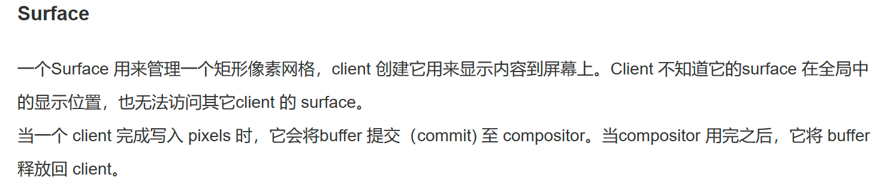

```c++
/**
 * @brief Submit the input buffer filled with data to the video decoder. The {@link OH_AVCodecOnNeedInputBuffer}
 * callback will report the available input buffer and the corresponding index value. Once the buffer with the
 * specified index is submitted to the video decoder, the buffer cannot be accessed again until the
 * {@link OH_AVCodecOnNeedInputBuffer} callback is received again reporting that the buffer with the same index is
 * available. In addition, for some decoders, it is required to input Codec-Specific-Data to the decoder at the
 * beginning to initialize the decoding process of the decoder, such as PPS/SPS data in H264 format.
 * @syscap SystemCapability.Multimedia.Media.VideoDecoder
 * @param codec Pointer to an OH_AVCodec instance
 * @param index The index of the input buffer.
 * @return Returns AV_ERR_OK if the execution is successful,
 * otherwise returns a specific error code, refer to {@link OH_AVErrCode}.
 * {@link AV_ERR_NO_MEMORY}, instance has already released.
 * {@link AV_ERR_INVALID_VAL}, the decoder is nullptr or invalid.
 * Buffer index should be given by {@link OH_AVCodecOnNeedInputBuffer}.
 * {@link AV_ERR_UNKNOWN}, unknown error.
 * {@link AV_ERR_SERVICE_DIED}, avcodec service is died.
 * {@link AV_ERR_INVALID_STATE}, this interface was called in invalid state.
 * {@link AV_ERR_DRM_DECRYPT_FAILED}, the drm-protected video buffer is decrypted failed,
 * it is recommended to check the logs.
 * @since 11
 */
OH_AVErrCode OH_VideoDecoder_PushInputBuffer(OH_AVCodec *codec, uint32_t index);

/**
 * @brief Return the processed output Buffer to the decoder, and notify the decoder to finish rendering the
 * decoded data contained in the Buffer on the output Surface. If the output surface is not configured before,
 * calling this interface only returns the output buffer corresponding to the specified index to the decoder.
 * @syscap SystemCapability.Multimedia.Media.VideoDecoder
 * @param codec Pointer to an OH_AVCodec instance
 * @param index The index value corresponding to the output Buffer
 * @return Returns AV_ERR_OK if the execution is successful,
 * otherwise returns a specific error code, refer to {@link OH_AVErrCode}.
 * {@link AV_ERR_NO_MEMORY}, instance has already released.
 * {@link AV_ERR_INVALID_VAL}, the decoder is nullptr or invalid.
 * Buffer index should be given by {@link OH_AVCodecOnNewOutputBuffer}.
 * {@link AV_ERR_UNKNOWN}, unknown error.
 * {@link AV_ERR_SERVICE_DIED}, avcodec service is died.
 * {@link AV_ERR_INVALID_STATE}, this interface was called in invalid state.
 * @since 11
 */
OH_AVErrCode OH_VideoDecoder_RenderOutputBuffer(OH_AVCodec *codec, uint32_t index);
```
OH_AVCodecOnNewOutputBuffer：
When new output data is generated during the operation of OH_AVCodec, the function pointer will be called and carry a Buffer containing the new output data.
在OH_AVCodec运行期间生成新的输出数据时，该函数指针将被调用，并携带一个包含新输出数据的缓冲区。

OH_AVCodecOnNeedInputBuffer：
When OH_AVCodec needs new input data during the running process,  the function pointer will be called and carry an available Buffer to fill in the new input data.

OH_VideoDecoder_RenderOutputBuffer
Return the processed output Buffer to the decoder, and notify the decoder to finish rendering the decoded data contained in the Buffer on the output Surface. If the output surface is not configured before, calling this interface only returns the output buffer corresponding to the specified index to the decoder. @syscap SystemCapability.Multimedia.Media.VideoDecoder
将处理后的输出缓冲区返回解码器，并通知解码器在输出表面完成对包含在缓冲区中的解码数据的渲染。如果输出表面未进行配置，则仅调用此接口仅将指定索引的输出缓冲区返回给解码器。


https://gitee.com/openharmony/graphic_surface_lite


https://ost.51cto.com/posts/9879


* OH_NativeImage_Create：
    1. 创建consumer，consumer创建BufferQueueConsumer和BufferQueueProducer，这两个都关联同一个BufferQueue。
    2. 用consumer的BufferQueueProducer赋值给自己的producer
    3. 创建一个监听surfaceImage的IBufferConsumerListener然后把这个listener注册给surfaceImage。
* OH_NativeImage_AcquireNativeWindow(OH_NativeImage* image)
    1. 正常是可以设计成类的成员函数，但是接口需要设计成实例无关的，image就是需要操作的OH_NativeImage实例。
    2. 让image的 pSurface 包含 producer
    3. 让image的 nativeWindow 包含 pSurface
    4. 返回image的 nativeWindow
* OH_NativeImage_UpdateSurfaceImage(OH_NativeImage* image)
* OH_NativeImage_SetOnFrameAvalableListener()
* OH_VideoDecocer_RenderOutputBuffer(): int32_t FCodec::RenderOutputBuffer(uint32_t index)
* OH_VideoDecoder_
* SetSurface(OH_AVCodec *codec, OHNativeWindow *window)

```c++
struct VideoDecoderObject : public OH_AVCodec {
    const std::shared_ptr<AVCodecVideoDecoder> videoDecoder_;  // 包含surface。在OH_VideoDecoder_SetSurface时传进来的。
    std::queue<OHOS::sptr<MFObjectMagic>> tempList_;
    std::unordered_map<uint32_t, OHOS::sptr<OH_AVBuffer>> outputBufferMap_;
    std::unordered_map<uint32_t, OHOS::sptr<OH_AVBuffer>> inputBufferMap_; 
}


struct OH_NativeImage {
    // OnFrameAvalibale回调就是给SurfaceImage设置的。
    OHOS::sptr<OHOS::SurfaceImage> consumer;     // 内部包含producer   在创建OH_NativeImage时创建。创建过程中会创建BufferQueueConsumer和BufferQueueProducer，这两个都关联同一个BufferQueue。
    OHOS::sptr<OHOS::IBufferProducer> producer;  // 在创建consumer后创建。 这个就是SurfaceImage的producer
    OHOS::sptr<OHOS::Surface> pSurface = nullptr; // 内部包含producer。实际类型是ProducerSurface。
    struct NativeWindow* nativeWindow = nullptr;  // 内部包含pSurface
};
// SurfaceImage extends from ConsumerSurface 
class SurfaceImage : public ConsumerSurface {
public:
    SurfaceImage(uint32_t textureId, uint32_t textureTarget = GL_TEXTURE_EXTERNAL_OES);
    SurfaceImage();
    virtual ~SurfaceImage();

    void InitSurfaceImage();

    SurfaceError UpdateSurfaceImage();
    int64_t GetTimeStamp();

    SurfaceError AttachContext(uint32_t textureId);
    SurfaceError DetachContext();

    SurfaceError GetTransformMatrix(float matrix[16]);
    SurfaceError GetTransformMatrixV2(float matrix[16]);
    SurfaceError SetOnBufferAvailableListener(void *context, OnBufferAvailableListener listener);
    OnBufferAvailableListener listener_ = nullptr;
    void *context_ = nullptr;

    SurfaceError AcquireNativeWindowBuffer(OHNativeWindowBuffer** nativeWindowBuffer, int32_t* fenceFd);
    SurfaceError ReleaseNativeWindowBuffer(OHNativeWindowBuffer* nativeWindowBuffer, int32_t fenceFd);

private:
    SurfaceError ValidateEglState();
    EGLImageKHR CreateEGLImage(EGLDisplay disp, const sptr<SurfaceBuffer>& buffer);
    SurfaceError UpdateEGLImageAndTexture(const sptr<SurfaceBuffer>& buffer);
    void UpdateSurfaceInfo(uint32_t seqNum, sptr<SurfaceBuffer> buffer, const sptr<SyncFence> &acquireFence,
                           int64_t timestamp, Rect damage);
    void CheckImageCacheNeedClean(uint32_t seqNum);
    void NewBufferDestroyEGLImage(bool isNewBuffer, uint32_t seqNum);

    uint32_t textureId_;
    uint32_t textureTarget_;
    std::string surfaceImageName_;

    std::mutex opMutex_;
    std::atomic<bool> updateSurfaceImage_;

    EGLDisplay eglDisplay_;
    EGLContext eglContext_;
    std::map<uint32_t, ImageCacheSeq> imageCacheSeqs_;
    uint32_t currentSurfaceImage_;
    sptr<SurfaceBuffer> currentSurfaceBuffer_;
    int64_t currentTimeStamp_;
    Rect currentCrop_ = {};
    GraphicTransformType currentTransformType_ = GraphicTransformType::GRAPHIC_ROTATE_NONE;
    float currentTransformMatrix_[TRANSFORM_MATRIX_ELE_COUNT] = {0.0};
    float currentTransformMatrixV2_[TRANSFORM_MATRIX_ELE_COUNT] = {0.0};
    uint64_t uniqueId_ = 0;
};


class ConsumerSurface : public IConsumerSurface {
private:
    std::map<std::string, std::string> userData_;
    sptr<BufferQueueProducer> producer_ = nullptr;
    sptr<BufferQueueConsumer> consumer_ = nullptr;
    std::string name_ = "not init";
    bool isShared_ = false;
    std::map<std::string, OnUserDataChangeFunc> onUserDataChange_;
    std::mutex lockMutex_;
    uint64_t uniqueId_ = 0;
};

OH_NativeImage* OH_NativeImage_Create(uint32_t textureId, uint32_t textureTarget)
{
    OHOS::sptr<OHOS::SurfaceImage> surfaceImage = new SurfaceImage(textureId, textureTarget);
    sptr<OHOS::IBufferProducer> producer = surfaceImage->GetProducer();
    OH_NativeImage* nativeImage = new OH_NativeImage();
    nativeImage->consumer = surfaceImage;
    nativeImage->producer = producer;
    sptr<IBufferConsumerListener> listener = new SurfaceImageListener(surfaceImage);
    nativeImage->consumer->RegisterConsumerListener(listener);
    return nativeImage;
}


GSError ConsumerSurface::Init()
{
    sptr<BufferQueue> queue_ = new BufferQueue(name_, isShared_);
    producer_ = new BufferQueueProducer(queue_);
    consumer_ = new BufferQueueConsumer(queue_);
    uniqueId_ = GetUniqueId();
    BLOGD("ConsumerSurface Init, uniqueId: %{public}" PRIu64 ".", uniqueId_);
    return GSERROR_OK;
}


struct NativeWindow : public NativeWindowMagic {
    NativeWindow();
    ~NativeWindow();
    OHOS::sptr<OHOS::Surface> surface;
    int64_t uiTimestamp = 0;
    uint32_t lastBufferSeqNum = 0;
    std::unordered_map<uint32_t, NativeWindowBuffer*> bufferCache_;
};

OHNativeWindow* OH_NativeImage_AcquireNativeWindow(OH_NativeImage* image)
{
    if (image->nativeWindow == nullptr) {
        if (image->pSurface == nullptr) {
            image->pSurface = Surface::CreateSurfaceAsProducer(image->producer);
        }
        BLOGE_CHECK_AND_RETURN_RET(image->pSurface != nullptr, nullptr, "pSurface is null");
        image->nativeWindow = CreateNativeWindowFromSurface(&(image->pSurface));
    }

    return image->nativeWindow;
}

```