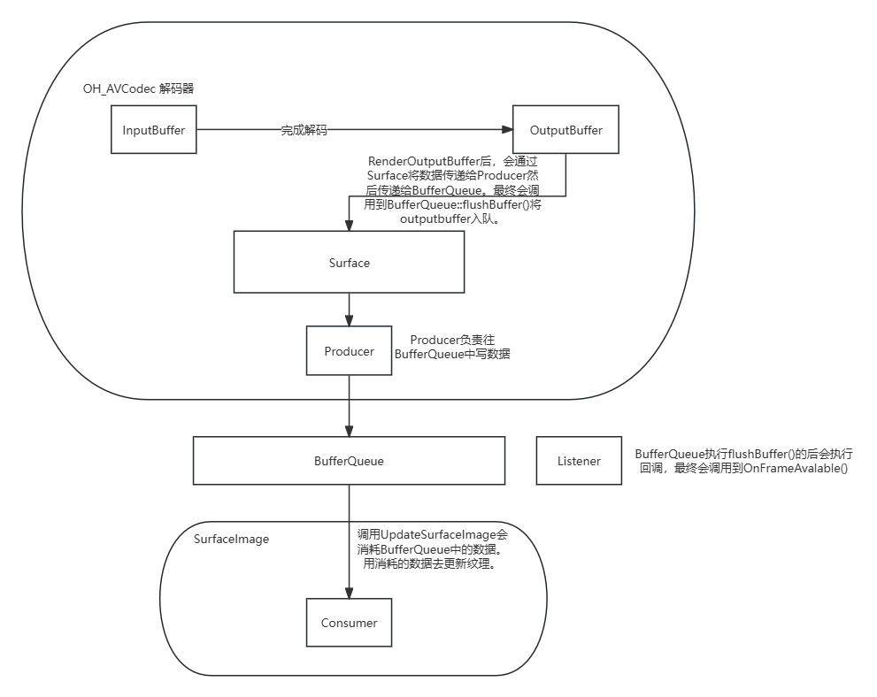

AVCodec核心数据结构
```C++
// VideoDecoderObject 是实际的视频解码器。
struct VideoDecoderObject : public OH_AVCodec {
    const std::shared_ptr<AVCodecVideoDecoder> videoDecoder_;  // 经过一系列代理最终会委托FCodec执行真正的视频解码相关函数。
    std::queue<OHOS::sptr<MFObjectMagic>> tempList_;
    std::unordered_map<uint32_t, OHOS::sptr<OH_AVBuffer>> outputBufferMap_;
    std::unordered_map<uint32_t, OHOS::sptr<OH_AVBuffer>> inputBufferMap_; 
}

/*
FCodec 内部包含三个线程
    sendTask_：SendFrame()。把inputAvailQue_中的InputBuffer送去解码。
    receiveTask_：ReceiveFrame()。将解码后数据填入空闲的OutputBuffer中。
    renderTask_ ：RenderFrame()。把renderAvailQue_中的OutputBuffer送去送显。
包含两个vector，buffers_[2]。分别存放InputBuffer和OutputBuffer。
包含三个blockqueue，用于存放buffer的index。
    inputAvailQue_：待解码的InputBuffer
    codecAvailQue_：空闲的OutputBuffer
    renderAvailQue_：待送显的OutputBuffer
*/
class FCodec : public CodecBase {
public:
    struct FBuffer {
    public:
        enum class Owner {
            OWNED_BY_US,
            OWNED_BY_CODEC,
            OWNED_BY_USER,
            OWNED_BY_SURFACE,
        };

        std::shared_ptr<AVBuffer> avBuffer_ = nullptr;
        std::shared_ptr<FSurfaceMemory> sMemory_ = nullptr;
        std::atomic<Owner> owner_ = Owner::OWNED_BY_US;
        int32_t width_ = 0;
        int32_t height_ = 0;
    };

private:
    enum struct State : int32_t {
        UNINITIALIZED,
        INITIALIZED,
        CONFIGURED,
        STOPPING,
        RUNNING,
        FLUSHED,
        FLUSHING,
        EOS,
        ERROR,
    };

    std::string codecName_;
    std::atomic<State> state_ = State::UNINITIALIZED;
    Format format_;
    int32_t width_ = 0;
    int32_t height_ = 0;
    int32_t inputBufferSize_ = 0;
    int32_t outputBufferSize_ = 0;
    // INIT
    std::shared_ptr<AVCodec> avCodec_ = nullptr;
    // Config
    std::shared_ptr<AVCodecContext> avCodecContext_ = nullptr;
    // Start
    std::shared_ptr<AVPacket> avPacket_ = nullptr;
    std::shared_ptr<AVFrame> cachedFrame_ = nullptr;
    // Receive frame
    uint8_t *scaleData_[AV_NUM_DATA_POINTERS] = {nullptr};
    int32_t scaleLineSize_[AV_NUM_DATA_POINTERS] = {0};
    std::shared_ptr<Scale> scale_ = nullptr;
    bool isConverted_ = false;
    bool isOutBufSetted_ = false;
    VideoPixelFormat outputPixelFmt_ = VideoPixelFormat::UNKNOWN;
    // Running
    std::vector<std::shared_ptr<FBuffer>> buffers_[2];
    std::vector<std::shared_ptr<AVBuffer>> outAVBuffer4Surface_;
    std::shared_ptr<BlockQueue<uint32_t>> inputAvailQue_;
    std::shared_ptr<BlockQueue<uint32_t>> codecAvailQue_;
    std::shared_ptr<BlockQueue<uint32_t>> renderAvailQue_;
    std::optional<uint32_t> synIndex_ = std::nullopt;
    SurfaceControl sInfo_;  // SurfaceControl内部包含surface
    std::shared_ptr<TaskThread> sendTask_ = nullptr;
    std::shared_ptr<TaskThread> receiveTask_ = nullptr;
    std::shared_ptr<TaskThread> renderTask_ = nullptr;
    std::condition_variable sendCv_;
    std::condition_variable recvCv_;
    std::shared_ptr<MediaCodecCallback> callback_;
    std::atomic<bool> isSendWait_ = false;
    std::atomic<bool> isSendEos_ = false;
    std::atomic<bool> isBufferAllocated_ = false;
    uint32_t decNum_ = 0;
    std::shared_ptr<std::ofstream> dumpInFile_ = nullptr;
    std::shared_ptr<std::ofstream> dumpOutFile_ = nullptr;
};
```
<!--
// RenderOutputBuffer: renderAvailQue_->push()  // User送来待送显的index，把待送显的index入队
// RenderFrame: renderAvailQue_->pop()  // 送显。线程不断调用
//              codecAvailQue_->push()
// ReleaseOutputBuffer: codecAvailQue_->push()
// ReceiveFrame->FramePostProcess: codecAvailQue_->Pop() // 。线程不断调用
// QueueInputBuffer: inputAvailQue_->push()  // User送来的待解码数据
// SendFrame: inputAvailQue_->pop()  // 送去解码。线程不断调用-->


NativeImage核心数据结构
```C++
struct OH_NativeImage {
    // OnFrameAvalibale回调就是给SurfaceImage设置的。
    OHOS::sptr<OHOS::SurfaceImage> consumer;     // 在OH_NativeImage_Create()时创建，创建过程中会创建BufferQueueConsumer和BufferQueueProducer，这两个都关联同一个BufferQueue。consumer内部包含producer。consumer是OH_NativeImage的核心，很多函数的调用都是委托给consumer进行的
    OHOS::sptr<OHOS::IBufferProducer> producer;  // 这个就是SurfaceImage的BufferQueueProducer。在OH_NativeImage_Create()时创建。
    OHOS::sptr<OHOS::Surface> pSurface = nullptr; // 内部包含producer。实际类型是ProducerSurface。
    struct NativeWindow* nativeWindow = nullptr;  // OH_NativeImage_AcquireNativeWindow()时创建。内部包含pSurface
};


class SurfaceImage : public ConsumerSurface {
public:
    OnBufferAvailableListener listener_ = nullptr;
    void *context_ = nullptr;

private:
    uint32_t textureId_;
    uint32_t textureTarget_;
    std::string surfaceImageName_;

    std::mutex opMutex_;
    std::atomic<bool> updateSurfaceImage_;

    EGLDisplay eglDisplay_;
    EGLContext eglContext_;
    std::map<uint32_t, ImageCacheSeq> imageCacheSeqs_;
    uint32_t currentSurfaceImage_;
    sptr<SurfaceBuffer> currentSurfaceBuffer_;
    int64_t currentTimeStamp_;
    Rect currentCrop_ = {};
    GraphicTransformType currentTransformType_ = GraphicTransformType::GRAPHIC_ROTATE_NONE;
    float currentTransformMatrix_[TRANSFORM_MATRIX_ELE_COUNT] = {0.0};
    float currentTransformMatrixV2_[TRANSFORM_MATRIX_ELE_COUNT] = {0.0};
    uint64_t uniqueId_ = 0;
};


class ConsumerSurface : public IConsumerSurface {
private:
    std::map<std::string, std::string> userData_;
    sptr<BufferQueueProducer> producer_ = nullptr;
    sptr<BufferQueueConsumer> consumer_ = nullptr;
    std::string name_ = "not init";
    bool isShared_ = false;
    std::map<std::string, OnUserDataChangeFunc> onUserDataChange_;
    std::mutex lockMutex_;
    uint64_t uniqueId_ = 0;
};
```
**解码、送显架构图**



* 帧（Frame）：就是一张静止的画面， 是视频的最小单位。
* 帧速率（FPS）：每秒播放图片的数量。
* 码率（Bit Rate）：视频文件在单位时间内使用的数据流量，决定视频的质量和大小，单位是 kb/s 或者 Mb/s。一般来说同样分辨率下，视频文件的码流越大，压缩比就越小，画面质量就越高。码流越大，说明单位时间内取样率越大，数据流，精度就越高，处理出来的文件就越接近原始文件，图像质量越好，画质越清晰，要求播放设备的解码能力也越高。

视频封装格式
常见封装格式有 MP4、AVI、FLV、mov、RMVB、MKV、WMV、3GP、ASF 等。

编码：做数据压缩
解码：将压缩后的数据解码为原来的格式。


总结来说，一个视频文件产生经过了：
1.图像和音频编码
2.将音频视频的编码按一定格式封装于容器中
因此解码的过程其实就是解视频的封装格式和编码格式，将视频还原成一帧帧图像和音频的过程。


2. 编码格式
视频编码是对采用视频压缩算法将一种视频格式转换成另一种视频格式的描述，音频编码同理。

常见的视频编码格式有：AC-1、MPEG2/H.262、VP8、MPEG4、VP9、H.261、H.263、H.264、H.265 等。

常见的音频编码格式有：WMA、MP3、AC-3、AAC、APE、FLAC、WAV 等。


视频播放流程：解封装->解码->送显。