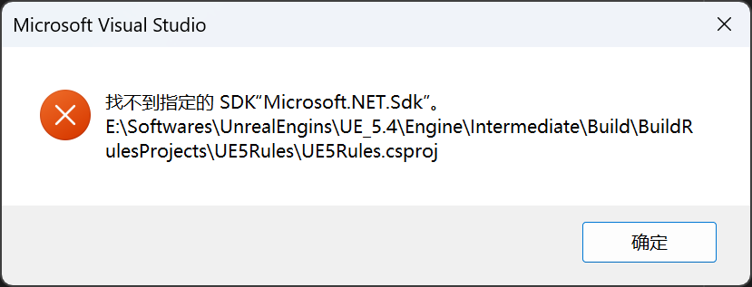
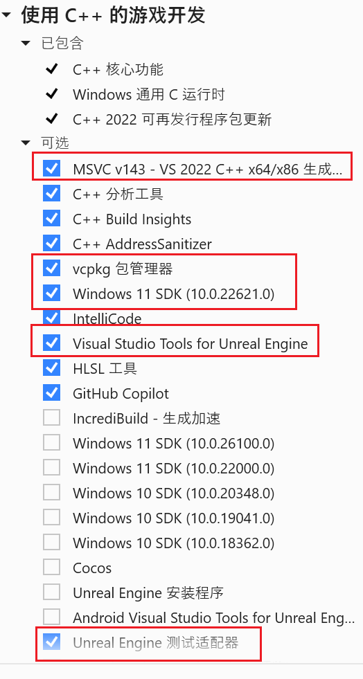
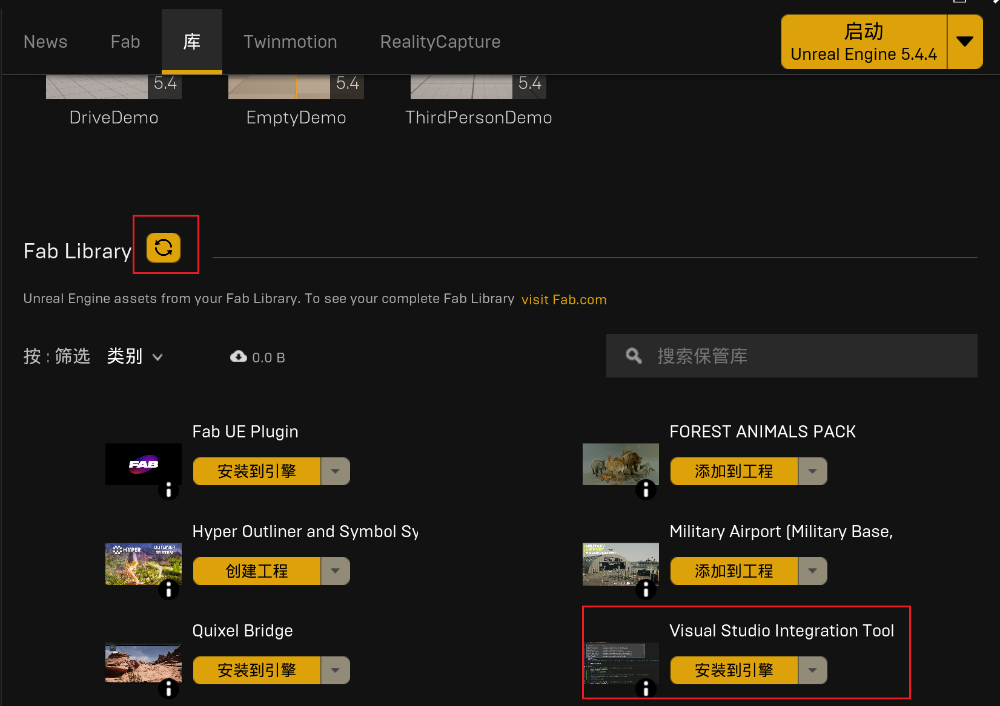
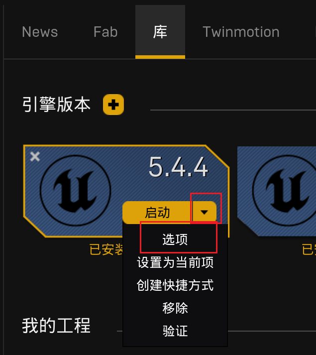
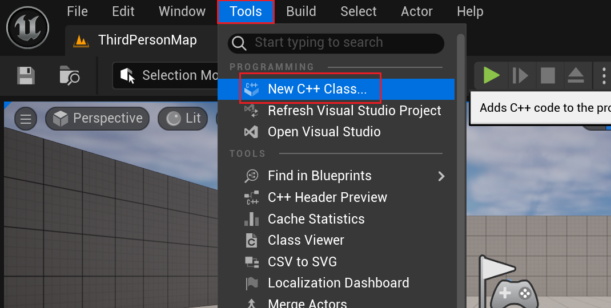
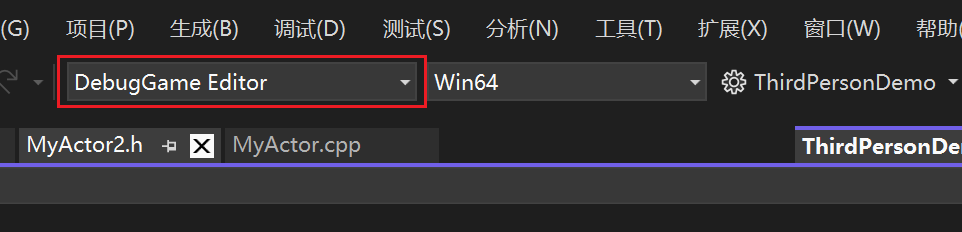

# 开发环境搭建
这一步要安装好Visual Studio和Unreal Editor环境。做到可以对UE的C++代码进行Debug。

[参考链接](https://learn.microsoft.com/zh-cn/visualstudio/gamedev/unreal/get-started/vs-tools-unreal-install)
[找不到Microsoft.NET.Sdk问题的解决办法](https://stackoverflow.com/questions/67049414/windows-or-visual-studio-2022-cant-find-the-latest-installed-net-sdk-due-to-bi/67049415#67049415)，配置好环境后最好重启一下。

### 安装Visual Studio

安装Visual Studio的网上教程很多，这里安装的是Visual Studio 2022 17.11.4。主要是要注意安装以下组件：

### 安装Unreal Engin

1. 首先在Epic中安装Unreal Editor，版本为5.4.4。
2. 安装Visual Studio Integration Tool，这是UE引擎使用VS2022作为IDE所必须的插件
   * 前往[fab](https://www.fab.com/)搜索`Visual Studio Integration Tool`，加入到自己的资源库中
   * 点击下载，跳转到Epic Games Launcher
   * 在 库-Fab Library 下点击刷新按钮
   * 选择`Visual Studio Integration Tool`，点击安装到引擎
    
3. 安装Debug工具
   * 选择一个引擎版本，点击启动旁边的下拉框
   * 点击选项，选中输入调试用符号
   * 点击应用进行安装。
   
4. 验证是否可以用IDE打开：
   * 创建一个空工程，打开
   * 点击Tools--New C++ Class...
   * 随便创建一个C++类。正常情况下应该是可以自动用Visual Studio打开的。
    
5. 验证Debug：
    * 在打开的VS 2022中，选择DebugGame Editor
    
    * TODO

**遇到的坑**
1. 

# 使用C++开发

1. 创建C++类
2. 删除C++类

