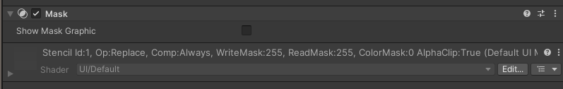
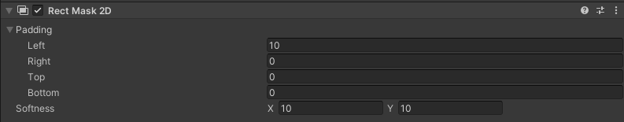
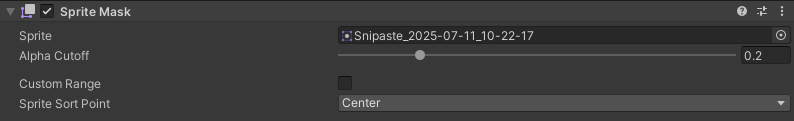
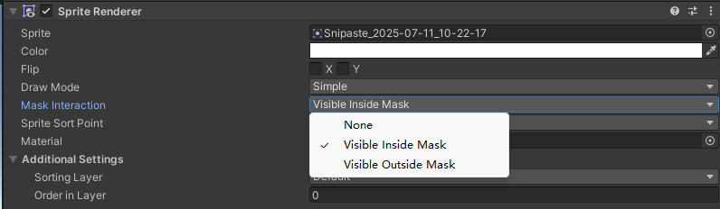
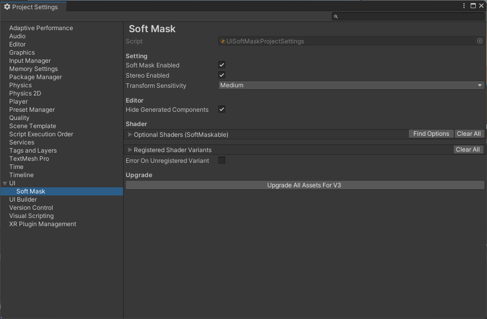
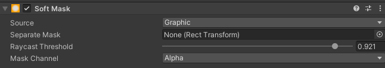

# Unity原生Mask

## Mask组件


**作用**

​​Mask组件​​主要用于控制子UI元素的可见区域。需要和Graphic组件配合使用（如Image、RawImage、Text）

**实际使用场景**

* UI内容裁剪：比如头像圆形裁剪等
* UI文本截断：长文本在特定区域内滚动显示。如ScrollView
* 动态遮罩效果：通过代码控制Mask的遮罩区域

Mask+Image：可以利用Image的Sprite透明度控制遮罩区域
Mask+RawImage：通过纹理的Alpha通道定义遮罩区域

**属性**

Show Mask Graphic：True代表显式Mask同级的Image，False表示不显示。

**原理**

Stencil

## Rect Mask 2D



**作用**

如果裁剪区域是矩形，可以用这个组件代替Mask+Image。

**属性**

Padding：子物体和裁剪区域边缘的填充
Softness：用于裁剪区域边缘虚化效果

## SpriteMask

SpritMask组件

粒子的Renderer中可以设置Masking属性

Sprite Renderer可以设置Mask Interaction属性


**作用**
SpriteMask用于控制整个场景中所有的Sprite和粒子的可见区域。

# SoftMaskForUGUI

## SoftMask组件

作用和原生的Mask类似，但是提供了更多的参数，通过调整这些参数可以平衡性能和效果。

* Masking Mode
  * Soft Masking：利用alpha通道值决定遮罩范围。运行时需要RenderTexture和soft-maskable Shader来保存数据，占用内存。效果最好，性能最低
  * Anti Aliasing：效果性能都居中
  * Normal：和原生Mask组件一样。效果不好，性能最高
* Show Mask Graphic：是否显式Mask同级的Graphic（如Image、RawImage）
* Alpha Hit Test：控制遮罩的透明部分是否可被点击。Disable代表不可点击
* Anti Aliasing Threshold（Anti Aliasing模式独有）：数值越大，锯齿越多。
* Softness Range （Soft Masking模式独有）：图片的alpha大于你设定的值才会显示。
* Down Sampling Rate（Soft Masking模式独有）: soft mask buffer的下采样率，值越高效果越差性能越高


## SoftMaskable组件

SoftMaskable组件是自动添加到所有SoftMask组件所在物体以及子物体下的。如果所有参数都是默认参数，那么该组件不会保存在预制体或场景中。

* Ignore Self: Masking Mode为Soft Masking时，屏蔽该graphic
* Ignore Children: Masking Mode为Soft Masking时，屏蔽子graphic
* Power: 值越高，边缘虚化越低

## MaskingShape

放在SoftMask下面，用于组合出复杂形状。提供了Subtract和Additive两种模式，代表应该加上还是减去这个Mask。

## RectTransformFitter

这个组件所在GO的Rect Transform跟随Target组件的Rect Transform

* Target: 需要跟随的目标RectTransform。会保证RectTransformFitter组件所在GO的Rect Transform的值和目标RectTransform相同。
* Target Properties: 一个下拉列表，可以选择跟踪哪些值（如Position、Rotation、Scale）

## 全局设置

File > Project Setting > UI > Soft Mask

 

# SoftMask 插件


使用方法和原生的Mask完全类似，只是多了一些功能。

* Source: 
  * Graphic: 使用Soft Mask组件所在GO下的Image或Raw Image作为Mask的输入 
  * Sprite: 使用设置的Sprite作为Mask输入
  * Texture: 使用设置的Texture作为Mask输入
* Separate Mask: 如果不指定，则Mask区域由Soft Mask组件所在GO的Rect Transform控制；如果指定则使用指定的Rect Transform控制。
* Raycast Threshold: 用于控制点击事件的接收阈值。只有Mask值大于等于指定的值时才接收点击事件。
* Mask Channel: 可以指定使用Mask使用哪个Channel作为输入。
  * Alpha: 默认使用Alpha作为输入
  * Red/Green/Blue: 使用Red/Green/Blue通道作为输入
  * Gray: RGB的平均值作为输入
  * Custom: 自定义四个通道的权重。如Gray=(0.33333,0.33333,0.33333,0);


原理：运行时会为SoftMask的所有子GO都生成一个不可见的SoftMaskable，SoftMaskable实现了IMaterialModifier接口，这个接口的作用是在Render之前，让程序有机会修改或替换Material。

# stencil

1. Mask会赋予Image一个特殊的材质，这个材质会给Image的每个像素点进行标记，将标记结果存放在一个缓存内（这个缓存叫做 Stencil Buffer）
2. 当子级UI进行渲染的时候会去检查这个 Stencil Buffer内的标记，如果当前覆盖的区域存在标记（即该区域在Image的覆盖范围内），进行渲染，否则不渲染

stencil buffer与depth buffer一样，都是缓冲区，存在于显存内的某一片区域中。据wikipedia上解释，目前的显卡架构中，stencil buffer与depth buffer是在一起的，比如在depth/stencil缓冲区某个32位的区域中，有24位记录着像素A的depth数据，紧接着8位记录着像素A的stencil数据。也许就是由于它们连接如此紧密，在stencil test中可以获取到Z test的结果。在Unity中新建一个RenderTexture也可以通过设定深度值的位数来选择开启/关闭stencil buffer。

在OpenGL渲染管线中，在片段着色器fragment shader之后，Blending混融之前有三个测试操作环节: scissor test(unity好像用不了)，Stencil Test和Z-Test。

```txt
Stencil
{
	Ref [_Stencil]//Ref表示要比较的值；0-255
	Comp [_StencilComp]//Comp表示比较方法（等于/不等于/大于/小于等）；
	Pass [_StencilOp]// Pass/Fail表示当比较通过/不通过时对stencil buffer做什么操作
			// Keep(保留)
			// Replace(替换)
			// Zero(置0)
			// IncrementSaturate(增加)
			// DecrementSaturate(减少)
	ReadMask [_StencilReadMask]//ReadMask/WriteMask表示取stencil buffer的值时用的mask（即可以忽略某些位）；
	WriteMask [_StencilWriteMask]
}
```


**参考：**
* [【Unity源码学习】遮罩：Mask与Mask2D](https://zhuanlan.zhihu.com/p/136505882)
* [Unity Shader: 理解Stencil buffer并将它用于一些实战案例](https://blog.csdn.net/liu_if_else/article/details/86316361)