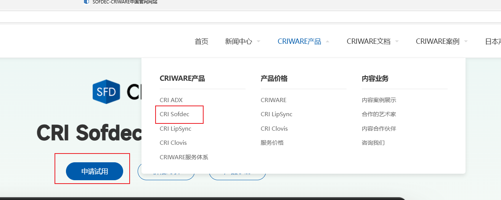
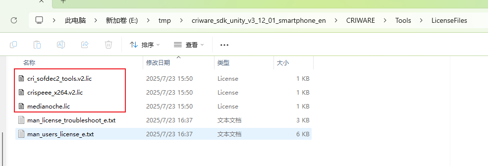
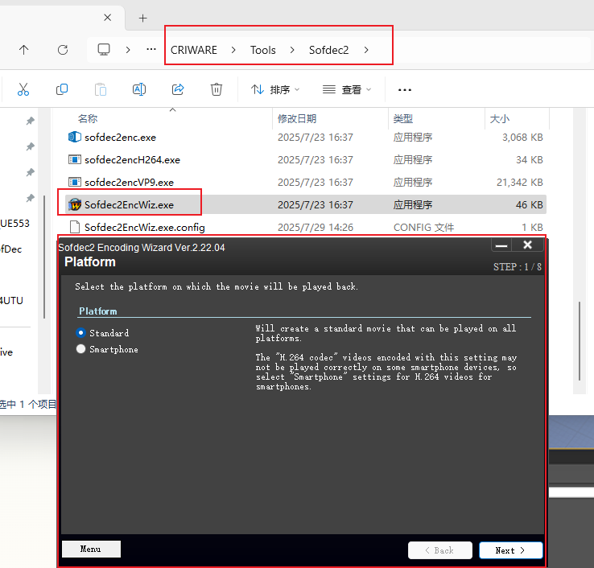
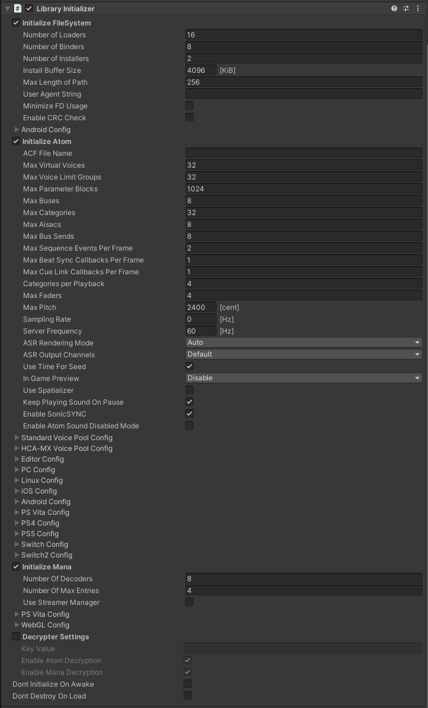

# 制作USM视频

1. 去[官方网站](https://www.criware.cn/web/#/zh/products_services/sofdec)申请使用权。入口如下所示：

2. 完成申请后去[我的订单](https://www.criware.cn/web/#/zh/center/order)中下载资源和license
3. 将下载的license放在`CRIWARE/Tools/LicenseFiles`下

4. `CRIWARE/Tools/Sofdec2/Sofdec2EncWiz.exe`可以用来制作usm格式视频

.usm文件是专门用来给游戏的视频播放的格式。USM格式通常采用游戏专用的编解码器，针对游戏场景中的实时播放优化，能在保持较高画质的同时减少CPU/GPU负载。

# 游戏内使用

下载后在`CRIWARE/SDK/documentation/sdk_manual`目录下有详细的使用手册。解压后双击index.html即可。

## Unity

### 基本使用

1. 导入unityproject：导入`CRIWARE/SDK/unity/plugin`目录下的unitypackage
2. 在场景中加入Error Handler和Library Initializer

3. 将USM文件放在`Assets/StreamingAssets/`目录下
4. 在物体上加上`CriManaMovieController`(如果是UI，则加上`CriManaMovieControllerForUI`)，并填上MoviePath，勾选Play On Start即可

### CriManaMovieController 组件

CriManaMovieControllerForUI组件和CriManaMovieController完全类似。这里只介绍CriManaMovieController组件。

**部分属性**

* Material: 要在哪个Material上播放视频。如果没有设置，就会创建一个Material，并将该Material设置到当前GO的MeshRenderer上。
* RenderMode: 
  * Always: 总是渲染
  * On Visilibility: 只有在target所在GO可见时渲染
  * Never: 不渲染。必须手动调用`CriManaMovieMaterial::RenderMovie`进行渲染
* MaxFrameDrop: 游戏帧率过低时，需要丢弃一些视频帧以适配游戏帧率。这里可以设置最大丢弃多少帧
* Target: 视频材质设置对象的 UnityEngine.Renderer。
* UseOriginalMaterial: 当视频帧无法使用的时候，是否使用原材质。

**部分成员函数**
* Play()/Stop()/Pause(bool): 用于控制播放/停止播放/暂停播放。
* PlayerManualInitialize()/PlayerManualFinalize()/PlayerManualUpdate(): 手动初始化、结束、每帧更新。

### Library Initializer组件

初始化组件，必须要加到场景中。否则视频播放会报错。

## UE

### 基本使用

1. 创建一个新的工程。将`CRIWARE/SDK/UnrealEngine/Engine/Plugins`放在UE的Content同级目录下
2. 重新Generate Visual Studio project files。然后重启引擎
3. 在Content目录下创建ManaPlayer，插件会自动创建好一个ManagerTexture，将ManagerTexture拖动到一个物体上，会自动创建一个Material，这三个资产之间的关联是自动完成的。
4. 将一个usm文件拖动到content目录下，插件会自动创建一个ManaMovie。
5. 在关卡蓝图中使用。这一步基本和原生的视频播放是类似的。

6. 完成后执行游戏可以自动播放视频了。

# UTU视角下SofDec插件与原生对比

不同点：
1. Unity侧使用CriwareManaMovieController时，场景中必须要有Library Initializer，否则会提示初始化失败。
2. Unity侧插件有CriwareManaMovieController和CriwareManaMovieControllerForUI两种。

相同点：
1. Unity侧一个原生VideoPlayer对应UE侧四个资产。该插件Unity侧一个MovieController组件也对应UE侧四个资产。

2. UE侧的视频播放基本和原生的MediaPlayer类似。**基本可以复用现有的UTU视频导出导入流程**。