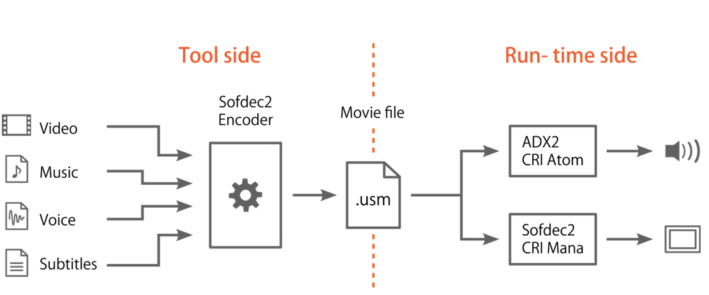
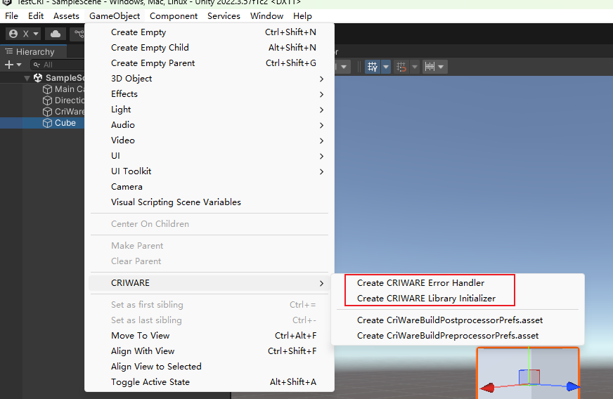
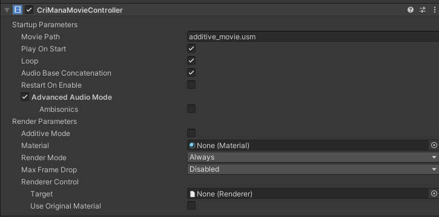
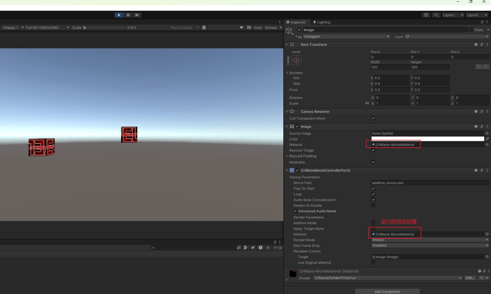
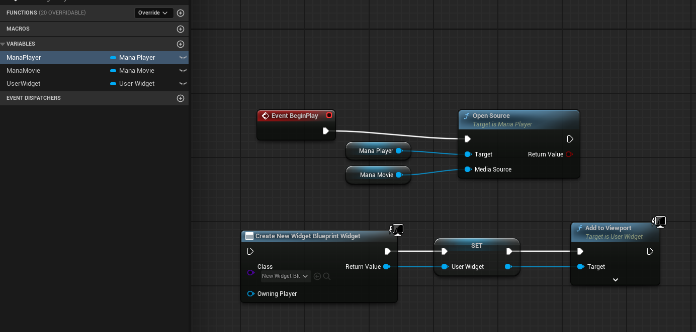
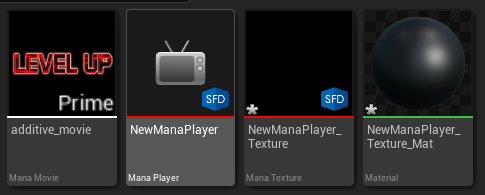

# 制作USM视频

1. 去官方网站申请使用权
2. 下载资源和license
3. 将下载的license放在CRIWARE/Tools/LicenseFiles下
4. CRIWARE/Tools/Sofdec2/Sofdec2EncWiz.exe可以用来制作usm格式视频
.usm文件是专门用来给游戏的视频播放的格式。USM格式通常采用游戏专用的编解码器，针对游戏场景中的实时播放优化，能在保持较高画质的同时减少CPU/GPU负载。

# 游戏内使用

## Unity

1. 导入unityproject
2. 在场景中加入Error Handler和Library Initializer

3. 将USM文件放在Assets/StreamingAssets/目录下
4. 在物体上加上CriManaMovieController(如果是UI，则加上CriManaMovieControllerForUI)，并填上MoviePath，勾选Play On Start即可

Unity侧只需要给GO添加一个CriManaMovieController组件即可，运行时会自动创建Material，然后赋给Image的Material（UI模式）或MeshRenderer的Material（非UI模式）

## UE

1. 创建一个新的工程。将`CRIWARE/SDK/UnrealEngine/Engine/Plugins`放在UE的Content同级目录下
2. 重新Generate Visual Studio project files。然后重启引擎
3. 在Content目录下创建ManaPlayer，插件会自动创建好一个ManagerTexture，将ManagerTexture拖动到一个物体上，会自动创建一个Material，这三个资产之间的关联是自动完成的。
4. 将一个usm文件拖动到content目录下，插件会自动创建一个ManaMovie。
5. 在关卡蓝图中使用。这一步基本和原生的视频播放是类似的。

6. 完成后执行游戏可以自动播放视频了。

# UTU角度下插件与原生对比

不同点：
1. Unity侧使用CriwareManaMovieController时，场景中必须要有Library Initializer，否则会提示初始化失败。
2. Unity侧有CriwareManaMovieController和CriwareManaMovieControllerForUI两种

相同点：
1. Unity侧一个原生VideoPlayer对应UE侧四个资产。该插件Unity侧一个MovieController组件也对应UE侧四个资产。

2. UE侧的视频播放基本和原生的MediaPlayer类似。**基本可以复用现有的UTU视频导出导入流程**。