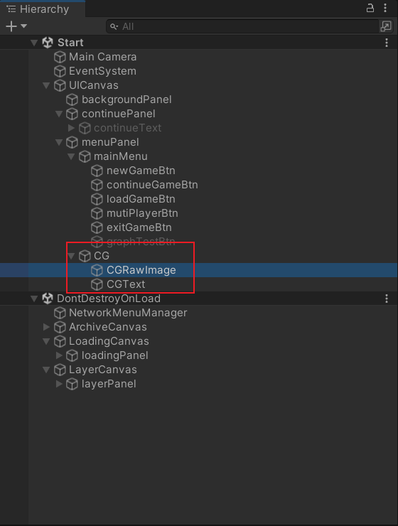
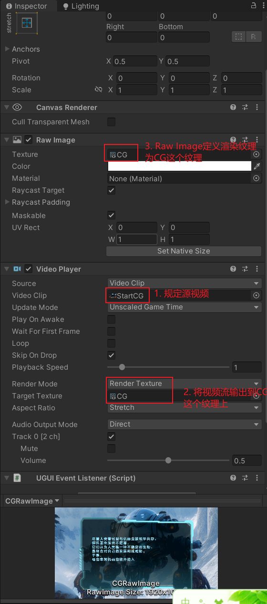
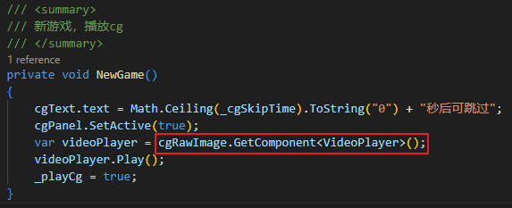

# 前期调研

## Unity侧视频播放

Unity的视频播放依赖VideoPlayer组件。这里列一下比较重要的参数，这些参数直接影响了VideoPlayer组件播视频的行为。
* Source：定义视频源
  * Video Clip：规定使用本地视频文件作为源视频。
  * URL：指定一个URL作为源视频
* Render Mode：规定视频渲染模式。
  * Camera Far Plane：将源视频渲染到摄像头的远平面上。可以指定具体渲染在哪一个摄像头上。也可以指定视频透明度。可以用来做背景播放器。
  * Camera Near Plane：将源视频渲染到摄像头近平面上。同上。可以用来做前景播放器。
  * Render Texture：渲染到一个Render Texture上。供物体或RawImage使用。如果给物体使用，则物体表面会动态播放视频。如果给RawImage使用，可以结合UGUI
  * Material Override：通过替换物体材质的方式，直接将视频渲染到物体表面。
  * API Only：完全自定义视频帧数据的处理方式。适合需要深度处理视频帧的场景。
* Audio Output Mode：音频输出模式
  * None：不播放音频。
  * Audio Source：输出到音频源
  * Direct：直接播放
  * API Only(Experimental)：

简单总结一下，VideoPlayer组件和音频、UI都存在一定的耦合。当视频渲染模式、音频输出模式的值发生变化时，对应UE侧都有不同的实现。

## UE侧视频播放

UE可以在项目设置里设置启动视频。[参考文档](https://dev.epicgames.com/documentation/zh-cn/unreal-engine/project-section-of-the-unreal-engine-project-settings?application_version=5.4#%E8%A7%86%E9%A2%91)


UE可以直接将 文件媒体源 拖入场景中播放视频。[参考](https://dev.epicgames.com/documentation/zh-cn/unreal-engine/migrating-assets-from-unity-to-unreal-engine?application_version=5.4#%E8%A7%86%E9%A2%91)

[在UE中播放视频文件](https://dev.epicgames.com/documentation/zh-cn/unreal-engine/play-a-video-file-in-unreal-engine)
[在UE中播放视频流](https://dev.epicgames.com/documentation/zh-cn/unreal-engine/play-a-video-stream-in-unreal-engine)


## AB视频实现方式

AB工程里视频实现方式为：使用本地视频作为原视频；渲染模式为Render Texture结合UI画布和RawImage实现视频播放；音频为Direct直接播放。




## AB中视频播放模块的迁移难点与解决思路

**1. Unity的RenderTexture在UE侧没有对应的资源**

在AB工程中，视频播放是通过将VideoClip渲染到RenderTexture中实现的。RenderTexture是Unity里的动态纹理。Unity中可以将摄像机实时渲染的结果送到RT中，也可以将VideoPlayer的渲染结果发送到RT中。**在UE中没有与RenderTexture完全对应的资源**（虽然UE中有RenderTarget，但是至少在视频播放方面，大家都还是使用媒体纹理实现）。

对于“将VideoPlayer的VideoClip渲染到RT上”这个场景来说，UE侧需创建一个媒体播放器，在媒体播放器中指定文本媒体源（类似VideoClip），然后再创建一个媒体纹理，在媒体纹理中指定媒体播放器。因此从UTU角度来说，在导出时需要记录RenderTexture和VideoPlayer的Json，在导入时利用这两个Json创建上述的三个资源并进行绑定。
[Unity3d中渲染到RenderTexture的原理，几种方式以及一些问题](https://blog.csdn.net/leonwei/article/details/54972653)


**2. Unity侧VideoPlayer是一个组件，UE侧无对应的组件**


在Unity中，视频播放通常是通过VideoPlayer组件实现的。既然是组件就可以利用GameObject的GetComponent方法获取对应的组件。比如在AB工程里VideoPlayer会挂载到一个RawImage上，代码里通过获取这个RawImage挂载的VideoPlayer组件即可实现视频的播放。如下图所示是AB工程里点击“新游戏”后播放CG的代码。

在UE中，视频播放是通过媒体播放器和与之绑定的媒体纹理实现的。媒体播放器在UE中表现为一个资产。因此原本挂载VideoPlayer的GO在迁移到UE后将不再挂载相应的组件。因此代码里GetComponent方法就会出现错误。此外，AB工程里VideoPlayer是挂载到RawImage下的（实际上这是很常见的做法），而RawImage在UE侧不是一个Actor，因此无法挂载任何组件。这一块因为和脚本还有UI都存在一定耦合，所以还需要进一步讨论。


**3. Unity RawImage是一个组件，UE侧则是控件蓝图里的控件**

Unity中RawImage是一个组件，组件的GetComponent\<VideoPlayer\>逻辑是：找到组件所挂载的GameObject，然后找到这个GO下挂载的VideoPlayer。目前难点在于UE侧的Image是一个控件蓝图里的控件而不是组件，无法挂载其它组件。

```cs
public VideoPlayer videoPlayer;
videoPlayer.loopPointReached += EndReached;
videoPlayer.isPlaying
videoPlayer.time
videoPlayer.length
videoPlayer.Pause()
videoPlayer.Stop()
videoPlayer.SetDirectAudioVolume(0, _currentVolume);
videoControl.videoPlayer.Play();
videoControl.videoPlayer.playbackSpeed = 1;

var videoPlayer = cgRawImage.GetComponent<VideoPlayer>();
cgRawImage.GetComponent<VideoPlayer>().clip.length
```