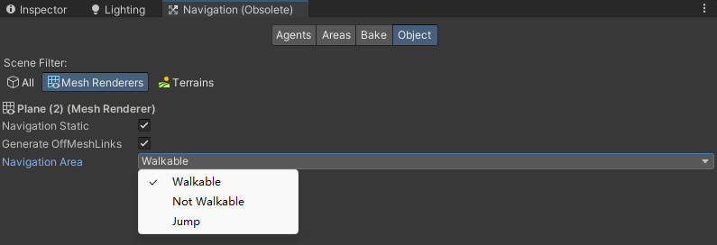

Navigation窗口

# Object界面

Navigation Static: 勾选后会在烘焙时包含该对象。

carving 代价十分高昂。

# Bake界面

Min Regine Area：剔除未连接的小型导航网格区域
Voxel Size：体素大小描述了生成的导航网格表示场景几何体的准确程度。默认的精度设置为每个代理半径为 3 个体素，即整个代理宽度为 6 个体素。体素大小减半将使内存使用量增加 4 倍，构建场景需要的时间也为 4 倍。

Agent Radius：代理半径。就是需要自动导航的东西的半径
AgentHeight：代理高度。
Max Slope：最大坡度
Setp Height：步进高度。代理的能跨越的阶梯的高度。
Drop Height：掉落高度
Jump Distance：跳跃距离

Height mesh：勾上就不会停留在斜坡上。否则代理可能会停留在斜坡上。

Bake里设置的参数用来设置整个导航网格的精度。Agents里用来设置不同类型的代理的参数。
由于一个场景中只能通过Bake操作生成一个导航网格，因此Bake里的精度需要设置为所有Agents里最大的精度（比如Bake的代理半径需要是所有Agents的代理半径的最大值。这样才能保证所有的Agents都能使用Bake出来的导航网格。缺陷是可能会出现由于粒度太大导致的小Agent不合理绕行）。需要保证Bake出来的导航网格体让所有的Agents都能使用。这就是旧版导航系统的缺陷之一。