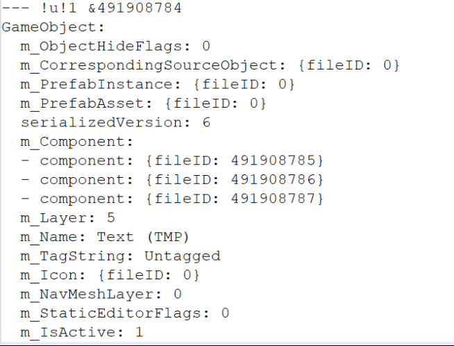

https://blog.csdn.net/chqj_163/article/details/106433866

无法从场景文件中找到GameObject的树形结构。

如下图是某个GameObject。内部包含m_Component。fileID就是这个GameObject下面Component对应的ID。同时这些Component也会持有一个m_GameObject，id就是这个GameObject。也就是GameObject和其内部的Component可以通过id双向绑定。
