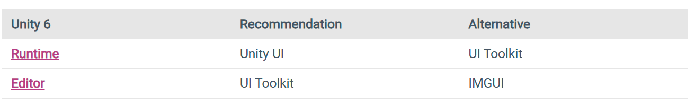

# Unity 原生UI系统对比

Unity 一共有三种原生的UI系统，分别是`UI Toolkit`、`uGUI`和`IMGUI`。现有项目中绝大多数都使用uGUI作为UI系统。在新项目中，Unity官方推荐使用UI Toolkit实现Editor的UI，使用uUGI实现运行时游戏UI。

**UI Toolkit**
UI Toolkit是Unity官方推出的新一代UI框架，旨在取代现有的UGUI。目前官方推荐Editor中的UI首选UI Toolkit，而游戏内UI还是首选UGUI。UI Toolkit使用文档对象模型（DOM）设计，把整个界面作为文档（Document）来看待。这种设计在安卓应用、网页前端、Windows的WPF和WinUI被广泛使用。Unity正是参考网页的标准设计了这个新的UI框架。

类似网页开发，UI Toolkit使用UXML代替HTML定义UI的层次结构，使用USS代替CSS定义UI样式。

**IMGUI**
IMGUI是Unity4.6之前的UI框架，是代码驱动的GUI系统。IMGUI只能通过代码的方式实现UI，因此用来实现游戏内UI的话非常不直观，因此主要用于实现Editor的扩展UI。

**[UGUI](https://docs.unity3d.com/Packages/com.unity.ugui@2.0/manual/index.html)**
UGUI是Unity目前最主要的UI系统，也是目前使用最广泛的UI系统。UGUI是基于GameObject的UI系统，使用Components和Game View来实现UI样式的控制。

**Unity UI系统发展史**

* Unity最初版本到Unity4.6版本之前，Unity官方只提供了IMGUI作为游戏UI的开发，由于使用起来非常不方便且不直观，所以当时人们更倾向于使用NGUI。
* Unity4.6之后的版本中，Unity官方招募NGUI作者加入Unity，协助Unity开发出了UGUI系统用于游戏UI功能的开发。
Unity5.0之后UGUI开始全面普及，目前是Unity游戏UI的主要开发方式。
* UI ToolKit是Unity2018之后推出的UI系统，号称要逐步代替UGUI的地位，但是目前制作游戏内UI还缺少一些功能所以无法完全代替UGUI，目前官方主要推荐用于Editor的扩展UI。

||运行时开发UI|运行时游戏UI|Unity Editor|
| ----------- | ----------- |---|---|
|UIElements|备选|备选|推荐|
|Unity UI|推荐|推荐|不可用|
|IMGUI|用于调试|不推荐|备选|

# Unity常用UI插件
UnityUIExtensions
Doozy UI
FairyGUI

# UE 的UI系统 --- UMG

