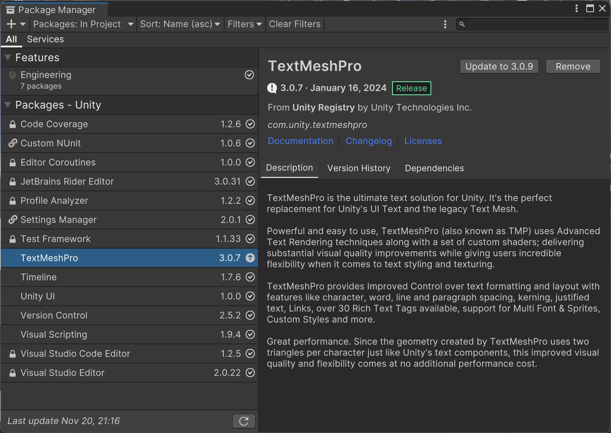

window-package manager可以打开包管理器。

如果想要修改包的版本，可以进入Assets同级的Packages目录下，修改其中的manifest.json。再重新打开Unity会自动下载缺失的包。比如你可以将TextMeshPro版本从3.0.7改为3.0.6。

对于TextMeshPro，Unity没有进行鸿蒙化适配，导致InputField在鸿蒙系统下无法拉起软键盘，这个时候只需要将tuanjie下对应版本的TextMeshPro复制到鸿蒙下即可。注意复制的时候最好用Beyond Compare只复制涉及到的代码部分。如果不小心把package.json也复制过去了，那么Unity会自动更新包，导致你复制过去的包又被下载的给覆盖了。