**参考**
[记录一次WSL2的网络代理配置](https://jiayaoo3o.github.io/2020/06/23/%E8%AE%B0%E5%BD%95%E4%B8%80%E6%AC%A1WSL2%E7%9A%84%E7%BD%91%E7%BB%9C%E4%BB%A3%E7%90%86%E9%85%8D%E7%BD%AE/)
[安装WSL2和Ubuntu22.04版本](https://blog.csdn.net/HHHBan/article/details/126843786)
[演练：使用 WSL 2 和 Visual Studio 2022 生成和调试 C++](https://learn.microsoft.com/zh-cn/cpp/build/walkthrough-build-debug-wsl2?view=msvc-170)

# 安装wsl

参考上面那个文档安装即可，没什么坑。这里列一下常用命令。
```shell
wsl --set-default-version 2
wsl -l --all -v
wsl --export Ubuntu-22.04 E:\wsl\ubuntu22.04.tar
```

# 安装Ubuntu22.04

使用微软商店安装Ubuntu22.04，如果没有网络，可以按以下步骤操作：
* win+R 输入 control.exe 弹出控制面板界面
* 依次点击 网络和Internet-Internet选项-连接-局域网设置
* 在弹出的页面勾选自动检测设置。如下所示。下载完成之后记得改回去，否则就没法上谷歌了。
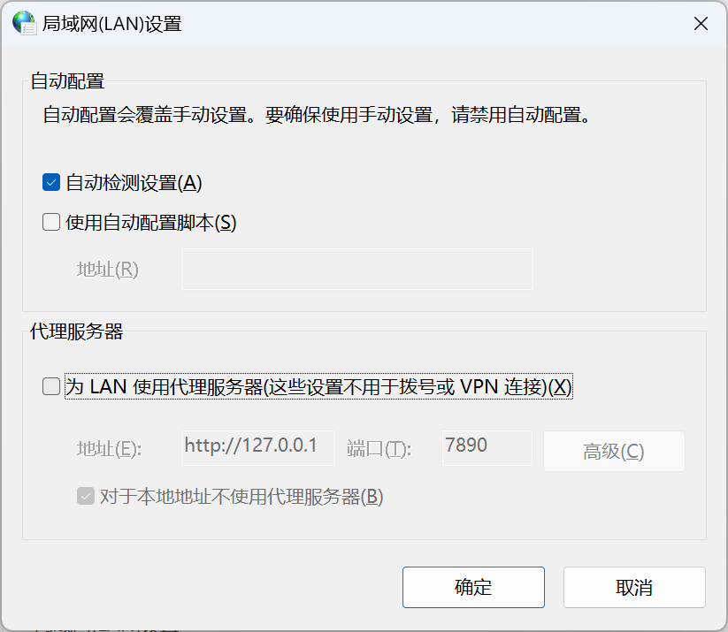

# 配置网络代理

1. **设置windows的wsl配置**：在`C:\Users\27062`下创建一个.wslconfig，内容如下
以下问题可以通过这一步解决：**检测到 localhost 代理配置，但未镜像到 WSL。NAT 模式下的 WSL 不支持 localhost 代理。**

```txt
[experimental]
autoMemoryReclaim=gradual  
networkingMode=mirrored
dnsTunneling=true
firewall=true
autoProxy=true
```

2. **进入wsl系统配置proxy**：新建一个.proxyrc，完成系统proxy设置，将代理映射到主机的代理地址。
```shell
cd ~
vim .proxyrc # 输入下面bash的内容，退出并保存
source .proxyrc
```
```bash
#!/bin/bash
host_ip="127.0.0.1"
export ALL_PROXY="http://$host_ip:7890"
export HTTP_PROXY=$ALL_PROXY
export http_proxy=$ALL_PROXY
export HTTPS_PROXY=$ALL_PROXY
export https_proxy=$ALL_PROXY
```
上面的host_ip="127.0.0.1"是因为我设置了windows代理

如果上面的失败了，就将host_ip改成下面的形式，会自动读取你主机的host_ip。
`host_ip=cat /etc/resolv.conf|grep nameserver|awk '{print $2}'`

3. **设置clash**：打开clash的`Allow LAN`

4. **检查配置是否成功**：进入wsl输入以下命令
```shell
xhf@xhflaptap:~$ curl google.com
<HTML><HEAD><meta http-equiv="content-type" content="text/html;charset=utf-8">
<TITLE>301 Moved</TITLE></HEAD><BODY>
<H1>301 Moved</H1>
The document has moved
<A HREF="http://www.google.com/">here</A>.
</BODY></HTML>
```

# VS2022使用wsl

首先要在wsl上准备好环境：
```shell
xhf:~$ sudo apt-get install gcc g++ zip gdb make ninja-build rsync net-tools
```
其次VS2022要确保安装上Linux和嵌入式开发。

## 创建cmake程序编译so

1. 新建一个cmake项目
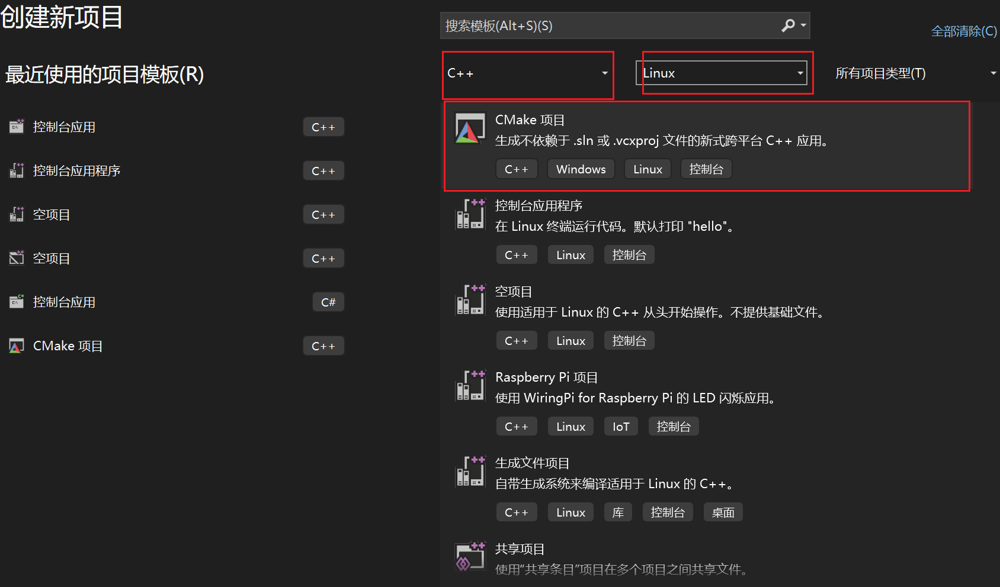

2. 将平台改为wsl
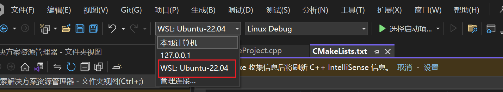

3. 修改cmake代码
```cmake
# add_executable (LinuxCMakeProject "LinuxCMakeProject.cpp" "LinuxCMakeProject.h")  # 默认为add_executable
add_library (LinuxCMakeProject SHARED "LinuxCMakeProject.cpp" "LinuxCMakeProject.h")  # 改为add_library就可以生成so了。
```

4. 如有需要，可以添加依赖库
```cmake
cmake_minimum_required (VERSION 3.8)

# 如果支持，请为 MSVC 编译器启用热重载。
if (POLICY CMP0141)
  cmake_policy(SET CMP0141 NEW)
  set(CMAKE_MSVC_DEBUG_INFORMATION_FORMAT "$<IF:$<AND:$<C_COMPILER_ID:MSVC>,$<CXX_COMPILER_ID:MSVC>>,$<$<CONFIG:Debug,RelWithDebInfo>:EditAndContinue>,$<$<CONFIG:Debug,RelWithDebInfo>:ProgramDatabase>>")
endif()

project ("LinuxCMakeProject")

# 将源代码添加到此项目的可执行文件。
add_library (LinuxCMakeProject SHARED "LinuxCMakeProject.cpp" "LinuxCMakeProject.h")
include_directories("/mnt/e/test/include")  # 依赖库所在的目录，里面包含一些.cpp，.h文件。

if (CMAKE_VERSION VERSION_GREATER 3.12)
  set_property(TARGET LinuxCMakeProject PROPERTY CXX_STANDARD 20)
endif()
```
ctrl+s保存之后vs2022会为我们自动执行cmake。
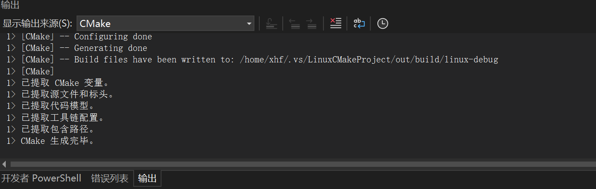

5. 输出so
按如下所示进行选择， 然后点击执行按钮，vs2022会为我们自动进行构建。生成的结果保存在项目的out目录下。
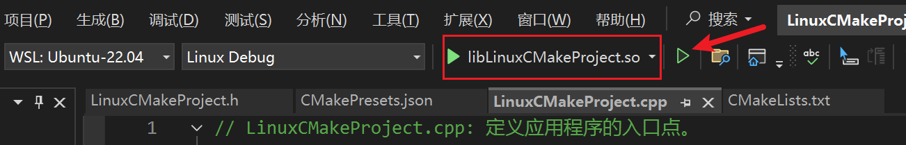
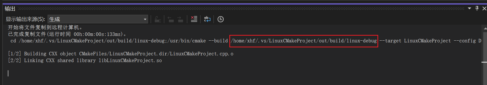

## 创建普通桌面程序编译so

1. 创建项目
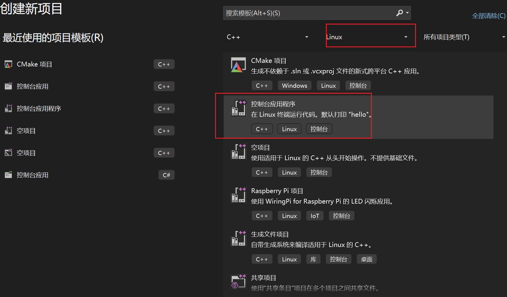

2. 修改工程属性
选中解决方案资源管理器下的工程名 -> 点击右键选择属性（或输入快捷键Alt+Enter）打开属性配置页面 -> 配置类型为.so
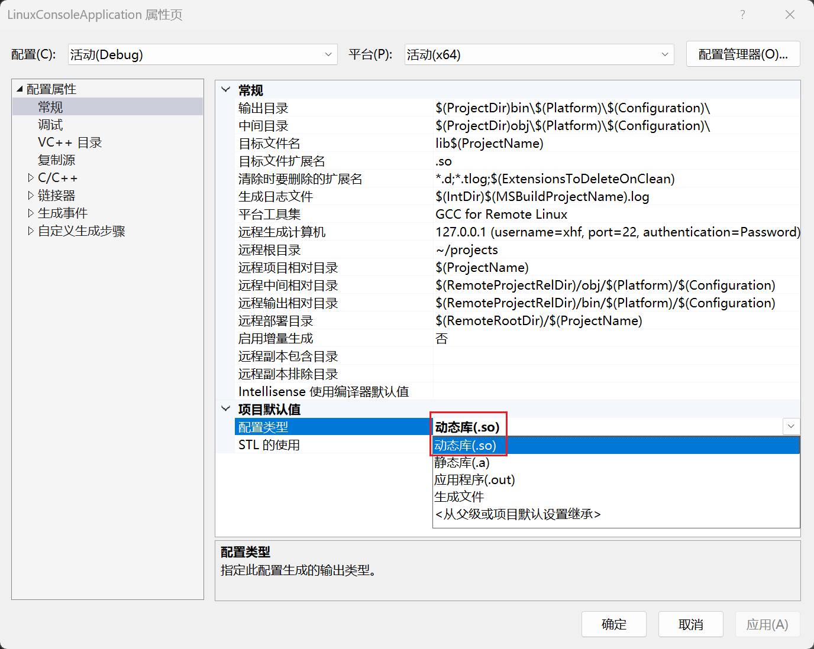

3. 连接wsl
工具 -- 选项 -- 跨平台 -- 连接管理器 -- 添加 
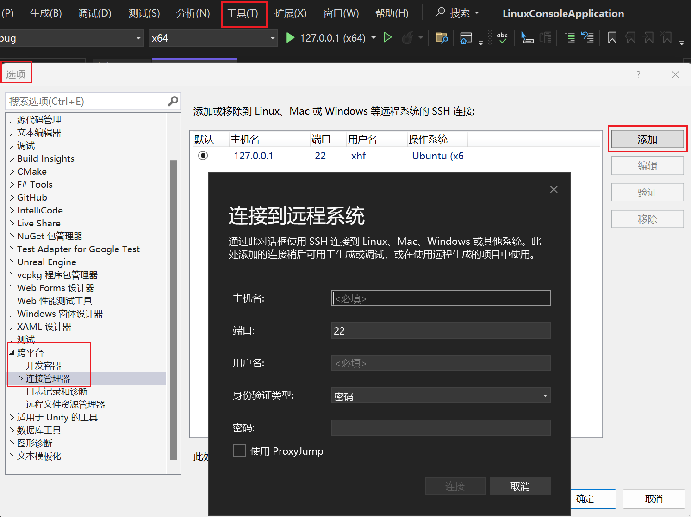
在弹出的页面里输入你的用户名和密码即可，主机名可以写localhost，也可以写127.0.0.1

4. 为你的项目添加include目录
选中解决方案资源管理器下的工程名 -> 点击右键选择属性（或输入快捷键Alt+Enter）打开属性配置页面 -> 选中VC++目录 -> 添加包含目录即可
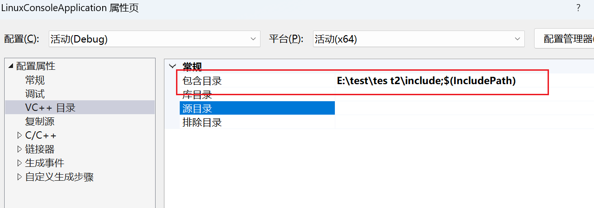

5. 生成so
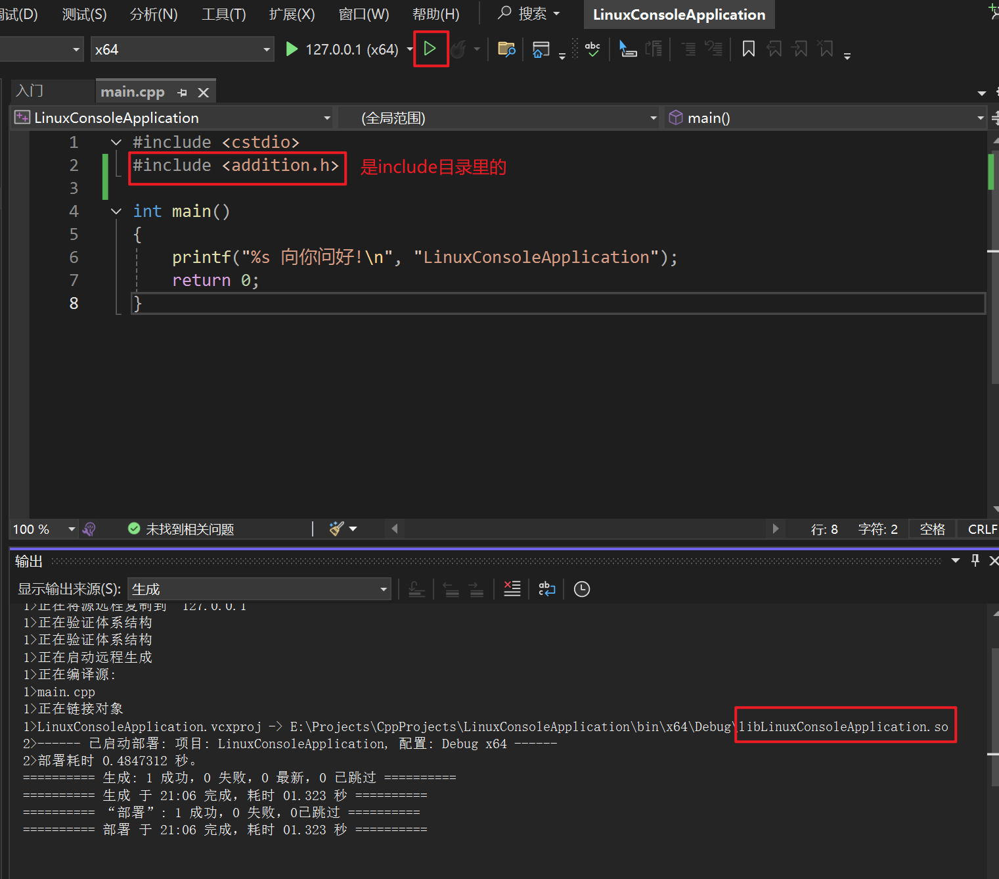

## 鸿蒙编译构建工具构建鸿蒙平台so

编译鸿蒙平台so需要鸿蒙编译工具链，这个在SDK目录里。

0. 准备cpp代码
使用vs2022创建一个空的C++项目。然后在deveco新建一份c++工程，把cpp代码拷贝过来即可。
```c++
#include "napi/native_api.h"

static napi_value Add(napi_env env, napi_callback_info info)
{
    size_t argc = 2;
    napi_value args[2] = {nullptr};
    napi_get_cb_info(env, info, &argc, args , nullptr, nullptr);

    napi_valuetype valuetype0;
    napi_typeof(env, args[0], &valuetype0);

    napi_valuetype valuetype1;
    napi_typeof(env, args[1], &valuetype1);

    double value0;
    napi_get_value_double(env, args[0], &value0);

    double value1;
    napi_get_value_double(env, args[1], &value1);

    napi_value sum;
    napi_create_double(env, value0 + value1, &sum);

    return sum;

}

EXTERN_C_START
static napi_value Init(napi_env env, napi_value exports)
{
    napi_property_descriptor desc[] = {
        { "add", nullptr, Add, nullptr, nullptr, nullptr, napi_default, nullptr }
    };
    // 在exports对象上挂载CallNative/NativeCallArkTS两个Native方法。
    napi_define_properties(env, exports, sizeof(desc) / sizeof(desc[0]), desc);
    return exports;
}
EXTERN_C_END

static napi_module demoModule = {
    .nm_version = 1,
    .nm_flags = 0,
    .nm_filename = nullptr,
    .nm_register_func = Init,
    .nm_modname = "testNapi",
    .nm_priv = ((void*)0),
    .reserved = { 0 },
};

// 加载so时，该函数会自动被调用。
extern "C" __attribute__((constructor)) void RegisterEntryModule(void)
{
    napi_module_register(&demoModule);
}
```

1. 首先写一个CMakeList.txt
最主要的是要链接一下`libace_napi.z.so`，鸿蒙工具链会自己在对应的位置寻找合适的so，不需要在CMakeList里写具体地址。
```cmake
cmake_minimum_required (VERSION 3.8)
project ("LinuxCMakeProject")
add_library (LinuxCMakeProject SHARED "WindowsConsoleProj.cpp")

# 链接libace_napi.z.so
target_link_libraries(LinuxCMakeProject PUBLIC libace_napi.z.so)

if (CMAKE_VERSION VERSION_GREATER 3.12)
  set_property(TARGET LinuxCMakeProject PROPERTY CXX_STANDARD 20)
endif()
```

2. 准备好build.bat脚本，里面写上cmake命令
这个脚本放在CMakeList.txt同级目录下，里面的地址改成自己的实际地址。
```shell
mkdir build
cd build
"D:\DevecoStudio\devecostudio-503-810\DevEco Studio\sdk\default\openharmony\native\build-tools\cmake\bin\cmake.exe" .. -G "MinGW Makefiles" ^
-DCMAKE_MAKE_PROGRAM="C:\Program Files\mingw64\bin\mingw32-make.exe" ^
-DCMAKE_TOOLCHAIN_FILE="D:\DevecoStudio\devecostudio-503-810\DevEco Studio\sdk\default\openharmony\native\build\cmake\ohos.toolchain.cmake" ^
-DCMAKE_SYSTEM_NAME=OHOS ^
-DCMAKE_OHOS_ARCH_ABI=arm64-v8a ^
-DOHOS_ARCH=arm64-v8a ^
-DOHOS_SDK_NATIVE="D:\DevecoStudio\devecostudio-503-810\DevEco Studio\sdk\default\openharmony\native\" ^
-DCMAKE_C_FLAGS="" ^
-DCMAKE_CXX_FLAGS="" ^
-DCMAKE_OHOS_NDK_TOOLCHAIN_VERSION=clang ^
-DQAF_PLATFORM_OHOS=TRUE ^
-DUSE_INTERNAL_CURL=TRUE ^
-DOHOS_STL=c++_static

"C:\Program Files\mingw64\bin\mingw32-make.exe" -j8

pause
```

3. 在对应目录执行build.bat，生成so
4. 使用so
deveco新建的C++模板工程一样使用即可。
```ts
// 导入
import testNapi from 'libLinuxCMakeProject.so';
// 使用
hilog.info(0x0000, 'testTag', 'Test NAPI 2 + 3 = %{public}d', testNapi.add(2, 3));
```

**补充说明**
可以通过添加include目录让vs2022能够识别到napi的代码。
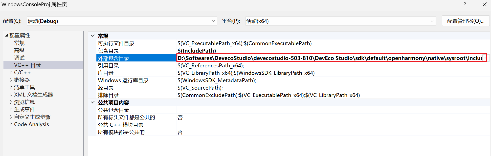